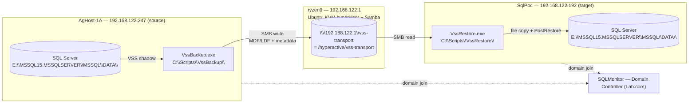
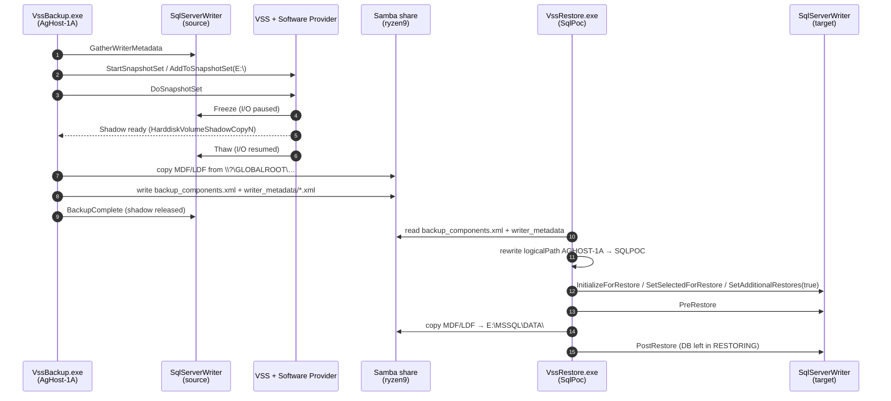
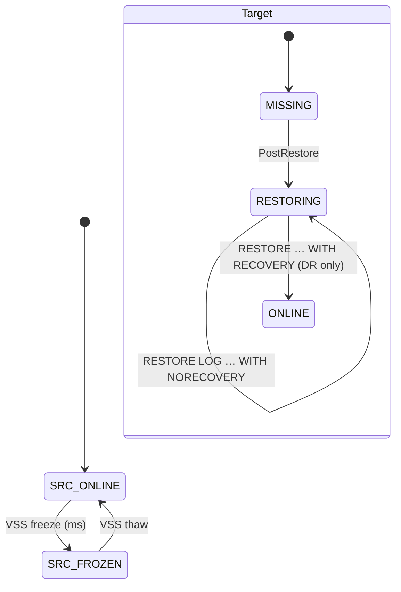

# SQL Server Pure-VSS Backup & Restore on KVM

A hands-on tutorial for a **novice DBA**: back up a SQL Server database on one
Windows VM using the Microsoft Volume Shadow Copy Service (VSS) directly, ship the
data files through a Linux-hosted SMB share, and restore the database on a second
Windows VM in `RESTORING` state so transaction logs can be applied continuously
(warm standby / log shipping).

No native `BACKUP DATABASE` step, no `.bak` files, no KVM-level disk snapshot. Two
small C# programs (`VssBackup.exe`, `VssRestore.exe`) coordinate with the SQL Server
VSS Writer on each side; a Python orchestrator drives them over WinRM.

### What you will build

By the end of this guide you will have:

1. `VssBackup.exe` running on the **source VM** — freezes SQL Server for a few
   milliseconds, takes a Windows software shadow copy of the data volume, copies the
   frozen MDF/LDF to a Samba share on the KVM host, and releases the shadow.
2. `VssRestore.exe` running on the **target VM** — reads the writer metadata from
   the share, rewrites the recorded machine name, asks the local SQL Writer to
   accept the files, and leaves the database in `RESTORING` state.
3. A verified **LSN chain**: a `BACKUP LOG` taken on the source after the VSS
   backup restores cleanly on top of the pure-VSS target.

### Who this guide is for

- You know basic SQL Server backup/restore (`RESTORE LOG ... WITH NORECOVERY`).
- You have `virsh`/KVM running Windows Server VMs, but have **not** written a VSS
  requester before.
- You want the Microsoft-standard VSS path (no KVM quiesce / no qcow2 juggling).

### Reading references

- [SQL Server VSS Writer backup guide](https://learn.microsoft.com/en-us/sql/relational-databases/backup-restore/sql-server-vss-writer-backup-guide) — protocol overview.
- [A Guide for SQL Server Backup Application Vendors](https://learn.microsoft.com/en-us/previous-versions/sql/sql-server-2005/administrator/cc966520(v=technet.10)) — `IVssBackupComponents` API.
- [Perils of VSS Snaps (Brent Ozar)](https://www.brentozar.com/archive/2018/01/perils-vss-snaps/) — what can go wrong.

---

## 1. Concepts (5-minute primer)

| Term | What it is | Who plays this role here |
|---|---|---|
| **Requester** | App that asks VSS to make a shadow copy and tells the Writer when to freeze / thaw / restore | `VssBackup.exe` on the source, `VssRestore.exe` on the target |
| **Writer** | Per-application module that knows how to quiesce state and enumerate files | `SqlServerWriter` (GUID `a65faa63-…`), ships with SQL Server |
| **Provider** | The engine that actually creates the shadow-copy storage | Microsoft Software Shadow Copy Provider (built into Windows) |
| **Shadow copy** | Point-in-time, read-only view of a volume exposed at `\\?\GLOBALROOT\Device\HarddiskVolumeShadowCopyN\…` | Created on `E:\` inside `AgHost-1A` at backup time |
| **Components XML** | Document recorded at backup time that lists selected databases, their files, and the source instance (`logicalPath` attribute) | `backup_components.xml` written to the share |
| **Warm standby** | Target DB kept in `RESTORING` state so T-logs can be applied without breaking the LSN chain | `SetAdditionalRestores(true)` during `PostRestore` |

### Why "pure VSS" instead of a KVM-quiesced snapshot?

| Aspect | KVM-quiesce path (old) | Pure-VSS path (this guide) |
|---|---|---|
| Trigger for SQL freeze | `virsh … --quiesce` → `qemu-guest-agent` → VSS | `VssBackup.exe` → VSS directly |
| Where the frozen data lives | KVM overlay qcow2 on the hypervisor | Windows shadow copy inside the guest |
| How data leaves the source | `rsync` of the qcow2 on the hypervisor | SMB copy from `\\?\GLOBALROOT\…` to a Samba share |
| Restore primitive | Attach qcow2 to target, `RESTORE … FROM DISK` | `IVssBackupComponents.PostRestore` on the target Writer |
| Components / LSN chain | Hidden inside `.bak` | Explicit — driven by the Writer |
| Extra moving parts | qcow2 attach/detach, blockcommit, NBD mounts | None |

---

## 2. Lab Topology



| Role | Host | IP | OS |
|---|---|---|---|
| KVM hypervisor + Samba server | `ryzen9` | `192.168.122.1` | Ubuntu Desktop |
| Domain controller | `SQLMonitor` | — | Windows Server (Lab.com) |
| Source SQL Server VM | `AgHost-1A` | `192.168.122.247` | Windows Server + SQL 2019 |
| Target SQL Server VM | `SqlPoc` | `192.168.122.192` | Windows Server + SQL 2019 |

Both Windows VMs are joined to `Lab.com`. The Samba share is reached by IP
(`192.168.122.1`) and accepts guest access; this keeps the data-transport layer
isolated from AD. Production deployments should use a domain-credentialed share
(see *Section 5 — Prerequisites*).

---

## 3. How Pure VSS Works — Sequence



The source-side freeze window is typically under one second. The multi-second
duration you will see in the test output is the file copy over SMB, **after** the
shadow has already been released — SQL Server is fully online during the copy.

### Database state during the cycle



---

## 4. Source Code Layout

All code for the pure-VSS workflow lives under a single folder:

```
SQLDBA-SSMS-Solution/Backup-Restore-VSS/
├── vss-backup-kvm.md                   # This tutorial
├── .venv/                              # Lab credentials — gitignored
│   └── config.env                      # Copy of vss-venv/config.env + real values
├── vss-venv/                           # Credentials TEMPLATE — committed to git
│   └── config.env                      # Dummy values; copy to .venv and edit
├── winrm_helper.py                     # WinRM/SMB helpers; loads .venv/config.env
├── _cleanup_sqlpoc.py                  # E2E: drop test DBs + clear staging dirs
├── discover.py / discover_sqlpoc.py    # One-shot probes of the lab (qemu-agent)
├── create_tlog_job.py                  # One-shot: install VSS-TLog-Backup-15min job
├── vss-tlog-job.sql                    # The Agent job definition
├── Apply-TLogs.ps1                     # Warm-standby T-log apply loop (on SqlPoc)
├── vss-backup.py / .sh                 # Legacy KVM-quiesce orchestrator (optional)
├── Backup-Database-PreSnapshot.ps1     # Legacy — used by the KVM-quiesce path only
├── Restore-FromVSSSnapshot.ps1         # Legacy — used by the KVM-quiesce path only
└── VssRequester/                       # The two C# requesters (the core of this guide)
    ├── VssRequester.sln
    ├── Directory.Build.props           # Targets net8.0-windows / win-x64, no single-file
    ├── VssBackup/
    │   ├── VssBackup.csproj            # ArxOne.AlphaVSS 2.2.1 + .Native.NetCore 2.2.4
    │   └── Program.cs                  # Backup requester (runs on AgHost-1A)
    ├── VssRestore/
    │   ├── VssRestore.csproj
    │   └── Program.cs                  # Restore requester (runs on SqlPoc)
    ├── e2e_run.py                      # End-to-end orchestrator (one DB, full cycle)
    ├── verify_tlog_chain.py            # Proves LSN chain intact after pure-VSS restore
    ├── preflight.py                    # Connectivity + share + SQL Writer probes
    └── retry_restore.py                # Re-runs VssRestore against an existing share
```

> **AlphaVSS version pin**: `ArxOne.AlphaVSS 2.3.0` shipped with an ARM64
> `AlphaVSS.Common.dll` — on x64 Windows the CLR loader rejects it
> (`BadImageFormatException`). Both projects are pinned to `2.2.1` (AnyCPU)
> paired with `ArxOne.AlphaVSS.Native.NetCore 2.2.4`, and
> `PublishSingleFile` is **disabled** so the native `AlphaVSS.x64.dll`
> and the `Native/` shim are deployed as side-car files.

---

## 5. Prerequisites

### 5.1 Lab credentials (on the hypervisor, first-time setup)

Every Python script in this folder reads endpoints and passwords from a single
env file. A **template** with dummy values lives at `vss-venv/config.env`; copy
it once to `.venv/config.env` and edit. The `.venv/` folder is listed in
`.gitignore`, so real credentials never leave your machine.

```bash
cd SQLDBA-SSMS-Solution/Backup-Restore-VSS

# One-time: clone the template into the live credentials directory
cp -r vss-venv .venv

# Edit the live values (keep the keys; change the values)
$EDITOR .venv/config.env
```

`vss-venv/config.env` — **committed template, do not put real secrets here**:

```ini
# --- Source SQL Server VM (runs VssBackup.exe) -------------------------------
AGHOST_NAME=AgHost-1A
AGHOST_IP=192.168.0.10
AGHOST_USER=Administrator
AGHOST_PWD=ChangeMe_StrongP@ssw0rd

# --- Target SQL Server VM (runs VssRestore.exe) ------------------------------
SQLPOC_NAME=SqlPoc
SQLPOC_IP=192.168.0.11
SQLPOC_USER=Administrator
SQLPOC_PWD=ChangeMe_StrongP@ssw0rd

# --- SQL Server sa password (used by orchestrator sqlcmd helpers) ------------
SA_PWD=ChangeMe_StrongP@ssw0rd

# --- Samba transport share on the hypervisor ---------------------------------
SHARE_UNC=\\192.168.0.1\vss-transport
SHARE_LINUX_PATH=/srv/samba/vss-transport

# --- Hypervisor host (Linux, running libvirt + Samba) ------------------------
HV_NAME=ryzen9
HV_IP=192.168.0.1
```

Verify the file parses cleanly before running the orchestrator:

```bash
python3 -c "import winrm_helper as h; \
  print('AgHost-1A ->', h.HOSTS['AgHost-1A']['ip']); \
  print('SqlPoc    ->', h.HOSTS['SqlPoc']['ip']); \
  print('SHARE_UNC ->', h.SHARE_UNC)"
```

Expected:

```text
AgHost-1A -> 192.168.122.247
SqlPoc    -> 192.168.122.192
SHARE_UNC -> \\192.168.122.1\vss-transport
```

If `.venv/config.env` is missing or a key is blank, every script aborts with
a one-line actionable error (no silent fallbacks). Move the `.venv` directory
— or delete a key — to exercise this before shipping.

### 5.2 Hypervisor (`ryzen9`, Linux)

1. `dotnet-sdk-8.0` to cross-build the Windows requesters.
2. A Samba share at `\\192.168.122.1\vss-transport` → `/hyperactive/vss-transport`
   with the following stanza in `/etc/samba/smb.conf`:

   ```ini
   [vss-transport]
      comment              = VSS requester transport (MDF/LDF + writer metadata)
      path                 = /hyperactive/vss-transport
      browseable           = yes
      writable             = yes
      guest ok             = yes
      force user           = nobody
      create mask          = 0666
      directory mask       = 0777
      force create mode    = 0666
      force directory mode = 0777
   ```

   Reload after any change: `sudo systemctl reload smbd`.

3. Verify from the host:

   ```bash
   testparm -s 2>/dev/null | grep -A12 vss-transport
   smbclient -N -L //192.168.122.1 -m SMB3 | grep vss-transport
   ```

   Expected:

   ```
   vss-transport   Disk      VSS requester transport (MDF/LDF + writer metadata)
   ```

### 5.3 Both Windows VMs (`AgHost-1A`, `SqlPoc`)

1. **SQL Server VSS Writer** must be running.

   ```powershell
   Get-Service SQLWriter | Format-Table -AutoSize
   vssadmin list writers | Select-String 'SqlServerWriter' -Context 0,2
   ```

   Expected:

   ```
   Status  Name      DisplayName
   ------  ----      -----------
   Running SQLWriter SQL Server VSS Writer

   > Writer name: 'SqlServerWriter'
        Writer Id: {a65faa63-5ea8-4ebc-9dbd-a0c4db26912a}
        Writer Instance Id: {<guid>}
   ```

2. **Insecure SMB guest auth must be allowed** on the `LanmanWorkstation` client.
   The SQL Server service account (default: `NT SERVICE\MSSQLSERVER`) uses the
   machine SMB session to reach `\\192.168.122.1\vss-transport`; without this
   flag, `BACKUP LOG` / `RESTORE LOG` against the Samba share fail with OS
   error `1272`.

   ```powershell
   # One-shot setup (both VMs)
   $k = 'HKLM:\SYSTEM\CurrentControlSet\Services\LanmanWorkstation\Parameters'
   New-ItemProperty -Path $k -Name AllowInsecureGuestAuth -Value 1 `
                    -PropertyType DWord -Force | Out-Null
   Restart-Service LanmanWorkstation -Force
   ```

   Verify:

   ```powershell
   Get-ItemProperty -Path $k -Name AllowInsecureGuestAuth |
       Select AllowInsecureGuestAuth
   # AllowInsecureGuestAuth
   # ----------------------
   #                      1
   ```

   > In production with a real AD-integrated Samba (or Windows) share, create a
   > service account, drop this flag, and configure the share with fixed
   > credentials (e.g., via `cmdkey /add:192.168.122.1` on both VMs).

---

## 6. Build & Deploy

Cross-compile both requesters on `ryzen9` and ship them to the VMs.

```bash
cd SQLDBA-SSMS-Solution/Backup-Restore-VSS/VssRequester

# Cross-compile for win-x64 (from ryzen9)
dotnet publish VssBackup/VssBackup.csproj  -c Release -o publish/VssBackup
dotnet publish VssRestore/VssRestore.csproj -c Release -o publish/VssRestore

# Expected tail of publish output:
#   VssBackup  -> .../publish/VssBackup/
#   VssRestore -> .../publish/VssRestore/

cd publish && zip -qr VssBackup.zip VssBackup && zip -qr VssRestore.zip VssRestore
ls -la *.zip
# -rw-rw-r-- 1 saanvi saanvi ~33 MB VssBackup.zip
# -rw-rw-r-- 1 saanvi saanvi ~33 MB VssRestore.zip
```

Push to the VMs (WinRM / SMB admin-share via `winrm_helper.push_file`):

```bash
python3 - << 'PY'
import sys
sys.path.insert(0, 'SQLDBA-SSMS-Solution/Backup-Restore-VSS')
from winrm_helper import run_ps, push_file

push_file("AgHost-1A", "SQLDBA-SSMS-Solution/Backup-Restore-VSS/VssRequester/publish/VssBackup.zip",
          r"C:\Scripts\VssBackup.zip")
run_ps("AgHost-1A", r"""
Remove-Item 'C:\Scripts\VssBackup' -Recurse -Force -EA SilentlyContinue
Expand-Archive -LiteralPath 'C:\Scripts\VssBackup.zip' -DestinationPath 'C:\Scripts' -Force
(Get-ChildItem 'C:\Scripts\VssBackup' -File -Recurse | Measure-Object).Count
""")
# Expected: 190  (AlphaVSS + native shims + .NET runtime side-cars)

push_file("SqlPoc", "SQLDBA-SSMS-Solution/Backup-Restore-VSS/VssRequester/publish/VssRestore.zip",
          r"C:\Scripts\VssRestore.zip")
run_ps("SqlPoc", r"""
Remove-Item 'C:\Scripts\VssRestore' -Recurse -Force -EA SilentlyContinue
Expand-Archive -LiteralPath 'C:\Scripts\VssRestore.zip' -DestinationPath 'C:\Scripts' -Force
(Get-ChildItem 'C:\Scripts\VssRestore' -File -Recurse | Measure-Object).Count
""")
# Expected: 190
PY
```

---

## 7. End-to-End Workflow

The orchestrator `VssRequester/e2e_run.py` drives one DB through the full cycle:
clean target → baseline → `VssBackup.exe` on source → share listing →
`VssRestore.exe` on target → post-restore state.

```bash
python3 SQLDBA-SSMS-Solution/Backup-Restore-VSS/VssRequester/e2e_run.py <Database> <RunLabel>
# Example
python3 SQLDBA-SSMS-Solution/Backup-Restore-VSS/VssRequester/e2e_run.py Db2 run1
```

Manually, phase by phase:

```powershell
# Phase B (on AgHost-1A)
C:\Scripts\VssBackup\VssBackup.exe `
    --databases Db2 `
    --output    \\192.168.122.1\vss-transport\run1_Db2_20260418_203042

# Phase R (on SqlPoc)
C:\Scripts\VssRestore\VssRestore.exe `
    --input     \\192.168.122.1\vss-transport\run1_Db2_20260418_203042
# Optional: --source-instance AGHOST-1A --target-instance SQLPOC
```

The restore requester automatically rewrites the component
`logicalPath="<source-machine>"` recorded in `backup_components.xml` to the
local machine name before calling `InitializeForRestore`. Without this, the SQL
Writer on the target attempts to OLE-DB-connect back to the source host during
`PostRestore` and fails with login error 18456 (see *Section 11 — Troubleshooting*).

---

## 8. Test Run Outputs

Six consecutive back-to-back E2E runs against `Db2` (200 MB MDF + 200 MB LDF) all
succeeded with the source DB remaining `ONLINE / FULL` on AgHost-1A and the target
landing in `RESTORING / FULL` on SqlPoc. The second set of three runs was captured
for this documentation.

| Run | VssBackup.exe | VssRestore.exe | Shadow copy id | Target state |
|---:|:---:|:---:|:---|:---|
| docrun1 | 39 s (exit 0) | 4 s (exit 0) | `ce46f9fd-72d7-4ac7-8087-e3d766aec08b` | `Db2 RESTORING FULL` |
| docrun2 | 27 s (exit 0) | 4 s (exit 0) | `484fa076-e695-4dd3-9e19-afcfbfb48e4b` | `Db2 RESTORING FULL` |
| docrun3 | 27 s (exit 0) | 4 s (exit 0) | `6a2e96d2-f0c2-4160-97d1-f2b39458512e` | `Db2 RESTORING FULL` |

### 8.1 `VssBackup.exe` on AgHost-1A (docrun1)

```text
21:00:05 === VssBackup ===  dbs=[Db2]  output=\\192.168.122.1\vss-transport\docrun1_Db2_20260418_210000
21:00:05 Writer: SqlServerWriter  components=8
21:00:05   + Db2  type=FileGroup  files=2
21:00:05 Volumes to snapshot: [E:\]
21:00:05 Snapshot queued: E:\  id=ce46f9fd-72d7-4ac7-8087-e3d766aec08b
21:00:06 DoSnapshotSet complete
21:00:06 Shadow: E:\ -> \\?\GLOBALROOT\Device\HarddiskVolumeShadowCopy9
21:00:06   copy \\?\GLOBALROOT\Device\HarddiskVolumeShadowCopy9\MSSQL15.MSSQLSERVER\MSSQL\DATA\Db2.mdf      -> \\192.168.122.1\vss-transport\docrun1_Db2_20260418_210000\Db2\Db2.mdf
21:00:24   copy \\?\GLOBALROOT\Device\HarddiskVolumeShadowCopy9\MSSQL15.MSSQLSERVER\MSSQL\DATA\Db2_log.ldf  -> \\192.168.122.1\vss-transport\docrun1_Db2_20260418_210000\Db2\Db2_log.ldf
21:00:42 Writer metadata persisted
21:00:42 BackupComplete  -> shadow released
OK output=\\192.168.122.1\vss-transport\docrun1_Db2_20260418_210000
```

### 8.2 Share contents after `VssBackup` (docrun1)

```text
/hyperactive/vss-transport/docrun1_Db2_20260418_210000/
├── backup_components.xml            10,218 B
├── writer_metadata/                 11 files (one per writer on the source)
│   ├── a65faa63-5ea8-4ebc-9dbd-a0c4db26912a_*.xml    SqlServerWriter (4,004 B)
│   ├── be000cbe-11fe-4426-9c58-531aa6355fc4_*.xml    System Writer     (3,193 B)
│   └── … (9 more writers: Registry, COM+ REGDB, WMI, BITS, ASR, Shadow Copy Optimization, IIS, Task Scheduler, Dedup)
└── Db2/
    ├── Db2.mdf                     209,715,200 B
    └── Db2_log.ldf                 209,715,200 B
```

### 8.3 `VssRestore.exe` on SqlPoc (docrun1)

```text
08:30:44 === VssRestore ===  input=\\192.168.122.1\vss-transport\docrun1_Db2_20260418_210000
08:30:44 Source writer metadata: SqlServerWriter  components=8
08:30:44 Rewrote logicalPath: 'AGHOST-1A' -> 'SQLPOC'
08:30:45   + Db2  type=FileGroup  files=2  logicalPath='SQLPOC'
08:30:45 PreRestore complete
08:30:45   copy \\192.168.122.1\vss-transport\docrun1_Db2_20260418_210000\Db2\Db2.mdf      -> E:\MSSQL15.MSSQLSERVER\MSSQL\DATA\Db2.mdf
08:30:45   copy \\192.168.122.1\vss-transport\docrun1_Db2_20260418_210000\Db2\Db2_log.ldf  -> E:\MSSQL15.MSSQLSERVER\MSSQL\DATA\Db2_log.ldf
08:30:47 PostRestore complete -> DBs should be in RESTORING state
OK
```

### 8.4 Post-restore state on SqlPoc

```text
name state_desc recovery_model_desc
---- ---------- -------------------
Db2  RESTORING  FULL

logical physical_name                                 state_desc
------- -------------                                 ----------
Db2     E:\MSSQL15.MSSQLSERVER\MSSQL\DATA\Db2.mdf     RESTORING
Db2_log E:\MSSQL15.MSSQLSERVER\MSSQL\DATA\Db2_log.ldf RESTORING
```

Source DB on AgHost-1A is untouched — `ONLINE / FULL`, same LSN as before the snapshot.

---

## 9. Verification Commands

Run these after any pure-VSS restore cycle. Each query's expected output is shown
inline; the `sqlcmd` invocations assume the `sa` password is exported from your
orchestrator environment.

### 9.1 Target database is in `RESTORING`

```sql
-- On SqlPoc
SELECT name, state_desc, recovery_model_desc
FROM   sys.databases
WHERE  name = 'Db2';
```

Expected:

```text
name state_desc recovery_model_desc
Db2  RESTORING  FULL
```

### 9.2 Data files are in the right location

```sql
-- On SqlPoc
SELECT mf.name         AS logical,
       mf.physical_name,
       mf.state_desc
FROM   sys.master_files mf
JOIN   sys.databases     d ON d.database_id = mf.database_id
WHERE  d.name = 'Db2';
```

Expected:

```text
logical physical_name                                 state_desc
Db2     E:\MSSQL15.MSSQLSERVER\MSSQL\DATA\Db2.mdf     RESTORING
Db2_log E:\MSSQL15.MSSQLSERVER\MSSQL\DATA\Db2_log.ldf RESTORING
```

### 9.3 VSS Writer health (both VMs)

```cmd
REM Cmd (or PowerShell)
vssadmin list writers
```

For every writer the output must read `State: [1] Stable` and `Last error:
No error`. A `Failed` or `Retryable error` against `SqlServerWriter` indicates
the last VSS cycle crashed without releasing the shadow — restart `SQLWriter`
and retry before debugging further.

### 9.4 Writer metadata on the share

```bash
# On ryzen9 — confirm the SQL Writer doc is present and 3-4 KB
ls -l /hyperactive/vss-transport/<run_label>/writer_metadata/ \
      | grep a65faa63                                 # SqlServerWriter GUID
xmllint --format /hyperactive/vss-transport/<run_label>/writer_metadata/a65faa63-*.xml | head -20
```

Expected: an `INSTANCE` + `WRITER_COMPONENTS` XML tree listing one `COMPONENT`
per user DB on the source, with `componentType="filegroup"` and one `FILE`
entry each for MDF and LDF.

---

## 10. Warm Standby — Transaction Log Chain

This is the proof that a pure-VSS full backup is LSN-compatible with native
`BACKUP LOG`: T-logs taken on the source after the VSS snapshot apply cleanly
on top of the pure-VSS restored DB.

```bash
python3 SQLDBA-SSMS-Solution/Backup-Restore-VSS/VssRequester/verify_tlog_chain.py Db2
```

The script:

1. Confirms `Db2` is in `RESTORING` on SqlPoc.
2. Inserts a marker row on AgHost-1A (`Db2.dbo.tlog_verify`) so a new LSN is
   generated.
3. `BACKUP LOG Db2 TO DISK = '\\192.168.122.1\vss-transport\tlog_verify\Db2_<ts>.trn'`.
4. `RESTORE LOG Db2 FROM DISK = '…' WITH NORECOVERY` on SqlPoc.
5. `RESTORE DATABASE Db2 WITH RECOVERY` (DR-style bring-up).
6. `SELECT … FROM Db2.dbo.tlog_verify` — the marker row must appear on SqlPoc.

Captured output (`docrun1` → T-log run immediately after `docrun3`):

```text
--- 0. Pre-state check on SqlPoc ---
name state_desc
Db2  RESTORING

--- 1. Insert a marker row on AgHost-1A to force a new LSN ---
rows_in_marker
3

--- 2. BACKUP LOG on AgHost-1A to the transport share ---
-rw-rw-rw- 1 nobody nogroup 13824 Apr 18 21:02 Db2_20260418_210249.trn

--- 3. RESTORE LOG on SqlPoc (WITH NORECOVERY) ---

--- 4. DB state on SqlPoc after log restore ---
name state_desc recovery_model_desc
Db2  RESTORING  FULL

--- 5. RESTORE ... WITH RECOVERY -> ONLINE, then read marker row ---
name state_desc
Db2  ONLINE

note                        ts
tlog_verify 20260418_210249 4/18/2026 3:32:51 PM
tlog_verify 20260418_203846 4/18/2026 3:08:49 PM
tlog_verify 20260418_203335 4/18/2026 3:03:36 PM

*** PURE-VSS T-LOG CHAIN VERIFIED ***
```

### Warm-standby operating mode

For continuous log shipping, **omit** the final `WITH RECOVERY` — keep the target
in `RESTORING` and apply each new T-log with `WITH NORECOVERY` as it appears on
the share. A second script (for example a `Apply-TLogs.ps1` scheduled task on
SqlPoc) scans `\\192.168.122.1\vss-transport\tlog_stream\Db2\*.trn` and calls
`RESTORE LOG Db2 FROM DISK = '<file>' WITH NORECOVERY` for every new file,
tracking the last applied T-log in a small state file. Bring the DB online
(`RESTORE DATABASE … WITH RECOVERY`) only on true failover.

---

## 11. Troubleshooting

| Symptom | Root cause | Fix |
|---|---|---|
| `BadImageFormatException` loading `AlphaVSS.Common.dll` during `VssBackup.exe` startup | `ArxOne.AlphaVSS 2.3.0` shipped `lib/net8.0/AlphaVSS.Common.dll` with PE machine `0xAA64` (ARM64) | Pin both `.csproj` files to `ArxOne.AlphaVSS 2.2.1` + `ArxOne.AlphaVSS.Native.NetCore 2.2.4`. Disable `PublishSingleFile`. |
| `Sqllib error: 18456  Login failed for user 'LAB\SQLPOC$'` during `PostRestore` | Target SQL Writer read `logicalPath="AGHOST-1A"` from the components XML and tried OLE-DB back to the source VM | `VssRestore.exe` rewrites `logicalPath` → target machine name before `InitializeForRestore`. Use `--source-instance` / `--target-instance` for named instances. |
| `BACKUP LOG … OS error 1272 (You can't access this shared folder…)` | Windows SMB client blocks unauthenticated guest access by default (`LanmanWorkstation`) | Set `AllowInsecureGuestAuth=1` under `HKLM:\SYSTEM\CurrentControlSet\Services\LanmanWorkstation\Parameters` and restart the service. See Section 5.3. |
| `SET DATABASE … OFFLINE WITH ROLLBACK IMMEDIATE` fails with *Option 'OFFLINE' cannot be set in database 'Db2'* | DB is already in `RESTORING` (not `ONLINE`) — `OFFLINE` is not a legal transition | Cleanup path must `DROP DATABASE` (or skip) when `state_desc='RESTORING'`. `e2e_run.py` already handles this. |
| Shadow copy id present but `HarddiskVolumeShadowCopyN` path not accessible inside the guest | Previous `VssBackup.exe` crashed before `BackupComplete` — shadow stayed mounted, OR the provider timed out | Run `vssadmin delete shadows /for=E: /oldest` or reboot the VM. Then restart `SQLWriter`. |
| `ERROR [42000]` on `sqlcmd` from orchestrator but same query works in SSMS | Missing UTF-8 BOM on pushed `.sql` / `.ps1` | `winrm_helper.push_file` auto-prepends the BOM when the file has `.sql` or `.ps1` extension — use it rather than raw SMB copy. |
| `vssadmin list writers` on source shows `SqlServerWriter` *Failed* with `Last error: Non-retryable error` | Previous backup cycle died inside SQL Writer (common after killing `VssBackup.exe` mid-flight) | `Restart-Service SQLWriter` on the source — the writer re-registers with state `Stable` / `No error`. |

---

## 12. References

- [SQL Server backup applications — VSS and SQL Writer](https://learn.microsoft.com/en-us/sql/relational-databases/backup-restore/sql-server-vss-writer-backup-guide) — official MS documentation.
- [A Guide for SQL Server Backup Application Vendors](https://learn.microsoft.com/en-us/previous-versions/sql/sql-server-2005/administrator/cc966520(v=technet.10)) — the canonical VSS requester specification.
- [AlphaVSS (ArxOne fork)](https://github.com/ArxOne/AlphaVSS) — the .NET wrapper used by the two requesters.
- [Perils of VSS Snaps (Brent Ozar)](https://www.brentozar.com/archive/2018/01/perils-vss-snaps/) — known pitfalls.
- Source in this repository: `SQLDBA-SSMS-Solution/Backup-Restore-VSS/VssRequester/`.

