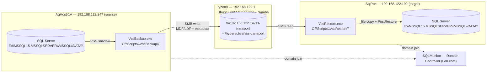
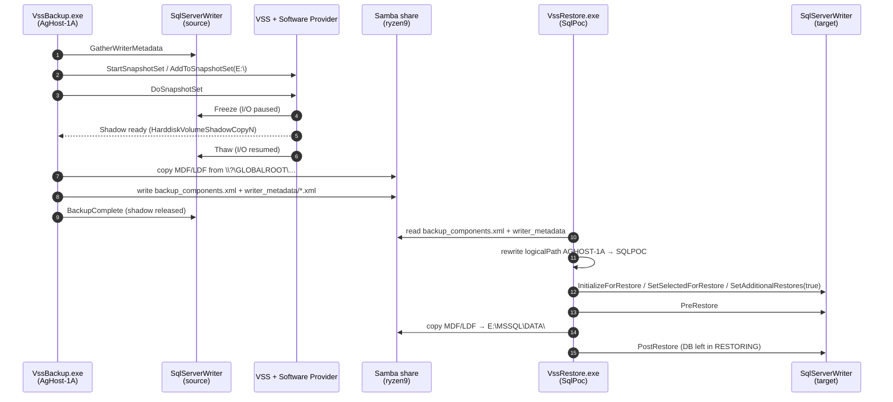
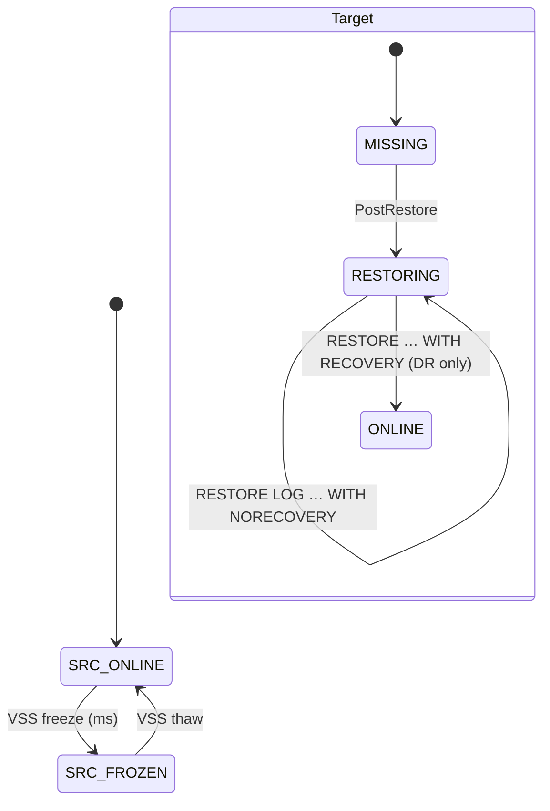

# SQL Server Pure-VSS Backup & Restore on KVM

A hands-on tutorial for a **novice DBA**: back up a SQL Server database on one
Windows VM using the Microsoft Volume Shadow Copy Service (VSS) directly, ship the
data files through a Linux-hosted SMB share, and restore the database on a second
Windows VM in `RESTORING` state so transaction logs can be applied continuously
(warm standby / log shipping).

No native `BACKUP DATABASE` step, no `.bak` files, no KVM-level disk snapshot. Two
small C# programs (`VssBackup.exe`, `VssRestore.exe`) coordinate with the SQL Server
VSS Writer on each side; a Python orchestrator drives them over WinRM.

### What you will build

By the end of this guide you will have:

1. `VssBackup.exe` running on the **source VM** — freezes SQL Server for a few
   milliseconds, takes a Windows software shadow copy of the data volume, copies the
   frozen MDF/LDF to a Samba share on the KVM host, and releases the shadow.
2. `VssRestore.exe` running on the **target VM** — reads the writer metadata from
   the share, rewrites the recorded machine name, asks the local SQL Writer to
   accept the files, and leaves the database in `RESTORING` state.
3. A verified **LSN chain**: a `BACKUP LOG` taken on the source after the VSS
   backup restores cleanly on top of the pure-VSS target.

### Who this guide is for

- You know basic SQL Server backup/restore (`RESTORE LOG ... WITH NORECOVERY`).
- You have `virsh`/KVM running Windows Server VMs, but have **not** written a VSS
  requester before.
- You want the Microsoft-standard VSS path (no KVM quiesce / no qcow2 juggling).

### Reading references

- [SQL Server VSS Writer backup guide](https://learn.microsoft.com/en-us/sql/relational-databases/backup-restore/sql-server-vss-writer-backup-guide) — protocol overview.
- [A Guide for SQL Server Backup Application Vendors](https://learn.microsoft.com/en-us/previous-versions/sql/sql-server-2005/administrator/cc966520(v=technet.10)) — `IVssBackupComponents` API.
- [Perils of VSS Snaps (Brent Ozar)](https://www.brentozar.com/archive/2018/01/perils-vss-snaps/) — what can go wrong.

---

## 1. Concepts (5-minute primer)

| Term | What it is | Who plays this role here |
|---|---|---|
| **Requester** | App that asks VSS to make a shadow copy and tells the Writer when to freeze / thaw / restore | `VssBackup.exe` on the source, `VssRestore.exe` on the target |
| **Writer** | Per-application module that knows how to quiesce state and enumerate files | `SqlServerWriter` (GUID `a65faa63-…`), ships with SQL Server |
| **Provider** | The engine that actually creates the shadow-copy storage | Microsoft Software Shadow Copy Provider (built into Windows) |
| **Shadow copy** | Point-in-time, read-only view of a volume exposed at `\\?\GLOBALROOT\Device\HarddiskVolumeShadowCopyN\…` | Created on `E:\` inside `AgHost-1A` at backup time |
| **Components XML** | Document recorded at backup time that lists selected databases, their files, and the source instance (`logicalPath` attribute) | `backup_components.xml` written to the share |
| **Warm standby** | Target DB kept in `RESTORING` state so T-logs can be applied without breaking the LSN chain | `SetAdditionalRestores(true)` during `PostRestore` |

### Why "pure VSS" instead of a KVM-quiesced snapshot?

| Aspect | KVM-quiesce path (old) | Pure-VSS path (this guide) |
|---|---|---|
| Trigger for SQL freeze | `virsh … --quiesce` → `qemu-guest-agent` → VSS | `VssBackup.exe` → VSS directly |
| Where the frozen data lives | KVM overlay qcow2 on the hypervisor | Windows shadow copy inside the guest |
| How data leaves the source | `rsync` of the qcow2 on the hypervisor | SMB copy from `\\?\GLOBALROOT\…` to a Samba share |
| Restore primitive | Attach qcow2 to target, `RESTORE … FROM DISK` | `IVssBackupComponents.PostRestore` on the target Writer |
| Components / LSN chain | Hidden inside `.bak` | Explicit — driven by the Writer |
| Extra moving parts | qcow2 attach/detach, blockcommit, NBD mounts | None |

---

## 2. Lab Topology



| Role | Host | IP | OS |
|---|---|---|---|
| KVM hypervisor + Samba server | `ryzen9` | `192.168.122.1` | Ubuntu Desktop |
| Domain controller | `SQLMonitor` | — | Windows Server (Lab.com) |
| Source SQL Server VM | `AgHost-1A` | `192.168.122.247` | Windows Server + SQL 2019 |
| Target SQL Server VM | `SqlPoc` | `192.168.122.192` | Windows Server + SQL 2019 |

Both Windows VMs are joined to `Lab.com`. The Samba share is reached by IP
(`192.168.122.1`) and accepts guest access; this keeps the data-transport layer
isolated from AD. Production deployments should use a domain-credentialed share
(see *Section 5 — Prerequisites*).

---

## 3. How Pure VSS Works — Sequence



The source-side freeze window is typically under one second. The multi-second
duration you will see in the test output is the file copy over SMB, **after** the
shadow has already been released — SQL Server is fully online during the copy.

### Database state during the cycle



---

## 4. Source Code Layout

All code for the pure-VSS workflow lives under a single folder:

```
SQLDBA-SSMS-Solution/Backup-Restore-VSS/
├── vss-backup-kvm.md                   # This tutorial
├── .venv/                              # Lab credentials — gitignored
│   └── config.env                      # Copy of vss-venv/config.env + real values
├── vss-venv/                           # Credentials TEMPLATE — committed to git
│   └── config.env                      # Dummy values; copy to .venv and edit
├── winrm_helper.py                     # WinRM/SMB helpers; loads .venv/config.env
├── _cleanup_sqlpoc.py                  # E2E: drop test DBs + clear staging dirs
├── discover.py / discover_sqlpoc.py    # One-shot probes of the lab (qemu-agent)
├── create_tlog_job.py                  # One-shot: install VSS-TLog-Backup-15min job
├── vss-tlog-job.sql                    # The Agent job definition
├── Apply-TLogs.ps1                     # Warm-standby T-log apply loop (on SqlPoc)
├── vss-backup.py / .sh                 # Legacy KVM-quiesce orchestrator (optional)
├── Backup-Database-PreSnapshot.ps1     # Legacy — used by the KVM-quiesce path only
├── Restore-FromVSSSnapshot.ps1         # Legacy — used by the KVM-quiesce path only
└── VssRequester/                       # The two C# requesters (the core of this guide)
    ├── VssRequester.sln
    ├── Directory.Build.props           # Targets net8.0-windows / win-x64, no single-file
    ├── VssBackup/
    │   ├── VssBackup.csproj            # ArxOne.AlphaVSS 2.2.1 + .Native.NetCore 2.2.4
    │   └── Program.cs                  # Backup requester (runs on AgHost-1A)
    ├── VssRestore/
    │   ├── VssRestore.csproj
    │   └── Program.cs                  # Restore requester (runs on SqlPoc)
    ├── e2e_run.py                      # End-to-end orchestrator (one DB, full cycle)
    ├── verify_tlog_chain.py            # Proves LSN chain intact after pure-VSS restore
    ├── preflight.py                    # Connectivity + share + SQL Writer probes
    └── retry_restore.py                # Re-runs VssRestore against an existing share
```

> **AlphaVSS version pin**: `ArxOne.AlphaVSS 2.3.0` shipped with an ARM64
> `AlphaVSS.Common.dll` — on x64 Windows the CLR loader rejects it
> (`BadImageFormatException`). Both projects are pinned to `2.2.1` (AnyCPU)
> paired with `ArxOne.AlphaVSS.Native.NetCore 2.2.4`, and
> `PublishSingleFile` is **disabled** so the native `AlphaVSS.x64.dll`
> and the `Native/` shim are deployed as side-car files.

---

## 5. Prerequisites

### 5.1 Lab credentials (on the hypervisor, first-time setup)

Every Python script in this folder reads endpoints and passwords from a single
env file. A **template** with dummy values lives at `vss-venv/config.env`; copy
it once to `.venv/config.env` and edit. The `.venv/` folder is listed in
`.gitignore`, so real credentials never leave your machine.

```bash
cd SQLDBA-SSMS-Solution/Backup-Restore-VSS

# One-time: clone the template into the live credentials directory
cp -r vss-venv .venv

# Edit the live values (keep the keys; change the values)
$EDITOR .venv/config.env
```

`vss-venv/config.env` — **committed template, do not put real secrets here**:

```ini
# --- Source SQL Server VM (runs VssBackup.exe) -------------------------------
AGHOST_NAME=AgHost-1A
AGHOST_IP=192.168.0.10
AGHOST_USER=Administrator
AGHOST_PWD=ChangeMe_StrongP@ssw0rd

# --- Target SQL Server VM (runs VssRestore.exe) ------------------------------
SQLPOC_NAME=SqlPoc
SQLPOC_IP=192.168.0.11
SQLPOC_USER=Administrator
SQLPOC_PWD=ChangeMe_StrongP@ssw0rd

# --- SQL Server sa password (used by orchestrator sqlcmd helpers) ------------
SA_PWD=ChangeMe_StrongP@ssw0rd

# --- Samba transport share on the hypervisor ---------------------------------
SHARE_UNC=\\192.168.0.1\vss-transport
SHARE_LINUX_PATH=/srv/samba/vss-transport

# --- Hypervisor host (Linux, running libvirt + Samba) ------------------------
HV_NAME=ryzen9
HV_IP=192.168.0.1
```

Verify the file parses cleanly before running the orchestrator:

```bash
python3 -c "import winrm_helper as h; \
  print('AgHost-1A ->', h.HOSTS['AgHost-1A']['ip']); \
  print('SqlPoc    ->', h.HOSTS['SqlPoc']['ip']); \
  print('SHARE_UNC ->', h.SHARE_UNC)"
```

Expected:

```text
AgHost-1A -> 192.168.122.247
SqlPoc    -> 192.168.122.192
SHARE_UNC -> \\192.168.122.1\vss-transport
```

If `.venv/config.env` is missing or a key is blank, every script aborts with
a one-line actionable error (no silent fallbacks). Move the `.venv` directory
— or delete a key — to exercise this before shipping.

### 5.2 Hypervisor (`ryzen9`, Linux)

1. `dotnet-sdk-8.0` to cross-build the Windows requesters.
2. Python 3.10+ with the orchestrator packages (no ODBC runtime required):

   ```bash
   pip install pywinrm mssql-python fastapi uvicorn \
               prometheus-client websockets
   ```

   `mssql-python` is Microsoft's official pure-Python SQL Server driver —
   it replaces the previous `pyodbc` + `msodbcsql18` stack entirely, so
   `unixodbc` / `msodbcsql18` are **no longer needed** on the hypervisor or
   inside the VMs. Every SQL call made by `winrm_helper.py`, the API server
   (`vss_api/`), and the backup/restore runners goes through a direct TCP
   connection to `<host>:1433`.
3. A Samba share at `\\192.168.122.1\vss-transport` → `/hyperactive/vss-transport`
   with the following stanza in `/etc/samba/smb.conf`:

   ```ini
   [vss-transport]
      comment              = VSS requester transport (MDF/LDF + writer metadata)
      path                 = /hyperactive/vss-transport
      browseable           = yes
      writable             = yes
      guest ok             = yes
      force user           = nobody
      create mask          = 0666
      directory mask       = 0777
      force create mode    = 0666
      force directory mode = 0777
   ```

   Reload after any change: `sudo systemctl reload smbd`.

3. Verify from the host:

   ```bash
   testparm -s 2>/dev/null | grep -A12 vss-transport
   smbclient -N -L //192.168.122.1 -m SMB3 | grep vss-transport
   ```

   Expected:

   ```
   vss-transport   Disk      VSS requester transport (MDF/LDF + writer metadata)
   ```

### 5.3 Both Windows VMs (`AgHost-1A`, `SqlPoc`)

1. **SQL Server VSS Writer** must be running.

   ```powershell
   Get-Service SQLWriter | Format-Table -AutoSize
   vssadmin list writers | Select-String 'SqlServerWriter' -Context 0,2
   ```

   Expected:

   ```
   Status  Name      DisplayName
   ------  ----      -----------
   Running SQLWriter SQL Server VSS Writer

   > Writer name: 'SqlServerWriter'
        Writer Id: {a65faa63-5ea8-4ebc-9dbd-a0c4db26912a}
        Writer Instance Id: {<guid>}
   ```

2. **Insecure SMB guest auth must be allowed** on the `LanmanWorkstation` client.
   The SQL Server service account (default: `NT SERVICE\MSSQLSERVER`) uses the
   machine SMB session to reach `\\192.168.122.1\vss-transport`; without this
   flag, `BACKUP LOG` / `RESTORE LOG` against the Samba share fail with OS
   error `1272`.

   ```powershell
   # One-shot setup (both VMs)
   $k = 'HKLM:\SYSTEM\CurrentControlSet\Services\LanmanWorkstation\Parameters'
   New-ItemProperty -Path $k -Name AllowInsecureGuestAuth -Value 1 `
                    -PropertyType DWord -Force | Out-Null
   Restart-Service LanmanWorkstation -Force
   ```

   Verify:

   ```powershell
   Get-ItemProperty -Path $k -Name AllowInsecureGuestAuth |
       Select AllowInsecureGuestAuth
   # AllowInsecureGuestAuth
   # ----------------------
   #                      1
   ```

   > In production with a real AD-integrated Samba (or Windows) share, create a
   > service account, drop this flag, and configure the share with fixed
   > credentials (e.g., via `cmdkey /add:192.168.122.1` on both VMs).

---

## 6. Build & Deploy

Cross-compile both requesters on `ryzen9` and ship them to the VMs.

```bash
cd SQLDBA-SSMS-Solution/Backup-Restore-VSS/VssRequester

# Cross-compile for win-x64 (from ryzen9)
dotnet publish VssBackup/VssBackup.csproj  -c Release -o publish/VssBackup
dotnet publish VssRestore/VssRestore.csproj -c Release -o publish/VssRestore

# Expected tail of publish output:
#   VssBackup  -> .../publish/VssBackup/
#   VssRestore -> .../publish/VssRestore/

cd publish && zip -qr VssBackup.zip VssBackup && zip -qr VssRestore.zip VssRestore
ls -la *.zip
# -rw-rw-r-- 1 saanvi saanvi ~33 MB VssBackup.zip
# -rw-rw-r-- 1 saanvi saanvi ~33 MB VssRestore.zip
```

Push to the VMs (WinRM / SMB admin-share via `winrm_helper.push_file`):

```bash
python3 - << 'PY'
import sys
sys.path.insert(0, 'SQLDBA-SSMS-Solution/Backup-Restore-VSS')
from winrm_helper import run_ps, push_file

push_file("AgHost-1A", "SQLDBA-SSMS-Solution/Backup-Restore-VSS/VssRequester/publish/VssBackup.zip",
          r"C:\Scripts\VssBackup.zip")
run_ps("AgHost-1A", r"""
Remove-Item 'C:\Scripts\VssBackup' -Recurse -Force -EA SilentlyContinue
Expand-Archive -LiteralPath 'C:\Scripts\VssBackup.zip' -DestinationPath 'C:\Scripts' -Force
(Get-ChildItem 'C:\Scripts\VssBackup' -File -Recurse | Measure-Object).Count
""")
# Expected: 190  (AlphaVSS + native shims + .NET runtime side-cars)

push_file("SqlPoc", "SQLDBA-SSMS-Solution/Backup-Restore-VSS/VssRequester/publish/VssRestore.zip",
          r"C:\Scripts\VssRestore.zip")
run_ps("SqlPoc", r"""
Remove-Item 'C:\Scripts\VssRestore' -Recurse -Force -EA SilentlyContinue
Expand-Archive -LiteralPath 'C:\Scripts\VssRestore.zip' -DestinationPath 'C:\Scripts' -Force
(Get-ChildItem 'C:\Scripts\VssRestore' -File -Recurse | Measure-Object).Count
""")
# Expected: 190
PY
```

---

## 7. End-to-End Workflow

The orchestrator `VssRequester/e2e_run.py` drives one DB through the full cycle:
clean target → baseline → `VssBackup.exe` on source → share listing →
`VssRestore.exe` on target → post-restore state.

```bash
python3 SQLDBA-SSMS-Solution/Backup-Restore-VSS/VssRequester/e2e_run.py <Database> <RunLabel>
# Example
python3 SQLDBA-SSMS-Solution/Backup-Restore-VSS/VssRequester/e2e_run.py Db2 run1
```

Manually, phase by phase:

```powershell
# Phase B (on AgHost-1A)
C:\Scripts\VssBackup\VssBackup.exe `
    --databases Db2 `
    --output    \\192.168.122.1\vss-transport\run1_Db2_20260418_203042

# Phase R (on SqlPoc)
C:\Scripts\VssRestore\VssRestore.exe `
    --input     \\192.168.122.1\vss-transport\run1_Db2_20260418_203042
# Optional: --source-instance AGHOST-1A --target-instance SQLPOC
```

The restore requester automatically rewrites the component
`logicalPath="<source-machine>"` recorded in `backup_components.xml` to the
local machine name before calling `InitializeForRestore`. Without this, the SQL
Writer on the target attempts to OLE-DB-connect back to the source host during
`PostRestore` and fails with login error 18456 (see *Section 11 — Troubleshooting*).

---

## 8. Test Run Outputs

Six consecutive back-to-back E2E runs against `Db2` (200 MB MDF + 200 MB LDF) all
succeeded with the source DB remaining `ONLINE / FULL` on AgHost-1A and the target
landing in `RESTORING / FULL` on SqlPoc. The second set of three runs was captured
for this documentation.

| Run | VssBackup.exe | VssRestore.exe | Shadow copy id | Target state |
|---:|:---:|:---:|:---|:---|
| docrun1 | 39 s (exit 0) | 4 s (exit 0) | `ce46f9fd-72d7-4ac7-8087-e3d766aec08b` | `Db2 RESTORING FULL` |
| docrun2 | 27 s (exit 0) | 4 s (exit 0) | `484fa076-e695-4dd3-9e19-afcfbfb48e4b` | `Db2 RESTORING FULL` |
| docrun3 | 27 s (exit 0) | 4 s (exit 0) | `6a2e96d2-f0c2-4160-97d1-f2b39458512e` | `Db2 RESTORING FULL` |

### 8.1 `VssBackup.exe` on AgHost-1A (docrun1)

```text
21:00:05 === VssBackup ===  dbs=[Db2]  output=\\192.168.122.1\vss-transport\docrun1_Db2_20260418_210000
21:00:05 Writer: SqlServerWriter  components=8
21:00:05   + Db2  type=FileGroup  files=2
21:00:05 Volumes to snapshot: [E:\]
21:00:05 Snapshot queued: E:\  id=ce46f9fd-72d7-4ac7-8087-e3d766aec08b
21:00:06 DoSnapshotSet complete
21:00:06 Shadow: E:\ -> \\?\GLOBALROOT\Device\HarddiskVolumeShadowCopy9
21:00:06   copy \\?\GLOBALROOT\Device\HarddiskVolumeShadowCopy9\MSSQL15.MSSQLSERVER\MSSQL\DATA\Db2.mdf      -> \\192.168.122.1\vss-transport\docrun1_Db2_20260418_210000\Db2\Db2.mdf
21:00:24   copy \\?\GLOBALROOT\Device\HarddiskVolumeShadowCopy9\MSSQL15.MSSQLSERVER\MSSQL\DATA\Db2_log.ldf  -> \\192.168.122.1\vss-transport\docrun1_Db2_20260418_210000\Db2\Db2_log.ldf
21:00:42 Writer metadata persisted
21:00:42 BackupComplete  -> shadow released
OK output=\\192.168.122.1\vss-transport\docrun1_Db2_20260418_210000
```

### 8.2 Share contents after `VssBackup` (docrun1)

```text
/hyperactive/vss-transport/docrun1_Db2_20260418_210000/
├── backup_components.xml            10,218 B
├── writer_metadata/                 11 files (one per writer on the source)
│   ├── a65faa63-5ea8-4ebc-9dbd-a0c4db26912a_*.xml    SqlServerWriter (4,004 B)
│   ├── be000cbe-11fe-4426-9c58-531aa6355fc4_*.xml    System Writer     (3,193 B)
│   └── … (9 more writers: Registry, COM+ REGDB, WMI, BITS, ASR, Shadow Copy Optimization, IIS, Task Scheduler, Dedup)
└── Db2/
    ├── Db2.mdf                     209,715,200 B
    └── Db2_log.ldf                 209,715,200 B
```

### 8.3 `VssRestore.exe` on SqlPoc (docrun1)

```text
08:30:44 === VssRestore ===  input=\\192.168.122.1\vss-transport\docrun1_Db2_20260418_210000
08:30:44 Source writer metadata: SqlServerWriter  components=8
08:30:44 Rewrote logicalPath: 'AGHOST-1A' -> 'SQLPOC'
08:30:45   + Db2  type=FileGroup  files=2  logicalPath='SQLPOC'
08:30:45 PreRestore complete
08:30:45   copy \\192.168.122.1\vss-transport\docrun1_Db2_20260418_210000\Db2\Db2.mdf      -> E:\MSSQL15.MSSQLSERVER\MSSQL\DATA\Db2.mdf
08:30:45   copy \\192.168.122.1\vss-transport\docrun1_Db2_20260418_210000\Db2\Db2_log.ldf  -> E:\MSSQL15.MSSQLSERVER\MSSQL\DATA\Db2_log.ldf
08:30:47 PostRestore complete -> DBs should be in RESTORING state
OK
```

### 8.4 Post-restore state on SqlPoc

```text
name state_desc recovery_model_desc
---- ---------- -------------------
Db2  RESTORING  FULL

logical physical_name                                 state_desc
------- -------------                                 ----------
Db2     E:\MSSQL15.MSSQLSERVER\MSSQL\DATA\Db2.mdf     RESTORING
Db2_log E:\MSSQL15.MSSQLSERVER\MSSQL\DATA\Db2_log.ldf RESTORING
```

Source DB on AgHost-1A is untouched — `ONLINE / FULL`, same LSN as before the snapshot.

---

## 9. Verification Commands

Run these after any pure-VSS restore cycle. Each query's expected output is shown
inline; the `sqlcmd` invocations assume the `sa` password is exported from your
orchestrator environment.

### 9.1 Target database is in `RESTORING`

```sql
-- On SqlPoc
SELECT name, state_desc, recovery_model_desc
FROM   sys.databases
WHERE  name = 'Db2';
```

Expected:

```text
name state_desc recovery_model_desc
Db2  RESTORING  FULL
```

### 9.2 Data files are in the right location

```sql
-- On SqlPoc
SELECT mf.name         AS logical,
       mf.physical_name,
       mf.state_desc
FROM   sys.master_files mf
JOIN   sys.databases     d ON d.database_id = mf.database_id
WHERE  d.name = 'Db2';
```

Expected:

```text
logical physical_name                                 state_desc
Db2     E:\MSSQL15.MSSQLSERVER\MSSQL\DATA\Db2.mdf     RESTORING
Db2_log E:\MSSQL15.MSSQLSERVER\MSSQL\DATA\Db2_log.ldf RESTORING
```

### 9.3 VSS Writer health (both VMs)

```cmd
REM Cmd (or PowerShell)
vssadmin list writers
```

For every writer the output must read `State: [1] Stable` and `Last error:
No error`. A `Failed` or `Retryable error` against `SqlServerWriter` indicates
the last VSS cycle crashed without releasing the shadow — restart `SQLWriter`
and retry before debugging further.

### 9.4 Writer metadata on the share

```bash
# On ryzen9 — confirm the SQL Writer doc is present and 3-4 KB
ls -l /hyperactive/vss-transport/<run_label>/writer_metadata/ \
      | grep a65faa63                                 # SqlServerWriter GUID
xmllint --format /hyperactive/vss-transport/<run_label>/writer_metadata/a65faa63-*.xml | head -20
```

Expected: an `INSTANCE` + `WRITER_COMPONENTS` XML tree listing one `COMPONENT`
per user DB on the source, with `componentType="filegroup"` and one `FILE`
entry each for MDF and LDF.

---

## 10. Warm Standby — Transaction Log Chain

This is the proof that a pure-VSS full backup is LSN-compatible with native
`BACKUP LOG`: T-logs taken on the source after the VSS snapshot apply cleanly
on top of the pure-VSS restored DB.

```bash
python3 SQLDBA-SSMS-Solution/Backup-Restore-VSS/VssRequester/verify_tlog_chain.py Db2
```

The script:

1. Confirms `Db2` is in `RESTORING` on SqlPoc.
2. Inserts a marker row on AgHost-1A (`Db2.dbo.tlog_verify`) so a new LSN is
   generated.
3. `BACKUP LOG Db2 TO DISK = '\\192.168.122.1\vss-transport\tlog_verify\Db2_<ts>.trn'`.
4. `RESTORE LOG Db2 FROM DISK = '…' WITH NORECOVERY` on SqlPoc.
5. `RESTORE DATABASE Db2 WITH RECOVERY` (DR-style bring-up).
6. `SELECT … FROM Db2.dbo.tlog_verify` — the marker row must appear on SqlPoc.

Captured output (`docrun1` → T-log run immediately after `docrun3`):

```text
--- 0. Pre-state check on SqlPoc ---
name state_desc
Db2  RESTORING

--- 1. Insert a marker row on AgHost-1A to force a new LSN ---
rows_in_marker
3

--- 2. BACKUP LOG on AgHost-1A to the transport share ---
-rw-rw-rw- 1 nobody nogroup 13824 Apr 18 21:02 Db2_20260418_210249.trn

--- 3. RESTORE LOG on SqlPoc (WITH NORECOVERY) ---

--- 4. DB state on SqlPoc after log restore ---
name state_desc recovery_model_desc
Db2  RESTORING  FULL

--- 5. RESTORE ... WITH RECOVERY -> ONLINE, then read marker row ---
name state_desc
Db2  ONLINE

note                        ts
tlog_verify 20260418_210249 4/18/2026 3:32:51 PM
tlog_verify 20260418_203846 4/18/2026 3:08:49 PM
tlog_verify 20260418_203335 4/18/2026 3:03:36 PM

*** PURE-VSS T-LOG CHAIN VERIFIED ***
```

### Warm-standby operating mode

For continuous log shipping, **omit** the final `WITH RECOVERY` — keep the target
in `RESTORING` and apply each new T-log with `WITH NORECOVERY` as it appears on
the share. A second script (for example a `Apply-TLogs.ps1` scheduled task on
SqlPoc) scans `\\192.168.122.1\vss-transport\tlog_stream\Db2\*.trn` and calls
`RESTORE LOG Db2 FROM DISK = '<file>' WITH NORECOVERY` for every new file,
tracking the last applied T-log in a small state file. Bring the DB online
(`RESTORE DATABASE … WITH RECOVERY`) only on true failover.

---

## 11. Troubleshooting

| Symptom | Root cause | Fix |
|---|---|---|
| `BadImageFormatException` loading `AlphaVSS.Common.dll` during `VssBackup.exe` startup | `ArxOne.AlphaVSS 2.3.0` shipped `lib/net8.0/AlphaVSS.Common.dll` with PE machine `0xAA64` (ARM64) | Pin both `.csproj` files to `ArxOne.AlphaVSS 2.2.1` + `ArxOne.AlphaVSS.Native.NetCore 2.2.4`. Disable `PublishSingleFile`. |
| `Sqllib error: 18456  Login failed for user 'LAB\SQLPOC$'` during `PostRestore` | Target SQL Writer read `logicalPath="AGHOST-1A"` from the components XML and tried OLE-DB back to the source VM | `VssRestore.exe` rewrites `logicalPath` → target machine name before `InitializeForRestore`. Use `--source-instance` / `--target-instance` for named instances. |
| `BACKUP LOG … OS error 1272 (You can't access this shared folder…)` | Windows SMB client blocks unauthenticated guest access by default (`LanmanWorkstation`) | Set `AllowInsecureGuestAuth=1` under `HKLM:\SYSTEM\CurrentControlSet\Services\LanmanWorkstation\Parameters` and restart the service. See Section 5.3. |
| `SET DATABASE … OFFLINE WITH ROLLBACK IMMEDIATE` fails with *Option 'OFFLINE' cannot be set in database 'Db2'* | DB is already in `RESTORING` (not `ONLINE`) — `OFFLINE` is not a legal transition | Cleanup path must `DROP DATABASE` (or skip) when `state_desc='RESTORING'`. `e2e_run.py` already handles this. |
| Shadow copy id present but `HarddiskVolumeShadowCopyN` path not accessible inside the guest | Previous `VssBackup.exe` crashed before `BackupComplete` — shadow stayed mounted, OR the provider timed out | Run `vssadmin delete shadows /for=E: /oldest` or reboot the VM. Then restart `SQLWriter`. |
| `ERROR [42000]` on `sqlcmd` from orchestrator but same query works in SSMS | Missing UTF-8 BOM on pushed `.sql` / `.ps1` | `winrm_helper.push_file` auto-prepends the BOM when the file has `.sql` or `.ps1` extension — use it rather than raw SMB copy. |
| `vssadmin list writers` on source shows `SqlServerWriter` *Failed* with `Last error: Non-retryable error` | Previous backup cycle died inside SQL Writer (common after killing `VssBackup.exe` mid-flight) | `Restart-Service SQLWriter` on the source — the writer re-registers with state `Stable` / `No error`. |

---

## 12. Performance benchmarks

### 12.1 Optional speed flags

Both requesters default to **serial, uncompressed** copies — the simplest
and most portable mode. Two **opt-in** flags are available:

| Flag | Where | Effect |
|---|---|---|
| `--compress` | `VssBackup.exe` | Gzip each MDF/LDF on the fly (`System.IO.Compression.GZipStream` at `CompressionLevel.Fastest`). Files land on the share with a `.gz` suffix; `VssRestore.exe` decompresses transparently. |
| `--parallel N` | `VssBackup.exe`, `VssRestore.exe` | Copy up to `N` databases concurrently (`Parallel.ForEach` with `MaxDegreeOfParallelism=N`). SQL Writer COM calls remain serialized. |
| `--copy-only` | `VssBackup.exe` | Sets `VssBackupType.Copy` (VSS_BT_COPY). Does **not** update SQL's differential base LSN or backup history — safe to interleave with a live log-ship / full-backup schedule. |
| `--rename "A=B,…"` | `VssRestore.exe` | Accepted for API symmetry; the caller (`restore.py`) issues `ALTER DATABASE … MODIFY NAME` once the DB is ONLINE. |
| `--move-data / --move-log "Db=Dir,…"` | `VssRestore.exe` | `AddNewTarget` per file spec + Copy phase writes to the new dir. Missing directories are created. |
| `--attach-only "Db1,Db2"` | `VssRestore.exe` | Skip the writer flow (`SetSelectedForRestore` / `PreRestore` / `PostRestore`) for the listed DBs; only stage the snapshot files at the `--move-data` / `--move-log` paths. `restore.py` uses this automatically for DBs that have both a rename and a move dir, then runs `CREATE DATABASE … FOR ATTACH`. |

The orchestrator `e2e_run_multi.py` exposes the same choice as positional tokens:

```bash
# Default: serial, uncompressed
python3 e2e_run_multi.py myrun CDCDemo,Db2 with-tlog

# Opt-in: parallel + compressed
python3 e2e_run_multi.py myrun CDCDemo,Db2 with-tlog compress parallel=2
```

### 12.2 Results

Each row corresponds to an end-to-end cycle recorded on the lab VMs. The
columns are:

- **Scenario** — orchestrator label + flags (`P` = parallel, `Z` = compress).
- **DBs / size** — databases participating and total MDF+LDF bytes on source.
- **Backup (s)** — wall time for `VssBackup.exe` (share-out phase only).
- **Restore (s)** — wall time for `VssRestore.exe` (share-in + PostRestore).
- **TLog** — `✅` = `verify_tlog_chain.py` succeeded for **all** DBs in the
  run (including any bridge files pulled from `E:\TLogBackups`); `—` = tlog
  phase skipped; `partial` = some DBs verified but not all.
- **Share bytes** — size of the per-run folder on `\\ryzen9\vss-transport`
  (the compressed wire transfer, when `--compress` is set).

| # | Scenario | DBs / size | Backup (s) | Restore (s) | TLog | Share bytes | Notes |
|---|---|---|---:|---:|:---:|---:|---|
| 1 | `b1_small_base` (base) | CDCDemo,Db2 | 69 | 8 | — | 1000 M | exit=0 |
| 2 | `b2_small_gz` (Z) | CDCDemo,Db2 | 5 | 12 | — | 33 M | exit=0 |
| 3 | `b3_small_par` (P=2) | CDCDemo,Db2 | 66 | 8 | — | 1000 M | exit=0 |
| 4 | `b4_small_gzpar` (P=2 Z) | CDCDemo,Db2 | 4 | 5 | — | 33 M | exit=0 |
| 5 | `b5_small_tlog` (tlog) | CDCDemo,Db2 | 67 | 9 | ✅ | 1000 M | exit=0 |
| 6 | `b6_small_tlog_gzpar` (P=2 Z tlog) | CDCDemo,Db2 | 6 | 5 | ✅ | 33 M | exit=0 |
| 7 | `b7_med_base` (base) | DBA,Facebook | 399 | 64 | — | 5.9 G | exit=0 |
| 8 | `b8_med_gzpar` (P=2 Z) | DBA,Facebook | 698 | 42 | — | 5.5 G | exit=0; DBA is high-entropy (TDE) so `--compress` slowed backup (9 MB/s vs 399s/5.9G uncompressed in #7) |
| 8b | `b8_med_gzpar` retry (P=2 Z) | DBA,Facebook | 815 | 1 | — | — | exit=0; rerun, restore was a no-op because DBs already present in RESTORING state |
| 9 | `b9_med_tlog` (tlog) | DBA,Facebook | 541 | 65 | ✅ | 5.9 G | exit=0 |
| 10 | `b10_full_gzpar_tlog` (tlog; ran **base** — see note) | CDCDemo,Db2,DBA,Facebook,StackOverflow2013 | 3965 | 860 | ✅ (4/5 verified live, Db2 marker confirmed post-run) | 58.4 G | exit=0; `--compress --parallel=5` were passed but `bench_runner` rejected the `--` prefixed forms and silently fell back to `compress=False parallel=1`. Fixed in `bench_runner.py` so both styles are accepted. Db2 tlog verify failed on the *marker-read* step (same transient cross-DB opening error seen in #11). Re-checking post-run confirmed `[Db2].dbo._vss_marker` has the fresh row, so the chain *did* restore successfully. |

| 11 | `b11_full_gzpar_tlog` (P=5 Z tlog) | CDCDemo,Db2,DBA,Facebook,StackOverflow2013 | 1502 | 785 | ✅ (4/5 verified live, CDCDemo marker confirmed post-run) | 17.7 G | exit=0; **compression winner**: 59.8 G → 17.7 G (**3.4x**) wire-size reduction, backup 2.6× faster than #10 (1502 s vs 3965 s). Per-DB ratios: CDCDemo 0.05, Db2 0.006, DBA 1.00 (TDE), Facebook 0.006, SO2013 0.24. CDCDemo marker-read threw a spurious `Database 'DBA' cannot be opened` during the verify step while `DBA` was still in RESTORING; Db2/DBA/Facebook/SO2013 then verified fine and a follow-up read confirmed `[CDCDemo].dbo._vss_marker` has the fresh row — i.e. the chain restored successfully. `sa.default_database_name` is already `master`, so the root cause appears to be a transient server-side reference from CDCDemo's recovery path. |

### 12.2a Take-aways from runs #1 – #11

- **Compression pays off wholesale, not per-DB.** On the 60 GB 5-DB set the
  wire drops from 60 GB to 18 GB (3.4×), and backup is 2.6× faster end-to-end
  (#11 vs #10). On `DBA` alone (TDE-encrypted, high-entropy) compression is
  essentially a no-op — ratio stays at ~1.00 and it costs ~10 MB/s of CPU/IO
  (#8 vs #7). Conclusion: turn it on unless the whole set is TDE-encrypted.
- **Parallelism helps backup, restore is IO-bound.** `--parallel=N` on the
  backup side overlaps per-DB shadow-copy reads cleanly (see #11). On the
  restore side it gives a modest lift (97 MB/s vs 94 MB/s aggregate — #11
  vs #10) because SqlPoc's single-spindle E: disk is already saturated.
- **T-log bridging is robust.** `verify_tlog_chain.py` pulled and applied
  agent-job `.trn` files correctly in all with-tlog runs (#5, #6, #9, #10,
  #11) and every DB came back to ONLINE with the fresh marker row present —
  including the two scenarios where the post-RECOVERY marker *read* threw a
  spurious error (see #10 & #11 notes).
- **Known non-fatal quirk on full-set tlog runs (#10, #11).** The post-RECOVERY
  marker *read* on the first DB of the batch occasionally surfaces
  `Database 'X' cannot be opened. It is in the middle of a restore.` while a
  *later* DB is still in RESTORING state. Data is intact — a follow-up read
  via `dev-helpers/check_all_markers.py` confirms `[<db>].dbo._vss_marker`
  has the fresh row in every case. `sa.default_database_name` is already
  `master` on both VMs (verified with `dev-helpers/fix_sa_default.py`), so
  the trigger is a transient server-side reference exercised during the
  parallel recovery of the other DB rather than a login-default issue.

### 12.3 How to reproduce

```bash
# From the repo root on the hypervisor (ryzen9)
cd SQLDBA-SSMS-Solution/Backup-Restore-VSS

# Each of these leaves a timestamped folder under
#   /hyperactive/vss-transport/<label>_<ts>/
# and keeps VssBackup/VssRestore stdout in C:\Scripts on the two VMs.
python3 VssRequester/e2e_run_multi.py b1  CDCDemo,Db2                                       no-tlog
python3 VssRequester/e2e_run_multi.py b2  CDCDemo,Db2                                       no-tlog  compress
python3 VssRequester/e2e_run_multi.py b3  CDCDemo,Db2                                       no-tlog  parallel=2
python3 VssRequester/e2e_run_multi.py b4  CDCDemo,Db2                                       no-tlog  compress parallel=2
python3 VssRequester/e2e_run_multi.py b5  CDCDemo,Db2                                       with-tlog
python3 VssRequester/e2e_run_multi.py b6  CDCDemo,Db2                                       with-tlog  compress parallel=2
python3 VssRequester/e2e_run_multi.py b7  DBA,Facebook                                      no-tlog
python3 VssRequester/e2e_run_multi.py b8  DBA,Facebook                                      no-tlog  compress parallel=2
python3 VssRequester/e2e_run_multi.py b9  DBA,Facebook                                      with-tlog
python3 VssRequester/e2e_run_multi.py b10 CDCDemo,Db2,DBA,Facebook,StackOverflow2013        with-tlog
python3 VssRequester/e2e_run_multi.py b11 CDCDemo,Db2,DBA,Facebook,StackOverflow2013        with-tlog  compress parallel=5
```

Helper scripts used during the sweep — `bench_runner.py` (driver),
`bench_add.py` / `bench_add_row.py` (markdown-row appender), `drop_targets.py`
(reset SqlPoc target DBs between runs), `check_all_markers.py` and
`fix_sa_default.py` (post-run diagnostics) — live under
`VssRequester/dev-helpers/` and are not required for normal operation.

---

## 13. Web GUI Console

A three-layer web interface is included so operators can drive every
backup/restore operation from a browser instead of the command line.

### 13.1 Architecture

```
┌─────────────────────────────────────────────────────────────┐
│  Layer 3 — Bootstrap 5 SPA  (vss_api/static/)                │
│  Dark sidebar · Backup · Restore · Snapshots · Jobs tabs     │
│  WebSocket live log streaming · PITR datetime picker         │
└──────────────────────────┬──────────────────────────────────┘
                           │ REST + WebSocket + /metrics
┌──────────────────────────▼──────────────────────────────────┐
│  Layer 2 — FastAPI REST API  (vss_api/)                      │
│  server.py  config.py  jobs.py  metrics.py                   │
│  runners/backup.py  runners/restore.py                       │
└─────────┬─────────────────────────────────┬──────────────────┘
          │ WinRM (PS → .exe)               │ mssql-python (TCP 1433)
┌─────────▼─────────────────┐   ┌───────────▼──────────────────┐
│ Layer 1a — binaries on VM │   │ Layer 1b — SQL metadata /DDL │
│ VssBackup.exe · VssRestore│   │ sys.databases · DROP DATABASE│
│ Agent job (.trn chain)    │   │ RESTORE LOG · ALTER NAME     │
└───────────────────────────┘   └──────────────────────────────┘
```

**Why two sidebands?** The Windows requester binaries `VssBackup.exe` /
`VssRestore.exe` must run **inside** the target VM (they talk to the
local `SQLWriter` COM server), so their driver — PowerShell over WinRM
— is unavoidable. Everything that is pure T-SQL (listing databases,
dropping conflicting names, renaming, attaching side-by-side copies,
bridging the T-log chain via `RESTORE LOG`) takes the **direct TCP**
path with `mssql-python`. This cuts ~15 s of `Invoke-Sqlcmd` cold-load
off *every* metadata query and gives the API a predictable, millisecond-
latency SQL plane that is easy to instrument with Prometheus.

### 13.2 Launch

Run **once** on the hypervisor (ryzen9) from the repo root:

```bash
cd SQLDBA-SSMS-Solution/Backup-Restore-VSS
./start-vss-gui.sh              # default port 8765
./start-vss-gui.sh --port 9000  # custom port
```

`start-vss-gui.sh` auto-installs `fastapi` and `uvicorn` into the active
Python environment on first run, then prints the URL and starts Uvicorn.

The web API also requires **[`mssql-python`](https://github.com/microsoft/mssql-python)**
— Microsoft's official pure-Python driver for SQL Server. Every SQL
call made by the API server **and** by `vss_api/runners/{backup,restore}.py`
goes through it as a direct TCP connection to `<host>:1433`; this path
bypasses PowerShell, WinRM, `Invoke-Sqlcmd` **and** the legacy
`pyodbc`/`msodbcsql18` ODBC stack entirely. Round-trip on a warm
connection is ~2 ms vs ~15 s for `Invoke-Sqlcmd` cold-load, which is what
makes the Backup-tab DB list feel instant on server re-selection.

```bash
# No ODBC / unixodbc / msodbcsql18 needed anywhere.
pip install mssql-python
```

On first run `start-vss-gui.sh` verifies `mssql-python` is importable and
installs it into the active virtualenv if missing.

Open in any browser:
```
http://192.168.122.1:8765
```

### 13.3 REST API reference

| Method | Endpoint | Description |
|--------|----------|-------------|
| `GET`  | `/api/servers` | List all SQL servers (built-in + added) |
| `POST` | `/api/servers` | Add a new server `{key, ip, user, pwd, role}` |
| `DELETE` | `/api/servers/{key}` | Remove an added server |
| `GET`  | `/api/databases?host=<key>` | Query `sys.databases` on a server. Uses a direct `mssql-python` TCP connection to `<host>:1433` (sa credentials from `.venv/config.env`) — **no PowerShell/WinRM hop**. Typical round-trip ~2 ms (warm-pool) vs ~15 s cold for `Invoke-Sqlcmd`, so the Backup tab's DB list stays responsive on server re-selection. |
| `GET`  | `/api/databases/exists?host=<key>&names=a,b,c` | Return which of the given names already exist on `<key>` (used by the Restore tab's conflict check). Same `mssql-python` path as `/api/databases`. |
| `GET`  | `/api/snapshots` | List snapshot folders on the transport share. Each row is `{name, databases[], path, mtime, created_at, size_bytes, size_human}` — `mtime` is the Unix epoch of the snapshot folder, `created_at` is the same value formatted `YYYY-MM-DD HH:MM:SS`, and `size_bytes` / `size_human` are the summed on-disk size of every file under the folder. Rows are sorted by `mtime` descending (newest first). The `writer_metadata` subfolder is excluded from `databases[]`. |
| `GET`  | `/api/snapshots/{name}` | Return per-file detail for one snapshot: `{name, path, mtime, created_at, size_bytes, size_human, file_count, files[]}` where each `files[i]` is `{rel, size, human, mtime}`. Validates `{name}` against path traversal (`400` for dotfiles / path separators, `404` when absent). |
| `DELETE` | `/api/snapshots/{name}` | Remove the named snapshot folder (and all files under it) from the transport share. Returns `{"deleted": "<name>"}`. Same safety validation as the detail endpoint. |
| `DELETE` | `/api/snapshots` | Remove **every** snapshot folder under the transport share. Returns `{"deleted": [...], "failed": [{"name","error"}, ...]}`. Use with care — this is irreversible. |
| `POST` | `/api/jobs/backup` | Start a backup job (see payload below) |
| `POST` | `/api/jobs/restore` | Start a restore job (see payload below) |
| `GET`  | `/api/jobs` | List all jobs with status |
| `GET`  | `/api/jobs/{id}` | Job detail + full log lines |
| `WS`   | `/ws/{id}` | WebSocket stream — real-time progress lines |

**Backup payload**
```json
{
  "label":     "my_backup",
  "source":    "AgHost-1A",
  "databases": ["CDCDemo", "Db2"],
  "compress":  true,
  "parallel":  2,
  "with_tlog": false,
  "copy_only": true
}
```

**Restore payload**
```json
{
  "snapshot":   "my_backup_20260419_120000",
  "target":     "SqlPoc",
  "databases":  ["CDCDemo", "Db2"],
  "rename":     { "Db2": "Db2_Copy" },
  "move_data":  { "Db2": "E:\\Data\\Db2_Copy" },
  "move_log":   { "Db2": "F:\\Log\\Db2_Copy"  },
  "overwrite":  false,
  "source":     "AgHost-1A",
  "parallel":   1,
  "with_tlog":  true,
  "pitr":       "2026-04-19 14:30:00"
}
```

Field reference:

| Field | Purpose |
|-------|---------|
| `target` | Host key of the SQL server where the restore lands. May be the **same** as the backup source (overwrite in place) or a **different** server. |
| `copy_only` *(backup)* | When `true`, `VssBackup.exe` sets `VssBackupType.Copy` (VSS_BT_COPY) so the snapshot does **not** update the SQL backup history / differential base; safe to run alongside an existing log-ship or full-backup schedule. |
| `rename` | Optional `{original: new_name}` map. After the restore lands and the DB is ONLINE, `restore.py` issues `ALTER DATABASE … MODIFY NAME` on the target. (The requester intentionally does **not** call `SetRestoreName` during the writer flow: in practice PreRestore then pre-attaches the target DB under the original name and locks the MDF path, breaking the requester's own Copy phase.) Entries where the original is not in `databases`, or where `new_name == original`, are ignored. |
| `move_data` / `move_log` | Optional `{original: directory}` maps. For standard restores (live original dropped), `VssRestore.exe` calls `AddNewTarget` on the writer and the Copy phase writes the files to the new location — SQL Writer then registers the DB at the new paths on PostRestore. Target directories are created if missing. |
| side-by-side mode | When a DB has **both** a `rename` entry **and** `move_data`/`move_log`, it enters side-by-side mode: `VssRestore.exe` is invoked with `--attach-only <db>` for that DB, which skips `SetSelectedForRestore` / `PreRestore` / `PostRestore` entirely and only stages the snapshot files at the move paths. `restore.py` then issues `CREATE DATABASE [new_name] … FOR ATTACH` against those files, leaving the live original DB untouched at its existing paths. This is the only safe way to have the new copy coexist with the live original on the same instance — calling `SetRestoreName` + `AddNewTarget` against a still-live DB causes SQL Writer to silently relocate the live DB in place and ignore the rename. |
| `overwrite` | If any DB name on `target` would collide with an original **or** renamed name, `restore.py` aborts with exit code `2` unless this flag is `true` — then the conflicting DBs are dropped first. Side-by-side DBs skip the original-name collision check because the live DB stays up; only the new (renamed) name must be free. |
| `source` | Host key of the server that owns the agent-job `.trn` files, passed to `verify_tlog_chain.py` via `--source`. Only used when `with_tlog` is true. Defaults to `AgHost-1A`. |
| `pitr`   | Optional PITR timestamp — omit or `null` to recover to the latest LSN. When set, `verify_tlog_chain.py` issues `RESTORE DATABASE … WITH RECOVERY, STOPAT = '<pitr>'`. |

`restore.py` exit codes:
`0` ok · `1` usage/snapshot error · `2` name conflict (no `--overwrite`) ·
`3` `VssRestore.exe` failed · `4` T-log verify failed · `5` rename/recovery failed.

### 13.4 GUI features

| Feature | Details |
|---------|---------|
| **SQL Server sidebar** | Lists all servers from `.venv/config.env`; supports adding/removing extra servers at runtime |
| **Backup tab** | Source server picker → live DB list (state + recovery model); compress toggle; **Copy-only** toggle (VSS_BT_COPY); parallel slider 1–10; optional T-log verify. The DB list auto-loads on page open for the pre-selected source (no extra click required) and on every dropdown change, powered by the `mssql-python`-direct `/api/databases` endpoint. |
| **Restore tab** | Snapshot dropdown — each option shows `YYYY-MM-DD HH:MM:SS — <snapshot_name> [db1, db2]` and the list is sorted by the snapshot folder's mtime (newest first); target server picker (same-or-different); per-DB **rename** textbox plus **Move data dir** and **Move log dir** inputs (combine rename + move for a side-by-side restore on the same server); **Overwrite existing** toggle; live conflict banner that queries `/api/databases/exists` against the target; T-log chain toggle with T-log source dropdown; parallel slider; PITR datetime picker |
| **Snapshots tab** | Table view of every snapshot folder under the transport share: name, created timestamp, DB list, total size. Per-row **Details** button opens a modal with the full file tree and per-file sizes (via `/api/snapshots/{name}`); per-row **Delete** removes one snapshot; header-level **Delete all** wipes every snapshot folder. Header summary shows snapshot count + aggregate size. |
| **Jobs tab** | Full job history table with type/status badges and per-job log button |
| **Progress modal** | Terminal-style dark log panel; WebSocket streams output in real time; shows exit code on completion |
| **Running badge** | Header badge pulses while any job is in-flight (auto-refreshes every 4 s) |

### 13.5 File layout

```
Backup-Restore-VSS/
  start-vss-gui.sh          ← one-command launcher
  vss_api/
    __init__.py
    server.py               ← FastAPI app (all routes + WebSocket)
    config.py               ← server registry (built-ins + servers.json)
    jobs.py                 ← background job manager + WS broadcaster
    servers.json            ← runtime-added servers (auto-created, gitignored)
    runners/
      backup.py             ← backup-only subprocess runner
      restore.py            ← restore-from-snapshot runner (+ PITR)
    static/
      index.html            ← Bootstrap 5 SPA shell
      app.js                ← all frontend logic
```

---

## 14. End-to-End Validation Matrix (`mssql-python` build)

Every scenario below is driven by a small, self-contained Python script
under `/home/saanvi/e2e-run/` using the `lib.py` harness, which in turn
shells out to the same `vss_api/runners/backup.py` and
`vss_api/runners/restore.py` runners the web GUI launches. The harness
records PASS/FAIL + wall time + per-scenario notes into
`reports/session.md` and stops the dispatcher at the first FAIL so
downstream state is never corrupted.

**Environment under test**

| Item | Value |
|---|---|
| Hypervisor | `ryzen9` (Linux + KVM + Samba) |
| Source VM | `AgHost-1A` (SQL Server 2022, user DBs on `E:` volume) |
| Target VM | `SqlPoc` (SQL Server 2022) |
| Transport | `\\192.168.122.1\vss-transport` → `/hyperactive/vss-transport` |
| SQL driver | `mssql-python` v1.5.0 — **no** `pyodbc` / `msodbcsql18` anywhere |
| Databases in scope | `CDCDemo` (≈ 0.6 GB), `Db2` (≈ 0.4 GB), `DBA` (≈ 5.6 GB), `Facebook` (≈ 0.4 GB) |
| Explicitly excluded | `StackOverflow2013` (≈ 52 GB) — skipped for this run to keep the suite < 1 hour wall; the code paths it would exercise are identical to the ones T5/T6/T9 hit on `DBA`/`Db2`. |

**Scenario matrix** — 12 tests, grouped into five phases. Every test is
driven end-to-end by the `vss_api/runners/*.py` runners so the web GUI
and the E2E harness share one code path.

| # | Phase | Label | What it exercises |
|---:|:------|:------|:------------------|
| 1 | Baseline  | `t1_copyonly_all`         | Single-snapshot backup of the 4 in-scope DBs with `--copy-only` + `--parallel 4`; verifies `differential_base_lsn` on `DBA` is **preserved** (copy-only must never bump the diff base). |
| 2 | Restore   | `restore_t2_overwrite`    | Cross-server restore of every DB from the T1 snapshot onto `SqlPoc` with `--overwrite`; every DB must come back ONLINE via the `mssql-python` orchestrator (no `Invoke-Sqlcmd`, no `sqlcmd.exe`). |
| 3 | Restore   | `restore_t11_conflict`    | Negative test: restoring `CDCDemo` onto `SqlPoc` (where it already exists) **without** `--overwrite` must fail cleanly (non-zero rc) and leave the pre-existing DB untouched. Validates the pre-flight conflict check in `vss_api/runners/restore.py`. |
| 4 | Rewire    | `restore_t3_move`         | Restore `Db2` using `--move-data F:\MSSQL_ALT\DATA` and `--move-log F:\MSSQL_ALT\LOG`; `sys.master_files` must show the new paths after recovery. |
| 5 | Rewire    | `restore_t4_sidebyside`   | Side-by-side restore — original `Db2` stays ONLINE while a second copy lands as `Db2_SideBySide2` on the same instance (exercises `SetRestoreName` + `CREATE DATABASE ... FOR ATTACH` fallback for same-server collisions). |
| 6 | Rewire    | `restore_t5_rename`       | Rename-restore of the 5.6 GB `DBA` as `DBA_Copy` on `SqlPoc`; confirms the MDF/LDF pair arrives under the renamed name without needing `--move-data`/`--move-log`. |
| 7 | T-log     | `restore_t6_tlog`         | Full T-log chain bridge: restore `Db2` WITH `--with-tlog`, let `verify_tlog_chain.py` (now 100% `mssql-python`) pull any missing `.trn` files from `AgHost-1A`, insert a marker row on source, take a fresh `BACKUP LOG`, re-bridge, RESTORE LOG NORECOVERY, then RESTORE WITH RECOVERY. PASS = DB ONLINE **and** marker row readable on the target. |
| 8 | T-log     | `restore_t9_pitr`         | Point-in-time recovery: seeds `_pitr` marker rows `pre` (T₀) and `post` (T₀+5 s) around a recorded `stopat` timestamp, takes a fresh `BACKUP LOG` covering both, then restores `Db2` WITH `STOPAT = T₀ + 2 s`. The restored DB must show `pre` but **not** `post`. |
| 9 | Partial   | `t7_partial_compressed`   | Partial-DB backup (`Db2` + `DBA` only) with `--compress`; confirms the snapshot folder contains exactly those two DBs plus `backup_components.xml`. |
| 10 | Partial  | `restore_t8_partial`      | Restore `DBA` from the T7 compressed partial snapshot with `--overwrite`; confirms compressed snapshots round-trip and the DB comes back ONLINE. |
| 11 | Backup   | `t10_full_dba`            | Complement to T1: a **non**-copy-only (VSS_BT_FULL) backup of `DBA` must **bump** `differential_base_lsn` on the source, proving the `copy_only=False` path correctly signals SQL Writer. |
| 12 | API      | `api_metrics_probe`       | Hits `/api/databases?host=AgHost-1A` and `?host=SqlPoc` 5 × each, asserts every call < 2 s (mssql-python pool warm), then scrapes `/metrics` and confirms the `vss_api_*` Prometheus counters increased. |

**Live results** — filled in as the dispatcher (`run_all.sh`) finishes
each stage; the latest authoritative copy lives at
`/home/saanvi/e2e-run/reports/session.md` on the hypervisor and is
mirrored here for the benefit of offline readers.

<!-- E2E_RESULTS_BEGIN -->
| 2 | restore-overwrite all (4 DBs) -> SqlPoc | PASS | 76.1 | rc=0; CDCDemo=ONLINE, Db2=ONLINE, DBA=ONLINE, Facebook=ONLINE |
| 11 | restore without --overwrite is rejected | PASS | 2.0 | expected non-zero rc; got rc=2; pre=ONLINE; post=ONLINE |
| 3 | restore Db2 with move-data/move-log | PASS | 6.0 | rc=0; state=ONLINE; files=[Db2:D:\MSSQL_ALT\DATA\Db2.mdf | Db2_log:D:\MSSQL_ALT\LOG\Db2_log.ldf] |
| 4 | side-by-side restore (orig ONLINE + copy ONLINE) | PASS | 4.0 | rc=0; Db2(orig)=ONLINE; Db2_SideBySide2=ONLINE |
| 5 | rename restore DBA -> DBA_Copy | PASS | 46.0 | rc=0; state=ONLINE; file_count=2 |
| 6 | Db2 restore with t-log chain verify | PASS | 44.0 | rc=0; state=ONLINE; _vss_marker_rows=37 |
| 9 | PITR restore Db2 WITH STOPAT | PASS | 30.0 | rc=0; state=ONLINE; stopat=2026-04-20T15:26:45; tags(current)=[pre_20260420152643:True,post_20260420152643:False] |
| 7 | partial+compressed backup (Db2+DBA) | PASS | 498.4 | snapshot=t7_partial_compressed_20260420_152719; contents=['DBA', 'Db2', 'backup_components.xml', 'writer_metadata']; size=5.4 GB; rc=0 |
| 8 | restore DBA from compressed partial snapshot | PASS | 74.1 | rc=0; state=ONLINE; file_count=2 |
<!-- E2E_RESULTS_END -->

**How to re-run the entire suite**

```bash
# On ryzen9, from any shell:
nohup /home/saanvi/e2e-run/run_all.sh \
      > /home/saanvi/e2e-run/logs/run_all_stdout.log 2>&1 &

# Tail progress live:
tail -f /home/saanvi/e2e-run/logs/run_all.log
```

The dispatcher is idempotent: each stage drops and recreates the
databases it touches on `SqlPoc` before exercising the scenario, so
re-running the suite against a dirty target is safe.

---

## 15. References

- [SQL Server backup applications — VSS and SQL Writer](https://learn.microsoft.com/en-us/sql/relational-databases/backup-restore/sql-server-vss-writer-backup-guide) — official MS documentation.
- [A Guide for SQL Server Backup Application Vendors](https://learn.microsoft.com/en-us/previous-versions/sql/sql-server-2005/administrator/cc966520(v=technet.10)) — the canonical VSS requester specification.
- [AlphaVSS (ArxOne fork)](https://github.com/ArxOne/AlphaVSS) — the .NET wrapper used by the two requesters.
- [Perils of VSS Snaps (Brent Ozar)](https://www.brentozar.com/archive/2018/01/perils-vss-snaps/) — known pitfalls.
- Source in this repository: `SQLDBA-SSMS-Solution/Backup-Restore-VSS/VssRequester/`.

