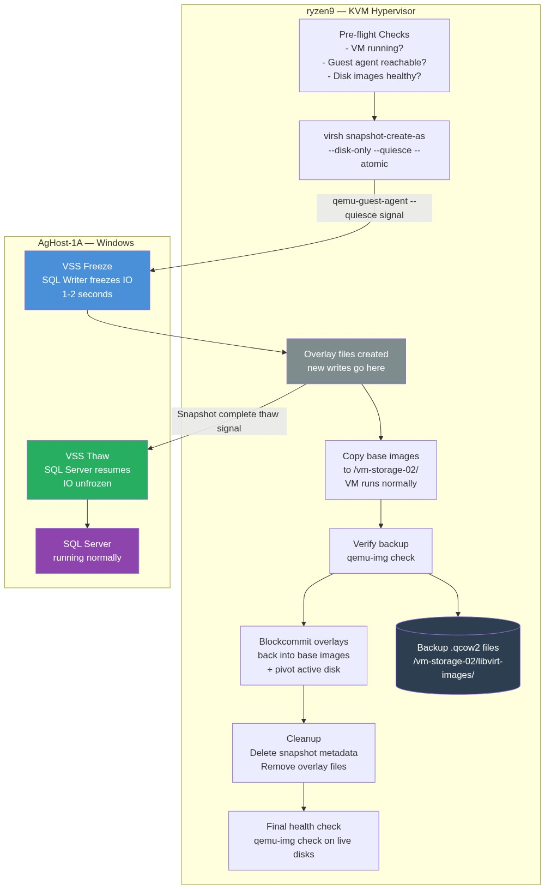
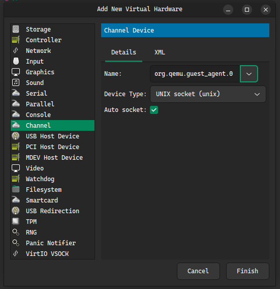

# VSS Snapshot Backup of SQL Server on KVM
- [BrentOzar - The Perils Of VSS Snaps](https://www.brentozar.com/archive/2018/01/perils-vss-snaps/)
- [A Guide for SQL Server Backup Application Vendors](https://learn.microsoft.com/en-us/previous-versions/sql/sql-server-2005/administrator/cc966520(v=technet.10)?redirectedfrom=MSDN)
- [SQL Server backup applications - Volume Shadow Copy Service (VSS) and SQL Writer](https://learn.microsoft.com/en-us/sql/relational-databases/backup-restore/sql-server-vss-writer-backup-guide?view=sql-server-ver17)

## Overview

This guide walks through performing a **VSS (Volume Shadow Copy Service)** snapshot backup of a SQL Server instance running inside a Windows Server virtual machine (`AgHost-1A`) hosted on a KVM hypervisor (`ryzen9` — Ubuntu Desktop).

### Architecture

```
ryzen9 (Ubuntu Desktop - KVM Hypervisor)
  ├── AgHost-1A  (Windows Server VM — SQL Server)
  │     ├── vda → C:\ (OS drive)
  │     ├── vdb → D:\ (SQL data files)
  │     └── vdc → E:\ (SQL log files + backups)
  └── /vm-storage-02/libvirt-images/  (Backup destination)
```

### End-to-End Flow



> **SQL Server freeze window is ~1–2 seconds** regardless of disk size.
> The copy and blockcommit phases happen entirely while the VM runs normally.

### How VSS Works with KVM

1. The KVM guest agent (`qemu-guest-agent`) signals Windows inside the VM.
2. Windows VSS freezes SQL Server I/O (via the SQL Writer VSS provider).
3. KVM takes a consistent disk snapshot (external snapshot).
4. VSS thaws SQL Server I/O — normal operations resume.
5. The snapshot can be mounted, backed up, or exported from the host.

### Snapshot vs. Backup — What Is Actually Fast?

> ⚠️ **Common misconception:** "Snapshot backup is fast."
>
> The **snapshot creation is instant** (~1–2 seconds). The **data copy is not** — and the
> two are separate phases. Understanding this distinction is critical.

| Phase | Duration | SQL Server state |
|---|---|---|
| VSS freeze | ~milliseconds | ❄️ I/O suspended |
| Overlay file creation (the actual snapshot) | ~1 second | ❄️ I/O suspended |
| VSS thaw — SQL Server resumes | ~milliseconds | ✅ Fully online |
| Copy base images to backup destination | **Minutes to hours** (proportional to disk size) | ✅ Fully online |
| Blockcommit + cleanup | 1–2 minutes | ✅ Fully online |

The copy phase for AgHost-1A (112G across 3 disks, spinning disk at ~75 MB/s):

| Drive | Size | Copy time (Run 3) |
|---|---|---|
| C (`vda`) | 37 G | ~8 min |
| D (`vdb`) | 18 G | ~4 min |
| E (`vdc`) | 57 G | ~14 min |
| **Total** | **112 G** | **~28 min total** |

**SQL Server was frozen for ~1–2 seconds.** The remaining 26+ minutes the VM ran
normally and served queries while the copy happened in the background on the host.

The copy speed depends entirely on storage throughput:

| Storage type | Expected throughput | 112G copy time |
|---|---|---|
| Spinning disk (HDD) | ~75–120 MB/s | 15–25 min |
| SSD (SATA) | ~400–500 MB/s | 4–5 min |
| NVMe SSD | ~2,000–3,500 MB/s | < 1 min |
| Network (1 GbE NFS) | ~100–110 MB/s | ~17 min |

### Eliminating the Copy Step — `virsh backup-begin` (Option C)

Instead of snapshot → copy → blockcommit, libvirt 7.2+ can stream directly to the backup
destination with native incremental support:

```bash
# Full backup — streams directly to backup destination, no separate copy step
virsh backup-begin AgHost-1A --backupxml backup-full.xml

# Subsequent runs — only changed blocks since last checkpoint (much faster)
virsh backup-begin AgHost-1A --backupxml backup-incremental.xml \
  --checkpointxml checkpoint.xml
```

> **POC / Learning note — performance impact:**
> A one-time full `virsh backup-begin` backup completes and leaves **no residual performance
> impact** on the VM. The dirty bitmap tracking that enables incremental backups only causes
> overhead when a **checkpoint is kept active** between backup runs.
> For a single POC backup with no further incremental runs planned, simply do not create or
> retain a checkpoint — the VM runs at full speed after the backup completes.

---

## Prerequisites

### On the KVM Host (ryzen9 — Ubuntu)

- KVM/QEMU installed with `libvirt`
- `virsh` available
- Enough disk space for snapshots

```bash
# Verify the VM is recognized and running
virsh list --all | grep AgHost-1A

# Check available disk space on the host (need at least 2x VM disk size free)
sudo mkdir /vm-storage-02/libvirt-images/
sudo ln -s /vm-storage-02/libvirt-images /var/lib/libvirt/images

df -h /var/lib/libvirt/images/
df -h /backup/

# Verify libvirt version supports --quiesce
virsh --version
virt-host-validate
```

Actual output on **ryzen9**:
```
  QEMU: Checking for hardware virtualization                                 : PASS
  QEMU: Checking if device /dev/kvm exists                                   : PASS
  QEMU: Checking if device /dev/kvm is accessible                            : PASS
  QEMU: Checking if device /dev/cpu/0/msr exists                             : PASS
  QEMU: Checking if device /dev/vhost-net exists                             : PASS
  QEMU: Checking if device /dev/net/tun exists                               : PASS
  QEMU: Checking for cgroup 'cpu' controller support                         : PASS
  QEMU: Checking for cgroup 'cpuacct' controller support                     : PASS
  QEMU: Checking for cgroup 'cpuset' controller support                      : PASS
  QEMU: Checking for cgroup 'memory' controller support                      : PASS
  QEMU: Checking for cgroup 'devices' controller support                     : WARN (Enable 'devices' in kernel Kconfig file or mount/enable cgroup controller in your system)
  QEMU: Checking for device assignment IOMMU support                         : PASS
  QEMU: Checking if IOMMU is enabled by kernel                               : PASS
  QEMU: Checking for secure guest support                                    : WARN (Unknown if this platform has Secure Guest support)
   LXC: Checking for cgroup 'devices' controller support                     : FAIL (Enable 'devices' in kernel Kconfig file or mount/enable cgroup controller in your system)
   LXC: Checking for cgroup 'freezer' controller support                     : FAIL (Enable 'freezer' in kernel Kconfig file or mount/enable cgroup controller in your system)
```

#### Interpreting the Results

| Check | Result | Impact on VSS Backup |
|---|---|---|
| Hardware virtualization, `/dev/kvm` | ✅ PASS | Core KVM works — VMs can run |
| IOMMU support + enabled | ✅ PASS | PCI passthrough capable if needed |
| `vhost-net`, `tun` devices | ✅ PASS | VM networking works |
| All QEMU cgroups except `devices` | ✅ PASS | CPU/memory/blkio limits work |
| QEMU cgroup `devices` controller | ⚠️ WARN | Non-critical for VSS backup — only affects device whitelisting within cgroups |
| Secure Guest support | ⚠️ WARN | Only needed for AMD SEV / Intel TDX confidential VMs — not required here |
| LXC cgroup `devices` + `freezer` | ❌ FAIL | **LXC containers only** — has no effect on KVM/QEMU VM operation |

> ✅ **Bottom line:** All WARNs and FAILs are **safe to ignore** for this KVM + Windows Server VSS backup setup.
> The two LXC FAILs are irrelevant since AgHost-1A is a KVM VM, not an LXC container.
> The QEMU WARNs do not affect `--quiesce`, VSS, or snapshot operations in any way.

### On the Windows Server VM (AgHost-1A)

- SQL Server installed and running
- `qemu-guest-agent` installed (enables host↔guest coordination)
- **SQL Server VSS Writer** service running
- Windows VSS service (`VSS`) running

```powershell
# Pre-flight: verify all required services on AgHost-1A (run as Administrator)
# Note: there are TWO QEMU services — both are required for VSS to work correctly
Get-Service -Name 'MSSQLSERVER','SQLWriter','VSS' |
  Select-Object Name, DisplayName, Status, StartType

# Discover all QEMU-related services (the VSS Provider name can vary by installer version)
Get-Service -DisplayName '*QEMU*' | Select-Object Name, DisplayName, Status, StartType
```

> ⚠️ **Two separate QEMU services are involved — both must be present:**
>
> | Service Name | Display Name | Role |
> |---|---|---|
> | `QEMU-GA` | QEMU Guest Agent | Receives the `--quiesce` signal from the KVM host |
> | `QEMU Guest Agent VSS Provider` | QEMU Guest Agent VSS Provider | The actual VSS provider that freezes/thaws writers |
>
> If the **VSS Provider** service is stopped or missing, QEMU-GA receives the quiesce signal
> but cannot coordinate with Windows VSS writers. This causes Event ID `8194` (`Access is denied`)
> errors in the Application event log — even though the snapshot appears to succeed on the host.

Expected output — **five** services, all in correct state:
```
Name          DisplayName                          Status  StartType
----          -----------                          ------  ---------
MSSQLSERVER   SQL Server (MSSQLSERVER)             Running Automatic
SQLWriter     SQL Server VSS Writer                Running Manual
VSS           Volume Shadow Copy                   Running Manual
QEMU-GA       QEMU Guest Agent                     Running Automatic
              QEMU Guest Agent VSS Provider        Stopped Manual
```

> The VSS Provider service has `StartType = Manual` by design — Windows VSS starts it
> on demand at the beginning of a backup and stops it when done. `Stopped` at rest is normal.
> The problem occurs when it **fails to start** during a VSS operation.

---

## Step 1 — Install & Verify qemu-guest-agent on AgHost-1A

The guest agent is critical — without it, KVM cannot signal VSS before snapshotting.

### 1.1 Download the Guest Agent on AgHost-1A

On the Windows VM, download the VirtIO drivers ISO which includes the guest agent:

```
https://fedorapeople.org/groups/virt/virtio-win/direct-downloads/stable-virtio/virtio-win.iso
```

Or install via the bundled installer if already mounted:

```
F:\guest-agent\qemu-ga-x86_64.msi
```

### 1.2 Install and Start Both QEMU Services

```powershell
# Run in PowerShell on AgHost-1A (as Administrator)
Start-Service QEMU-GA
Set-Service -Name QEMU-GA -StartupType Automatic

# Find and verify the VSS Provider service (name varies by installer version)
Get-Service -DisplayName '*QEMU*' | Select-Object Name, DisplayName, Status, StartType
```

> ⚠️ **If the QEMU Guest Agent VSS Provider service is missing entirely**, it means the VSS
> Provider component was not installed alongside QEMU-GA. Install it separately:
>
> ```
> # On AgHost-1A — locate and run the VSS Provider installer from the VirtIO ISO
> F:\guest-agent\qemu-vss-x86_64.msi
> ```
>
> After installation, verify both services appear:
> ```powershell
> Get-Service -DisplayName '*QEMU*' | Select-Object Name, DisplayName, Status, StartType
> ```
>
> The VSS Provider service should have `StartType = Manual` — this is correct.
> It is started on demand by the Windows VSS subsystem at backup time and stops when done.
> **Do not set it to Automatic** — that can cause conflicts with VSS orchestration.

```powershell
# Start the main guest agent

& "C:\Program Files\qemu-ga\qemu-ga.exe" -d

PS C:\Users\adwivedi> & "C:\Program Files\qemu-ga\qemu-ga.exe" -d
1775924364.470023: critical: error opening path
1775924364.470023: critical: error opening channel
1775924364.470023: critical: failed to create guest agent channel
1775924364.471060: critical: failed to initialize guest agent channel
```

> ⚠️ **If `Start-Service QEMU-GA` fails** with *"Cannot start service QEMU-GA"* and running
> `qemu-ga.exe -d` shows:
> ```
> critical: error opening path
> critical: error opening channel
> critical: failed to create guest agent channel
> critical: failed to initialize guest agent channel
> ```
> This means the **VirtIO serial port device is not present in the VM's hardware config on ryzen9**.
> The guest agent has nothing to connect to. Fix this in **Step 1.2a and 1.2b** below before retrying.

### 1.2a Fix — Add the VirtIO Serial Channel Device on ryzen9 (KVM Host)

The guest agent communicates over a special `virtio-serial` channel. It must be defined in the VM's XML. This is done **on ryzen9 while the VM is shut down**.

```bash
# On ryzen9 — shut down the VM cleanly first
virsh shutdown AgHost-1A

# Wait for it to stop
virsh domstate AgHost-1A   # repeat until output is "shut off"
```

```bash
# Open the VM XML editor
virsh edit AgHost-1A
```

First, check whether the `virtio-serial` controller already exists in the VM XML:

```bash
virsh dumpxml AgHost-1A | grep -A2 'virtio-serial'
```

**Case A — Controller is missing** (nothing returned): add both blocks below.

**Case B — Controller already exists** (e.g. `virt-manager` shows *Controller VirtIO Serial 0* in the left panel): add **only the `<channel>` block** — the controller is already there.

> On AgHost-1A, the controller is already present with `bus="0x03" slot="0x00"`.
> Only the `<channel>` entry is missing — that is what `qemu-ga.exe` actually tries to open.

```xml
<!-- Add ONLY if controller is missing -->
<controller type='virtio-serial' index='0'>
  <address type='pci' domain='0x0000' bus='0x03' slot='0x00' function='0x0'/>
</controller>

<!-- Always add this — this is the pipe qemu-ga.exe opens -->
<channel type='unix'>
  <target type='virtio' name='org.qemu.guest_agent.0'/>
  <address type='virtio-serial' controller='0' bus='0' port='2'/>
</channel>
```



> **Port numbering:** Port `1` on `controller='0'` is already occupied by the `Channel (spice)` device
> (visible in virt-manager as *Channel (spice)* in the left panel). Use `port='2'` for the guest agent channel.
> If port 2 is also occupied, increment to `port='3'`, etc.
>
> The `<address>` values (`controller='0' bus='0' port='2'`) are VirtIO serial port coordinates —
> they do **not** need to match the PCI address of the controller above.

Save and exit the editor (`:wq` in vi). Then start the VM:

```bash
virsh start AgHost-1A
```

### 1.2b Fix — Install the VirtIO Serial Driver on AgHost-1A (Windows)

The channel device on the host is now present, but Windows also needs the **VirtIO serial (`vioserial`) driver** to expose it as `\\.\Global\org.qemu.guest_agent.0`.

#### ✅ Check If the Driver Is Already Installed (Run First)

```powershell
# Check 1 — Most definitive: does the guest agent channel device exist?
# Run as Administrator for accurate results.
# Note: Test-Path on device paths returns "Access is denied" + False even when the
# device EXISTS if run without elevation. Use the try/catch below instead.
$devicePath = '\\.\Global\org.qemu.guest_agent.0'
try {
    $stream = [System.IO.File]::Open($devicePath, 'Open', 'Read', 'ReadWrite')
    $stream.Close()
    Write-Host "✅ Device EXISTS and is accessible — driver installed, channel present"
} catch [System.UnauthorizedAccessException] {
    Write-Host "✅ Device EXISTS — 'Access is denied' confirms the path is present (run as Admin to access)"
} catch [System.IO.FileNotFoundException] {
    Write-Host "❌ Device NOT FOUND — driver missing or channel XML not configured on host"
} catch {
    Write-Host "❌ Device NOT FOUND — $($_.Exception.Message)"
}

# Check 2 — Is the VirtIO Serial driver loaded?
Get-PnpDevice | Where-Object { $_.FriendlyName -match 'VirtIO' } |
  Select-Object Status, Class, FriendlyName

# Check 3 — Any unrecognised devices needing a driver? (yellow bang in Device Manager)
Get-PnpDevice | Where-Object { $_.Status -eq 'Error' -or $_.Status -eq 'Unknown' } |
  Select-Object Status, Class, FriendlyName, InstanceId
```

> ⚠️ **`Test-Path` is unreliable for device paths** — it returns `Access is denied` + `False`
> even when the device exists. Use the `try/catch` above which distinguishes
> `UnauthorizedAccessException` (device exists) from `FileNotFoundException` (device truly absent).
>
> **`UnauthorizedAccessException` is expected even when running as Administrator.**
> The guest agent pipe (`\\.\Global\org.qemu.guest_agent.0`) is owned by `SYSTEM` and its ACL
> does not grant read access to the Administrator account — only the `QEMU-GA` service itself
> (running as Local System) can open it. The exception still confirms the device is present.

| Result | Meaning | Action |
|---|---|---|
| `UnauthorizedAccessException` caught (any user level) | ✅ Device exists — driver installed, channel present | Skip installation — proceed to Step 1.3 |
| No exception, stream opens | ✅ Device exists and fully accessible | Skip installation — proceed to Step 1.3 |
| `FileNotFoundException` caught | ❌ Device missing — driver not installed or channel XML absent | Check 2 & 3, then install driver or revisit Step 1.2a |
| Check 2 shows VirtIO Serial `Status=OK`, device path missing | Driver installed but channel XML missing on host | Go back to Step 1.2a |
| Check 3 shows unknown PCI device | Driver not installed | Proceed with installation below |

#### Actual Output from AgHost-1A — Check 2 (VirtIO devices, after latest drivers)

```
Status   Class        FriendlyName
------   -----        ------------
OK       System       VirtIO Serial Driver              ← ✅ vioserial — Step 1.2b NOT needed
OK       DiskDrive    Red Hat VirtIO SCSI Disk Device
OK       SCSIAdapter  Red Hat VirtIO SCSI controller
OK       Net          Red Hat VirtIO Ethernet Adapter
OK       Net          Red Hat VirtIO Ethernet Adapter #2
OK       System       VirtIO Balloon Driver             ← ✅ resolved after driver update
OK       DiskDrive    Red Hat VirtIO SCSI Disk Device
OK       SCSIAdapter  Red Hat VirtIO SCSI controller
OK       SCSIAdapter  Red Hat VirtIO SCSI controller
OK       DiskDrive    Red Hat VirtIO SCSI Disk Device
Unknown  SCSIAdapter  Red Hat VirtIO SCSI controller    ← ⚠️ one instance still unresolved
Unknown  DiskDrive    Red Hat VirtIO SCSI Disk Device   ← ⚠️ disk on the Unknown controller above
```

> **Balloon Driver and Ethernet Adapter #3 are now resolved** after updating to the latest
> VirtIO driver package. One SCSI controller and its associated disk still show `Unknown`.
>
> **`Unknown` in `Get-PnpDevice` does not always mean a present broken device.**
> `Get-PnpDevice` returns ALL devices Windows has ever seen — including **ghost/phantom devices**
> (non-present hardware from a previous VM configuration or driver installation).
> Device Manager hides these by default, which is why Device Manager shows nothing Unknown
> even when `Get-PnpDevice` does.
>
> Confirm whether an Unknown device is real (present) or a ghost:
> ```powershell
> # Show ONLY currently present Unknown VirtIO devices (excludes ghosts)
> Get-PnpDevice |
>   Where-Object { $_.FriendlyName -match 'VirtIO|Red Hat' -and $_.Status -eq 'Unknown' } |
>   ForEach-Object {
>       $present = (Get-PnpDeviceProperty -InstanceId $_.InstanceId `
>                   -KeyName 'DEVPKEY_Device_IsPresent').Data
>       [PSCustomObject]@{ Status=$_.Status; FriendlyName=$_.FriendlyName; IsPresent=$present }
>   }
> ```
> If `IsPresent = False` → ghost device. No driver action needed.
>
> On **AgHost-1A**, Device Manager shows nothing Unknown and
> `virsh dumpxml AgHost-1A | grep -A5 'controller type=.scsi'` returns empty —
> confirming there are **no VirtIO SCSI controllers** in the VM XML at all.
> The disks (`vda/vdb/vdc`) use `virtio-blk` bus directly, not `virtio-scsi`.
> All Unknown SCSI controller entries in `Get-PnpDevice` were ghost devices — harmless remnants.
>
> | `Get-PnpDevice` Status | Device Manager | Meaning | Action |
> |---|---|---|---|
> | `Unknown` | ⚠️ Yellow bang visible | Real present device, driver missing | Install driver |
> | `Unknown` | ✅ Nothing shown | Ghost/phantom device | None — harmless remnant |
> | `OK` | ✅ Listed normally | Driver loaded, device working | None |
>
> **To remove ghost devices (optional housekeeping):**
> ```powershell
> # Show all hidden/non-present devices in Device Manager
> # Run in an elevated cmd prompt, then open devmgmt.msc
> $env:DEVMGR_SHOW_NONPRESENT_DEVICES = 1
> devmgmt.msc
> # In Device Manager: View → Show hidden devices
> # Right-click any greyed-out ghost device → Uninstall device
> ```

**Step 1 — Install the full VirtIO driver package and reboot:**

```powershell
# On AgHost-1A — silent install of all VirtIO drivers at once (adjust drive letter)
F:\virtio-win-gt-x64.msi /quiet /norestart
Restart-Computer
```

**Step 2 — Understand why one controller is OK and the other is Unknown**

Both controllers are the same device type (`Red Hat VirtIO SCSI controller`) yet one has a
driver and one does not. This happens because QEMU assigns each controller a unique PCI
address and potentially a different **PCI Subsystem ID** depending on when and how it was
added to the VM.

Windows driver INF files match devices using their full Hardware ID string:
```
PCI\VEN_1AF4&DEV_1048&SUBSYS_11001AF4&REV_01    ← Vendor, Device, Subsystem, Revision
```

Two controllers of the same "type" can have different `DEV_` or `SUBSYS_` values if:

| Cause | Example |
|---|---|
| Controllers added at different times with different QEMU versions | `DEV_1004` (legacy) vs `DEV_1048` (modern) |
| Transitional vs. non-transitional VirtIO model in VM XML | `virtio-scsi-pci` vs `virtio-scsi-pci-non-transitional` |
| Different QEMU machine types (`pc` vs `q35`) for each controller slot | Different SUBSYS values |

The installed `vioscsi.inf` contains a fixed list of Hardware IDs it supports.
The OK controller's ID is in that list — the Unknown controller's ID is not.

Compare the Hardware IDs of both controllers to confirm:

```powershell
# Compare Hardware IDs of OK vs Unknown SCSI controllers side by side
Get-PnpDevice |
  Where-Object { $_.FriendlyName -match 'VirtIO SCSI controller|Red Hat VirtIO SCSI' } |
  ForEach-Object {
      $hwids = (Get-PnpDeviceProperty -InstanceId $_.InstanceId `
                -KeyName 'DEVPKEY_Device_HardwareIds').Data
      [PSCustomObject]@{
          Status      = $_.Status
          FriendlyName= $_.FriendlyName
          InstanceId  = $_.InstanceId
          HardwareIds = $hwids -join ' | '
      }
  } | Sort-Object Status | Format-List
```

The output will show a `DEV_` or `SUBSYS_` difference between the OK and Unknown entries —
that is the exact mismatch preventing the driver from binding.

**Fix Option A — Force-install the driver from Windows side (Device Manager)**

This bypasses Hardware ID matching and directly assigns `vioscsi` to the Unknown controller:

```
1. Open Device Manager (devmgmt.msc)
2. Find the Unknown SCSI controller (yellow bang icon)
3. Right-click → Update driver
4. Choose: Browse my computer for drivers
5. Choose: Let me pick from a list of available drivers on my computer
6. Click: Have Disk → Browse → navigate to F:\vioscsi\2k22\amd64\
7. Select vioscsi.inf → OK → select "Red Hat VirtIO SCSI controller" → Next
8. Accept the warning about driver compatibility → Install
```

Or via PowerShell (get the InstanceId from Step 2 output above):

```powershell
# Replace <InstanceId> with the Unknown controller's InstanceId from the query above
pnputil /add-driver "F:\vioscsi\2k22\amd64\vioscsi.inf" /install
# Then update the specific device to use the newly staged driver
Update-PnpDeviceDriver -InstanceId "<InstanceId>" -Confirm:$false
```

**Fix Option B — Standardise the controller model on ryzen9 (KVM host side)**

The cleanest long-term fix is to make all SCSI controllers use the same QEMU device model
so they all get the same Hardware ID. Do this on **ryzen9 with the VM shut down**:

```bash
# On ryzen9 — shut down the VM first
virsh shutdown AgHost-1A

# Check what controller models are currently defined
virsh dumpxml AgHost-1A | grep -A5 'controller type=.scsi'
```

Look for inconsistencies like:
```xml
<controller type='scsi' model='virtio-scsi'>   ← one controller
<controller type='scsi' model='lsilogic'>       ← different model on another
```

Edit to make all SCSI controllers use the same model:
```bash
virsh edit AgHost-1A   # set all scsi controllers to model='virtio-scsi'
virsh start AgHost-1A
```

After the VM boots, re-run the Hardware ID comparison — all controllers should now have
matching `DEV_` and `SUBSYS_` values, and `vioscsi.inf` will bind to all of them.

**Step 3 — Verify all Unknown devices are resolved:**

```powershell
pnputil /scan-devices

Get-PnpDevice |
  Where-Object { $_.FriendlyName -match 'VirtIO|Red Hat' } |
  Select-Object Status, Class, FriendlyName |
  Sort-Object Status, FriendlyName
```

All VirtIO devices should show `Status = OK`.

> Adjust the folder path for your Windows Server version — see the version mapping table above.

#### Actual Output from AgHost-1A — Check 3 (Error/Unknown devices, filtered to QEMU/VirtIO)

```
Status  Class   FriendlyName   InstanceId
------  -----   ------------   ----------
Error           (no name)      ACPI\QEMU0002\3&11583659&0    ← ⚠️ QEMU system device — missing driver
```

> `ACPI\QEMU0002` is the **QEMU system/platform device**. The `virtio-win-gt-x64.msi` may not
> include its driver — install it directly with `pnputil`:
>
> ```powershell
> # On AgHost-1A — install QEMU PCI serial / system device driver
> pnputil /add-driver "F:\qemupciserial\qemupciserial.inf" /install
> ```
>
> If `F:\qemupciserial\` does not exist on the ISO, search for it:
> ```powershell
> Get-ChildItem F:\ -Recurse -Filter "*.inf" | Select-String "QEMU0002" | Select-Object Path
> ```
>
> After installing, verify `ACPI\QEMU0002` no longer shows `Error`:
> ```powershell
> Get-PnpDevice | Where-Object { $_.InstanceId -like 'ACPI\QEMU0002*' } |
>   Select-Object Status, FriendlyName, InstanceId
> ```

**Option A — Install from the VirtIO ISO (recommended)**

Mount the VirtIO ISO in virt-manager or via virsh, then on AgHost-1A:

```
1. Open Device Manager
2. Look for "PCI Simple Communications Controller" with a yellow warning icon
3. Right-click → Update Driver → Browse my computer
4. Navigate to:  F:\vioserial\2k22\amd64\   (adjust for your Windows Server version)
5. Install the driver — the device should now show as "VirtIO Serial Driver"
```

Windows Server version folder mapping:

| Windows Version | Folder |
|---|---|
| Windows Server 2025 | `2k25\amd64` |
| Windows Server 2022 | `2k22\amd64` |
| Windows Server 2019 | `2k19\amd64` |
| Windows Server 2016 | `2k16\amd64` |

**Option B — Silent install from PowerShell on AgHost-1A**

```powershell
# Mount ISO first via virt-manager, then run on AgHost-1A (adjust drive letter)
pnputil /add-driver "F:\vioserial\2k22\amd64\vioserial.inf" /install
```

After the driver installs, retry starting the guest agent:

```powershell
Start-Service QEMU-GA
Get-Service QEMU-GA   # should show: Running
```

### 1.3 ✅ Verify Guest Agent from the Host (ryzen9)

```bash
# On ryzen9 — check guest agent is responding and get version info
virsh qemu-agent-command AgHost-1A '{"execute":"guest-info"}' | python3 -m json.tool
```

Expected: a JSON response with `"version"` and `"supported_commands"` fields.
If the command hangs or returns an error, the guest agent is not running — return to Step 1.2.

```bash
# Also verify guest agent channel exists in the VM config
virsh dumpxml AgHost-1A | grep -A3 'channel'
```

Expected output should include:
```xml
<channel type='unix'>
  ...
  <target type='virtio' name='org.qemu.guest_agent.0'/>
```

---

## Step 2 — Verify SQL Server VSS Writer on AgHost-1A

```powershell
# Run in PowerShell or CMD on AgHost-1A (as Administrator)
vssadmin list writers
```

### ✅ Expected Output — SqlServerWriter Must Be Stable

```
Writer name: 'SqlServerWriter'
   Writer Id: {a65faa63-5ea8-4ebc-9dbd-a0c4db26912a}
   State: [1] Stable
   Last error: No error
```

> ⚠️ **Do not proceed to Step 4 if State is not `[1] Stable`.**
> A failed writer means VSS will not quiesce SQL Server properly.

### Fix — If the SQL Writer Is Missing or in a Failed State

```powershell
# Restart the SQL Server VSS Writer
net stop SQLWriter
net start SQLWriter

# Also restart the base VSS service if needed
net stop VSS
net start VSS

# Re-verify after restart
vssadmin list writers | Select-String -Pattern 'SqlServerWriter' -Context 0,4
```

### ✅ Validate VSS Shadow Copy Provider Is Available

```powershell
# List available VSS providers — Microsoft Software Shadow Copy provider must appear
vssadmin list providers
```

Expected output includes:
```
Provider name: 'Microsoft Software Shadow Copy provider 1.0'
   Provider type: System
   Provider Id: {b5946137-7b9f-4925-af80-51abd60b20d5}
```

---

## Step 3 — Identify the VM Disk on the Host (ryzen9)

```bash
# Find the disk image path used by AgHost-1A
virsh domblklist AgHost-1A --details
```

Example output:
```
 Type   Device   Target   Source
------------------------------------------------------------------
 file   disk     vda      /vm-os/AgHost-1A_C_Drive.qcow2
 file   disk     vdb      /vm-storage-01/AgHost-1A_D_Drive.qcow2
 file   disk     vdc      /vm-storage-01/AgHost-1A_E_Drive.qcow2
```

Note the **Source** path — this is what will be snapshotted.

### ✅ Validate Disk Image Health Before Snapshotting

> ⚠️ **Two common errors when inspecting live VM disk images:**
>
> | Error | Cause | Fix |
> |---|---|---|
> | `Permission denied` | Image owned by `root`/`libvirt-qemu` (mode `0600`) | Prefix with `sudo` |
> | `Failed to get shared "write" lock` | The running VM already holds an exclusive write lock on the image | Add `-U` (`--force-share`) flag |
>
> Diagnose ownership first:
> ```bash
> ls -la /vm-os/AgHost-1A_C_Drive.qcow2
> ls -la /vm-storage-01/AgHost-1A_D_Drive.qcow2
> ls -la /vm-storage-01/AgHost-1A_E_Drive.qcow2
> ```
> You will typically see files owned by `root:root` or `libvirt-qemu:kvm` with mode `0600`.
>
> Always use **`sudo qemu-img -U`** when inspecting **live** disk images (VM is running).
> Use **`sudo qemu-img`** (no `-U`) on **backup copies** — nothing else has those open.

```bash
# Run for each disk — C, D and E drives
# -U (--force-share) bypasses the write lock held by the running VM
sudo qemu-img info -U /vm-os/AgHost-1A_C_Drive.qcow2
sudo qemu-img info -U /vm-storage-01/AgHost-1A_D_Drive.qcow2
sudo qemu-img info -U /vm-storage-01/AgHost-1A_E_Drive.qcow2

sudo qemu-img check -U /vm-os/AgHost-1A_C_Drive.qcow2
sudo qemu-img check -U /vm-storage-01/AgHost-1A_D_Drive.qcow2
sudo qemu-img check -U /vm-storage-01/AgHost-1A_E_Drive.qcow2
```

Expected `qemu-img info` output for each disk:
```
image: /vm-storage-01/AgHost-1A_E_Drive.qcow2
file format: qcow2
virtual size: 200 GiB (214748364800 bytes)
disk size: 56.3 GiB
cluster_size: 65536
Format specific information:
    compat: 1.1
    compression type: zlib
    lazy refcounts: true
    refcount bits: 16
    corrupt: false
    extended l2: false
Child node '/file':
    filename: /vm-storage-01/AgHost-1A_E_Drive.qcow2
    protocol type: file
    file length: 200 GiB (214781394944 bytes)
    disk size: 56.3 GiB
```

Expected `qemu-img check` output:
```
No errors were found on the image.
```

---

## Step 4 — Create a VSS-Consistent External Snapshot from ryzen9

This is the key step. `virsh snapshot-create-as` with `--quiesce` tells `qemu-guest-agent`
to trigger a VSS freeze inside Windows before taking the snapshot.

```bash
# On ryzen9 — create a quiesced (VSS-consistent) external snapshot
virsh snapshot-create-as AgHost-1A \
  --name "AgHost-1A-vss-$(date +%Y%m%d-%H%M%S)" \
  --description "VSS-consistent SQL Server snapshot" \
  --disk-only \
  --quiesce \
  --atomic
```

### Parameter Explanation

| Parameter | Purpose |
|---|---|
| `--disk-only` | Creates an external snapshot (overlay file), not a full VM state snapshot |
| `--quiesce` | Signals guest agent to freeze I/O via VSS before snapping |
| `--atomic` | Rolls back all disks if any one snapshot fails |

### ✅ Verify the Snapshot Was Created

```bash
# Confirm snapshot appears in the list
virsh snapshot-list AgHost-1A

# Confirm active disk is now the overlay (not the original qcow2)
virsh domblklist AgHost-1A --details
```

Expected — `virsh snapshot-list` output:
```
 Name                            Creation Time               State
----------------------------------------------------------------------------
 AgHost-1A-vss-20260412-104104   2026-04-12 10:41:04 +0530   disk-snapshot
```

Expected — `virsh domblklist` Source column now points to **overlay files** for all three disks.
Note the overlay naming convention: `<original_filename>.<snapshot-name>` — **no `.qcow2` extension**:
```
 Type   Device   Target   Source
------------------------------------------------------------------------------------------
 file   disk     vda      /vm-os/AgHost-1A_C_Drive.AgHost-1A-vss-20260412-104104
 file   disk     vdb      /vm-storage-01/AgHost-1A_D_Drive.AgHost-1A-vss-20260412-104104
 file   disk     vdc      /vm-storage-01/AgHost-1A_E_Drive.AgHost-1A-vss-20260412-104104
 file   cdrom    sda      -
```

> The base images (original `.qcow2` files) are now **frozen at the point of the snapshot** —
> all new writes from the running VM go into the overlay files.
> This is what makes the base images safe to back up.

```bash
# Verify each overlay has a backing file pointing back to its base image
# -U needed — VM is running and holds write lock on the overlay files too
SNAP_NAME="AgHost-1A-vss-20260412-104104"   # replace with actual snapshot name

sudo qemu-img info -U "/vm-os/AgHost-1A_C_Drive.${SNAP_NAME}"
sudo qemu-img info -U "/vm-storage-01/AgHost-1A_D_Drive.${SNAP_NAME}"
sudo qemu-img info -U "/vm-storage-01/AgHost-1A_E_Drive.${SNAP_NAME}"
```

Expected `qemu-img info` output for each overlay — confirms the backing chain:
```
image: /vm-storage-01/AgHost-1A_E_Drive.AgHost-1A-vss-20260411-225012
file format: qcow2
backing file: /vm-storage-01/AgHost-1A_E_Drive.qcow2
backing file format: qcow2
```

### ✅ Verify VSS Freeze/Thaw Events in Windows Event Log

Immediately after the snapshot, check Windows Event Viewer on `AgHost-1A` to confirm VSS completed cleanly:

```powershell
# On AgHost-1A — check Application event log for VSS events around snapshot time
Get-WinEvent -LogName Application -MaxEvents 50 |
  Where-Object { $_.ProviderName -match 'VSS|SQLWriter|SQLWRITER' } |
  Select-Object TimeCreated, Id, LevelDisplayName, Message |
  Format-List
```

#### VSS Event ID Reference

| Event ID | Level | Meaning |
|---|---|---|
| `8224` | Information | VSS service shut down due to idle timeout — **normal**, not a problem |
| `8229` | Information | A VSS writer successfully completed a backup |
| `8230` | Information | Freeze and thaw completed cleanly |
| `8194` | **Error** | VSS writer callback failed — writer did **not** quiesce cleanly |
| `24583` | Information | SQL Server database was successfully quiesced by SqlServerWriter |

#### Actual Output from AgHost-1A — Snapshot `AgHost-1A-vss-20260412-104104`

```
TimeCreated      : 4/12/2026 10:41:08 AM
Id               : 8194
LevelDisplayName : Error
Message          : Volume Shadow Copy Service error: Unexpected error querying for the
                   IVssWriterCallback interface.  hr = 0x80070005, Access is denied.
                   This is often caused by incorrect security settings in either the
                   writer or requestor process.
                   Operation:      Gathering Writer Data
                   Writer Name:    System Writer
                   Writer Class Id:{e8132975-6f93-4464-a53e-1050253ae220}

TimeCreated      : 4/12/2026 10:41:03 AM
Id               : 8194
LevelDisplayName : Error
Message          : (same as above — System Writer)

TimeCreated      : 4/12/2026 10:32:01 AM
Id               : 8224
LevelDisplayName : Information
Message          : The VSS service is shutting down due to idle timeout.
```

> The error persists across snapshots. The QEMU Guest Agent VSS Provider is either
> not installed, not registered with VSS, or not starting when VSS initiates the backup.
> Run the diagnostic steps below to identify exactly which stage is failing.

#### Interpreting This Output

| Observation | Meaning |
|---|---|
| Event ID `8194` on **System Writer** | The System Writer (OS files, registry) failed to quiesce — `Access is denied` (0x80070005) |
| **No SqlServerWriter events** | SqlServerWriter did not log any events — either it succeeded silently or was skipped |
| Event ID `8224` | Normal VSS idle timeout — not related to the backup |

> ⚠️ **The System Writer `Access is denied` error** means the QEMU guest agent process did not have
> DCOM permission to call back into the System Writer. This is a security configuration issue.
> The snapshot disk state may be **crash-consistent but not fully application-consistent** for OS-level components.
>
> **SqlServerWriter absence from the log is ambiguous.** Confirm its actual state immediately:
> ```powershell
> vssadmin list writers | Select-String -Pattern 'SqlServerWriter' -Context 0,4
> ```
> If it shows `State: [1] Stable` and `Last error: No error`, SQL Server data files are consistent.
> If it shows a failed state, **do not use this backup for SQL Server recovery**.

#### Fix — System Writer `Access is denied` (Event ID 8194, hr=0x80070005)

> On **AgHost-1A**, `QEMU-GA` already runs as **Local System** — that is correct.
> The actual cause was the **QEMU Guest Agent VSS Provider** service being in a stopped/failed state.
> The VSS Provider is what bridges QEMU-GA to the Windows VSS writer framework. Without it,
> VSS writers (including System Writer and SqlServerWriter) cannot be properly quiesced.

**Fix — Ensure the QEMU Guest Agent VSS Provider is installed and startable**

```powershell
# On AgHost-1A (as Administrator) — find the VSS Provider service
Get-Service -DisplayName '*QEMU*' | Select-Object Name, DisplayName, Status, StartType

# If the VSS Provider service exists but is stopped, try starting it manually to test
# (normally VSS starts it on demand — this is just to verify it can start)
$vssProv = Get-Service -DisplayName '*QEMU*VSS*' -ErrorAction SilentlyContinue
if ($vssProv) {
    Start-Service $vssProv.Name
    Get-Service $vssProv.Name
} else {
    Write-Host "VSS Provider service not found — install qemu-vss-x86_64.msi from VirtIO ISO"
}
```

> The VSS Provider service **start type must remain Manual** — do not change it to Automatic.
> VSS starts it at the beginning of each backup operation and stops it afterwards.
> Setting it to Automatic can interfere with VSS orchestration.

**If the VSS Provider service is missing entirely** — install it from the VirtIO ISO:

```
F:\guest-agent\qemu-vss-x86_64.msi
```

After installation, verify registration with the Windows VSS subsystem:

```powershell
# The QEMU VSS Provider should appear in the provider list
vssadmin list providers
```

Expected — QEMU VSS Provider appears alongside the Microsoft built-in provider:
```
Provider name: 'QEMU Guest Agent VSS Provider'
   Provider type: Software
   Provider Id: {<guid>}
```

#### Diagnostic — Actual State of AgHost-1A (Verified Live)

```
QEMU Services:
  QEMU Guest Agent              Status: Running   StartType: Automatic  ✅
  QEMU Guest Agent VSS Provider Status: Stopped   StartType: Manual     ✅ (correct at rest)

vssadmin list providers:
  Provider name: 'QEMU Guest Agent VSS Provider'
     Provider type: Software
     Provider Id:   {3629d4ed-ee09-4e0e-9a5c-6d8ba2872aef}
     Version:       110.0.2                                             ✅ registered

vssadmin list writers (at rest — all Stable):
  SqlServerWriter   State: [1] Stable   Last error: No error            ✅
  System Writer     State: [1] Stable   Last error: No error            ✅
  (all other writers also Stable)
```

> **Key finding:** The QEMU Guest Agent VSS Provider IS installed, IS registered with VSS,
> and all writers are Stable at rest. The Event ID 8194 error on System Writer happens only
> **during** the snapshot — not before or after.
>
> This is a **DCOM callback timing issue**: when the QEMU VSS Provider initiates the VSS
> backup, the System Writer tries to call back to the provider process via `IVssWriterCallback`.
> That callback fails with `Access is denied` (0x80070005). The provider process is not
> accepting inbound COM callbacks from the System Writer's host process (`svchost.exe`).
>
> **Critically — SqlServerWriter is NOT affected.** It shows Stable before and after the
> snapshot with no error. SQL Server data files are application-consistent in the snapshot.
> The System Writer failure only affects OS-level components (registry, system files, COM+ catalog)
> which are not needed for SQL Server backup and restore.

#### Impact Assessment

| Writer | Status | Data covered | Impact on SQL Server backup |
|---|---|---|---|
| `SqlServerWriter` | ✅ Stable | SQL Server `.mdf`/`.ldf` files | ✅ None — SQL data is consistent |
| `System Writer` | ❌ Fails during backup | OS files, registry, COM+ catalog | ⚠️ OS-level files not quiesced — irrelevant for SQL Server recovery |

> For **SQL Server backup and restore practice**, the current snapshot is usable.
> The System Writer error would matter for a full bare-metal OS restore, not for database recovery.

#### Fix — DCOM Callback Issue with QEMU VSS Provider (version 110.0.2)

The QEMU VSS Provider (v110.0.2) does not properly configure its COM security to accept
inbound callbacks from system service processes. This is a known limitation in older
QEMU guest agent builds.

**Fix A — Update QEMU Guest Agent to latest version (recommended)**

```powershell
# On AgHost-1A — check current version
Get-ItemProperty 'HKLM:\SOFTWARE\Microsoft\Windows\CurrentVersion\Uninstall\*' |
  Where-Object { $_.DisplayName -match 'QEMU' } |
  Select-Object DisplayName, DisplayVersion
```

Download the latest VirtIO ISO from:
```
https://fedorapeople.org/groups/virt/virtio-win/direct-downloads/stable-virtio/virtio-win.iso
```
Then reinstall: `F:\guest-agent\qemu-ga-x86_64.msi` and `F:\guest-agent\qemu-vss-x86_64.msi`

**Fix B — Grant DCOM callback rights (if update is not possible)**

```
1. Run dcomcnfg on AgHost-1A
2. Navigate: Component Services → Computers → My Computer → Properties
3. Tab: COM Security → Access Permissions → Edit Limits
4. Add: SYSTEM, LOCAL SERVICE, NETWORK SERVICE → grant Local + Remote Access
5. Tab: COM Security → Launch and Activation Permissions → Edit Limits
6. Add: SYSTEM → grant all four permissions
7. OK → restart QEMU-GA service
```

**After applying the fix — re-validate:**

```powershell
# Delete the current snapshot, take a fresh one from ryzen9, then re-check the event log
Get-WinEvent -LogName Application -MaxEvents 20 |
  Where-Object { $_.ProviderName -match 'VSS|SQLWriter' -and
                 $_.TimeCreated -gt (Get-Date).AddMinutes(-5) } |
  Select-Object TimeCreated, Id, LevelDisplayName, Message |
  Format-List
```

A clean run should show **no Event ID 8194 errors** and ideally Event IDs `8229`/`8230`.

> ⚠️ **Do not proceed to Step 5 (backup copy) until the System Writer error is resolved.**
> The current snapshot `AgHost-1A-vss-20260412-104104` should be considered **not fully
> application-consistent**. Delete it, resolve the VSS Provider issue, and retake the snapshot.

---

## Step 4A — Selective Drive Snapshot (SQL Server Drives Only)

By default, `virsh snapshot-create-as` snapshots **all disks** attached to the VM.
For SQL Server, the OS drive (`vda` → `C:\`) rarely changes and is expensive to copy.
You can exclude it and snapshot only the SQL data and log drives.

### Drive Layout for AgHost-1A

| virsh target | Windows drive | Contents | Include in backup? |
|---|---|---|---|
| `vda` | `C:\` | Windows OS, SQL binaries | ❌ No — OS drive, rarely needed |
| `vdb` | `D:\` | SQL Server data files (`.mdf`, `.ndf`) | ✅ Yes |
| `vdc` | `E:\` | SQL Server log files (`.ldf`) + native `.bak`/`.trn` backups | ✅ Yes |

### How to Exclude a Disk — `--diskspec` with `snapshot=no`

Pass a `--diskspec` entry for every disk. Set `snapshot=no` for disks to skip:

```bash
SNAP_NAME="AgHost-1A-sql-$(date +%Y%m%d-%H%M%S)"

virsh snapshot-create-as AgHost-1A \
  --name "$SNAP_NAME" \
  --description "SQL-drives-only VSS snapshot" \
  --diskspec vda,snapshot=no \
  --diskspec vdb,snapshot=external \
  --diskspec vdc,snapshot=external \
  --disk-only --quiesce --atomic
```

> `--atomic` ensures that if the `vdb` or `vdc` snapshot fails, everything rolls back cleanly.
> `snapshot=no` on `vda` tells libvirt to leave the C drive untouched — no overlay is created for it.

### ✅ Verify Only SQL Drives Were Snapshotted

```bash
# Active disks — vda should still point to original .qcow2, vdb/vdc to overlays
virsh domblklist AgHost-1A --details
```

Expected output — `vda` unchanged, `vdb` and `vdc` now point to overlays:
```
 Type   Device   Target   Source
------------------------------------------------------------------------------------------
 file   disk     vda      /vm-os/AgHost-1A_C_Drive.qcow2                     ← unchanged
 file   disk     vdb      /vm-storage-01/AgHost-1A_D_Drive.AgHost-1A-sql-... ← overlay
 file   disk     vdc      /vm-storage-01/AgHost-1A_E_Drive.AgHost-1A-sql-... ← overlay
 file   cdrom    sda      -
```

```bash
# Verify overlay backing files
OVL_D=$(virsh domblklist AgHost-1A | awk '/vdb/ {print $2}')
OVL_E=$(virsh domblklist AgHost-1A | awk '/vdc/ {print $2}')

sudo qemu-img info -U "$OVL_D" | grep -E 'backing file:|disk size'
sudo qemu-img info -U "$OVL_E" | grep -E 'backing file:|disk size'
```

Expected — each overlay lists the original `.qcow2` as backing file:
```
disk size: 328 KiB
backing file: /vm-storage-01/AgHost-1A_D_Drive.qcow2
disk size: 2.51 MiB
backing file: /vm-storage-01/AgHost-1A_E_Drive.qcow2
```

### Copy, Verify, and Commit — SQL Drives Only

```bash
BACKUP_DIR="/vm-storage-02/libvirt-images"
IMG_D="/vm-storage-01/AgHost-1A_D_Drive.qcow2"
IMG_E="/vm-storage-01/AgHost-1A_E_Drive.qcow2"

# Copy only D and E base images (C skipped — saves ~37G and ~8 minutes)
sudo cp "$IMG_D" "${BACKUP_DIR}/AgHost-1A_D_Drive-${SNAP_NAME}.qcow2"
sudo cp "$IMG_E" "${BACKUP_DIR}/AgHost-1A_E_Drive-${SNAP_NAME}.qcow2"

# Verify
sudo qemu-img check "${BACKUP_DIR}/AgHost-1A_D_Drive-${SNAP_NAME}.qcow2" && echo "D: OK"
sudo qemu-img check "${BACKUP_DIR}/AgHost-1A_E_Drive-${SNAP_NAME}.qcow2" && echo "E: OK"

# Blockcommit overlays back — only vdb and vdc have overlays
virsh blockcommit AgHost-1A vdb --active --verbose --pivot
virsh blockcommit AgHost-1A vdc --active --verbose --pivot

# Cleanup
virsh snapshot-delete AgHost-1A --snapshotname "$SNAP_NAME" --metadata
sudo rm -f "$OVL_D" "$OVL_E"
```

### Comparison: Full vs. SQL-Only Snapshot

| Aspect | All drives (vda+vdb+vdc) | SQL drives only (vdb+vdc) |
|---|---|---|
| Data copied | ~112G (37+18+57) | ~75G (18+57) |
| Copy time (HDD) | ~28 min | ~18 min |
| OS recovery | ✅ Possible from backup | ❌ Not possible |
| SQL recovery | ✅ Yes | ✅ Yes |
| Space saved per run | — | ~37G |
| Use case | Full DR | SQL data recovery / log shipping practice |

> **Recommendation for POC/practice:** Use SQL-drives-only (`vdb`+`vdc`).
> Add `vda` only when you need full OS + application recovery from a single backup set.

---

## Step 5 — Back Up the Snapshot Data (ryzen9)

Now that a consistent snapshot exists, the **original base disk** (before the overlay) holds
a point-in-time consistent image of SQL Server. Back it up:

```bash
SNAP_DATE=$(date +%Y%m%d-%H%M%S)
BACKUP_DIR="/backup/AgHost-1A"
mkdir -p "$BACKUP_DIR"

# Back up all three disks — C, D and E drives
# sudo cp is needed because the source files are owned by root/libvirt-qemu
sudo cp /vm-os/AgHost-1A_C_Drive.qcow2        "$BACKUP_DIR/AgHost-1A_C_Drive-$SNAP_DATE.qcow2"
sudo cp /vm-storage-01/AgHost-1A_D_Drive.qcow2 "$BACKUP_DIR/AgHost-1A_D_Drive-$SNAP_DATE.qcow2"
sudo cp /vm-storage-01/AgHost-1A_E_Drive.qcow2 "$BACKUP_DIR/AgHost-1A_E_Drive-$SNAP_DATE.qcow2"

# Optional: compress (useful for thinly-provisioned images with lots of free space)
sudo qemu-img convert -O qcow2 -c \
  /vm-storage-01/AgHost-1A_E_Drive.qcow2 \
  "$BACKUP_DIR/AgHost-1A_E_Drive-$SNAP_DATE-compressed.qcow2"
```

### ✅ Validate the Backup File Integrity

```bash
# Check all three backup files exist and are non-zero
ls -lh "$BACKUP_DIR/"

# Verify each backup image has no internal corruption
sudo qemu-img check "$BACKUP_DIR/AgHost-1A_C_Drive-$SNAP_DATE.qcow2"
sudo qemu-img check "$BACKUP_DIR/AgHost-1A_D_Drive-$SNAP_DATE.qcow2"
sudo qemu-img check "$BACKUP_DIR/AgHost-1A_E_Drive-$SNAP_DATE.qcow2"
```

Expected output:
```
No errors were found on the image.
Image end offset: XXXXXXX
```

```bash
# Cross-check: backup file size should be close to (or larger than) the source
du -sh /var/lib/libvirt/images/AgHost-1A.qcow2
du -sh "$BACKUP_FILE"
```

---

## Step 6 — Merge (Blockcommit) and Clean Up the Snapshot

After backup, merge the overlay back into the base image so the VM stays healthy.

```bash
# Blockcommit merges the overlay back into the base and pivots the active disk
virsh blockcommit AgHost-1A vda --active --verbose --pivot

# Delete the snapshot metadata
SNAP_NAME="<snapshot-name>"   # use name from Step 4
virsh snapshot-delete AgHost-1A --snapshotname "$SNAP_NAME" --metadata
```

> ⚠️ **Do not** leave the VM running on the overlay file long-term.
> Overlays grow unbounded and are not suitable as permanent disk images.

### ✅ Verify Active Disk Is Back to the Base Image

```bash
# Source must point back to the original .qcow2, not an overlay
virsh domblklist AgHost-1A --details
```

Expected — Source columns revert to the original paths:
```
 Type   Device   Target   Source
------------------------------------------------------------------
 file   disk     vda      /vm-os/AgHost-1A_C_Drive.qcow2
 file   disk     vdb      /vm-storage-01/AgHost-1A_D_Drive.qcow2
 file   disk     vdc      /vm-storage-01/AgHost-1A_E_Drive.qcow2
```

```bash
# Confirm no backing file on any disk (overlay chain fully collapsed on each)
# -U needed — VM is running and holds a write lock on these images
sudo qemu-img info -U /vm-os/AgHost-1A_C_Drive.qcow2        | grep -E 'backing|format|image'
sudo qemu-img info -U /vm-storage-01/AgHost-1A_D_Drive.qcow2 | grep -E 'backing|format|image'
sudo qemu-img info -U /vm-storage-01/AgHost-1A_E_Drive.qcow2 | grep -E 'backing|format|image'
```

Expected for each:
```
image: AgHost-1A_E_Drive.qcow2
file format: qcow2
backing file: <none>       ← overlay fully merged
```

### ✅ Verify SQL Server Is Healthy After Thaw

```powershell
# On AgHost-1A — confirm SQL Server is running and accessible
Invoke-Sqlcmd -Query "SELECT @@SERVERNAME AS ServerName, GETDATE() AS CurrentTime, @@VERSION AS Version"

# Check all databases are ONLINE
Invoke-Sqlcmd -Query "SELECT name, state_desc FROM sys.databases ORDER BY name"
```

All user databases should show `state_desc = ONLINE`. If any show `SUSPECT` or `RECOVERY`, the VSS freeze did not complete cleanly.

---

## Step 7 — Validate Backup Recoverability (Restore Test)

> This is the most important validation step. A backup that cannot be restored is worthless.

### 7.1 Mount the Backup Image on ryzen9

```bash
# Load the NBD module
sudo modprobe nbd max_part=8

# Attach the backup qcow2 as a block device
sudo qemu-nbd --connect=/dev/nbd0 /backup/AgHost-1A/AgHost-1A-base-<date>.qcow2

# List partitions inside the image
sudo fdisk -l /dev/nbd0
```

### 7.2 Mount the Windows Partition Read-Only

```bash
# Windows Server typically places data on partition 3 or 4 — check fdisk output first
sudo mkdir -p /mnt/AgHost-1A-backup
sudo mount -o ro,offset=... /dev/nbd0p3 /mnt/AgHost-1A-backup

# Confirm SQL Server data files are present
ls -lh "/mnt/AgHost-1A-backup/Program Files/Microsoft SQL Server/"
```

### 7.3 ✅ Verify SQL Data File Consistency Using sqlcmd (Optional — Requires Attach)

If you have a separate test SQL Server instance, you can attach the MDF/LDF files directly:

```sql
-- Run on a separate SQL Server test instance
USE master;
GO
CREATE DATABASE [TestRestore]
  ON (FILENAME = 'E:\restored\YourDB.mdf'),
     (FILENAME = 'E:\restored\YourDB_log.ldf')
  FOR ATTACH;
GO

-- Verify data integrity
DBCC CHECKDB('TestRestore') WITH NO_INFOMSGS, ALL_ERRORMSGS;
GO
```

### 7.4 ✅ Clean Up After Restore Test

```bash
# Unmount and disconnect
sudo umount /mnt/AgHost-1A-backup
sudo qemu-nbd --disconnect /dev/nbd0
```

---

## Automation Script (ryzen9)

Save as `/usr/local/bin/AgHost-1A-vss-backup.sh`:

```bash
#!/bin/bash
set -euo pipefail

VM_NAME="AgHost-1A"
BACKUP_DIR="/backup/AgHost-1A"
SNAP_NAME="${VM_NAME}-vss-$(date +%Y%m%d-%H%M%S)"

# All three disks — update paths if they ever change
DISK_C="vda" ; IMG_C="/vm-os/AgHost-1A_C_Drive.qcow2"
DISK_D="vdb" ; IMG_D="/vm-storage-01/AgHost-1A_D_Drive.qcow2"
DISK_E="vdc" ; IMG_E="/vm-storage-01/AgHost-1A_E_Drive.qcow2"

mkdir -p "$BACKUP_DIR"

# --- Pre-flight checks ---
echo "[0/6] Running pre-flight checks..."
virsh domstate "$VM_NAME" | grep -q "running" \
  || { echo "❌ VM is not running. Aborting."; exit 1; }
virsh qemu-agent-command "$VM_NAME" '{"execute":"guest-info"}' > /dev/null 2>&1 \
  || { echo "❌ Guest agent not responding. Aborting."; exit 1; }
# sudo + -U required: images owned by root/libvirt-qemu AND locked by the running VM
sudo qemu-img check -U "$IMG_C" > /dev/null || { echo "❌ C drive image has errors. Aborting."; exit 1; }
sudo qemu-img check -U "$IMG_D" > /dev/null || { echo "❌ D drive image has errors. Aborting."; exit 1; }
sudo qemu-img check -U "$IMG_E" > /dev/null || { echo "❌ E drive image has errors. Aborting."; exit 1; }
echo "✅ Pre-flight passed."

# --- Snapshot (all disks atomically) ---
echo "[1/6] Creating VSS-consistent snapshot: $SNAP_NAME"
virsh snapshot-create-as "$VM_NAME" \
  --name "$SNAP_NAME" \
  --description "Automated VSS SQL Server backup" \
  --disk-only \
  --quiesce \
  --atomic

# Verify overlay files exist for all disks
for DISK in $DISK_C $DISK_D $DISK_E; do
  OVERLAY=$(virsh domblklist "$VM_NAME" | awk "/$DISK/ {print \$2}")
  [[ -f "$OVERLAY" ]] || { echo "❌ Overlay for $DISK not found. Aborting."; exit 1; }
  echo "✅ Overlay for $DISK: $OVERLAY"
done

# --- Backup all base images ---
echo "[2/6] Backing up base images (sudo required)..."
sudo cp "$IMG_C" "$BACKUP_DIR/AgHost-1A_C_Drive-$SNAP_NAME.qcow2"
sudo cp "$IMG_D" "$BACKUP_DIR/AgHost-1A_D_Drive-$SNAP_NAME.qcow2"
sudo cp "$IMG_E" "$BACKUP_DIR/AgHost-1A_E_Drive-$SNAP_NAME.qcow2"

echo "[3/6] Validating backup file integrity..."
sudo qemu-img check "$BACKUP_DIR/AgHost-1A_C_Drive-$SNAP_NAME.qcow2" \
  || { echo "❌ C drive backup check failed!"; exit 1; }
sudo qemu-img check "$BACKUP_DIR/AgHost-1A_D_Drive-$SNAP_NAME.qcow2" \
  || { echo "❌ D drive backup check failed!"; exit 1; }
sudo qemu-img check "$BACKUP_DIR/AgHost-1A_E_Drive-$SNAP_NAME.qcow2" \
  || { echo "❌ E drive backup check failed!"; exit 1; }
echo "✅ All backup files passed integrity check."

# --- Blockcommit all disks ---
echo "[4/6] Merging overlays back into base images..."
virsh blockcommit "$VM_NAME" "$DISK_C" --active --verbose --pivot
virsh blockcommit "$VM_NAME" "$DISK_D" --active --verbose --pivot
virsh blockcommit "$VM_NAME" "$DISK_E" --active --verbose --pivot

# --- Cleanup ---
echo "[5/6] Removing snapshot metadata..."
virsh snapshot-delete "$VM_NAME" --snapshotname "$SNAP_NAME" --metadata

# --- Final validation ---
echo "[6/6] Final base image health checks..."
# -U needed — VM is running again after blockcommit pivot
sudo qemu-img check -U "$IMG_C" || { echo "⚠️  C drive check failed after blockcommit!"; exit 1; }
sudo qemu-img check -U "$IMG_D" || { echo "⚠️  D drive check failed after blockcommit!"; exit 1; }
sudo qemu-img check -U "$IMG_E" || { echo "⚠️  E drive check failed after blockcommit!"; exit 1; }

echo "✅ Backup complete: $BACKUP_DIR/ ($SNAP_NAME)"
```

```bash
chmod +x /usr/local/bin/AgHost-1A-vss-backup.sh
```

Schedule with cron (daily at 2 AM):

```bash
echo "0 2 * * * root /usr/local/bin/AgHost-1A-vss-backup.sh >> /var/log/AgHost-1A-backup.log 2>&1" \
  | sudo tee /etc/cron.d/AgHost-1A-vss-backup
```

---

## Verification & Validation Checklist

Use this as a go/no-go checklist at each stage of the process:

### Before Taking the Snapshot (Pre-flight)
- [ ] `virsh list --all` shows `AgHost-1A` in **running** state
- [ ] `virsh qemu-agent-command AgHost-1A '{"execute":"guest-info"}'` returns a JSON response
- [ ] `Get-Service QEMU-GA` on AgHost-1A shows **Running**
- [ ] `vssadmin list writers` shows `SqlServerWriter` in **Stable** state with **No error**
- [ ] `vssadmin list providers` shows the Microsoft Software Shadow Copy provider
- [ ] `qemu-img check AgHost-1A.qcow2` reports **No errors**
- [ ] Host has sufficient free disk space (`df -h /var/lib/libvirt/images/`)
- [ ] No active overlay/snapshot chain (`qemu-img info` shows no backing file)

### After Taking the Snapshot
- [ ] `virsh snapshot-list AgHost-1A` shows the new snapshot entry
- [ ] `virsh domblklist AgHost-1A` Source column points to an **overlay** file
- [ ] `qemu-img info <overlay>` shows correct **backing file** path
- [ ] Windows Event Viewer on `AgHost-1A` shows VSS events with **no errors** (Event IDs 8229, 8230)
- [ ] SQL Server is accessible after thaw — `SELECT @@SERVERNAME` returns a result
- [ ] All databases show `state_desc = ONLINE` in `sys.databases`

### After Backup Copy
- [ ] Backup file exists and is non-zero: `ls -lh /backup/AgHost-1A/`
- [ ] `qemu-img check <backup.qcow2>` reports **No errors**
- [ ] Backup file size is reasonable compared to the source disk

### After Blockcommit & Cleanup
- [ ] `virsh domblklist AgHost-1A` Source column is back to the **original `.qcow2`**
- [ ] `qemu-img info AgHost-1A.qcow2` shows **no backing file** (overlay fully merged)
- [ ] `qemu-img check AgHost-1A.qcow2` reports **No errors** on the live disk
- [ ] `virsh snapshot-list AgHost-1A` shows no leftover snapshot entries

### Restore Test (Periodic — Recommended Monthly)
- [ ] Backup `.qcow2` mounts successfully via `qemu-nbd`
- [ ] SQL Server `.mdf`/`.ldf` files are visible in the mounted partition
- [ ] `DBCC CHECKDB` on attached databases reports **no corruption**

---

## Troubleshooting

| Problem | Cause | Fix |
|---|---|---|
| `--quiesce` fails with "unsupported" | Guest agent not running | Install/start `QEMU-GA` on AgHost-1A |
| `vssadmin list writers` shows SqlServerWriter as failed | SQL Writer service stopped | `net stop/start SQLWriter` |
| Snapshot created but data inconsistent | VSS freeze timed out | Check Windows Event Viewer → Application log for VSS errors |
| `blockcommit` fails | Overlay disk not found | Run `virsh domblklist AgHost-1A` to confirm overlay path |
| Mount shows NTFS errors | Snapshot taken without quiesce | Repeat with `--quiesce` enabled |
| `qemu-img`: `Permission denied` | Image owned by `root`/`libvirt-qemu` | Use `sudo qemu-img` |
| `qemu-img`: `Failed to get shared "write" lock` | Running VM holds exclusive lock on the image | Add `-U` flag: `sudo qemu-img info -U` / `sudo qemu-img check -U` |
| `qemu-img check` fails on backup | I/O error during copy | Retry copy; check host disk health with `smartctl` |
| Event ID 8194: System Writer `Access is denied` (hr=0x80070005) | **QEMU Guest Agent VSS Provider** service not running — it bridges QEMU-GA to the VSS writer framework | Verify `Get-Service -DisplayName '*QEMU*'`; install `qemu-vss-x86_64.msi` if missing; StartType must be Manual |
| SqlServerWriter absent from event log after snapshot | Writer may have failed silently | Run `vssadmin list writers` immediately after snapshot to confirm state |
| SQL databases in SUSPECT after thaw | VSS freeze/thaw interrupted | Run `DBCC CHECKDB` immediately; restore from backup if needed |

---

## References

- [libvirt Snapshot XML Format](https://libvirt.org/formatsnapshot.html)
- [QEMU Guest Agent Protocol](https://wiki.qemu.org/Features/GuestAgent)
- [Microsoft VSS Technical Reference](https://learn.microsoft.com/en-us/windows-server/storage/file-server/volume-shadow-copy-service)
- [SQL Server VSS Writer](https://learn.microsoft.com/en-us/sql/relational-databases/backup-restore/vss-writer-sql-server)
- [VirtIO Win Guest Tools](https://github.com/virtio-win/virtio-win-pkg-scripts)

---

## Deleting a Snapshot

Since external disk-only snapshots leave the VM running on **overlay files**, you cannot simply
delete the snapshot — the overlays must be merged back into the base images first, then cleaned up.

> ⚠️ Never delete overlay files directly while the VM is running on them. The VM has open file
> handles on those files and will crash immediately.

### Step 1 — Merge Overlays Back into Base Images (ryzen9)

Run `blockcommit` for each disk. The `--pivot` flag atomically switches the VM back to writing
directly to the base `.qcow2` once the merge is complete:

```bash
virsh blockcommit AgHost-1A vda --active --verbose --pivot
virsh blockcommit AgHost-1A vdb --active --verbose --pivot
virsh blockcommit AgHost-1A vdc --active --verbose --pivot
```

### Step 2 — Confirm VM Is Back on the Base Images

```bash
virsh domblklist AgHost-1A --details
```

Expected — all three Source paths back to `.qcow2`:
```
 Type   Device   Target   Source
----------------------------------------------------------------------
 file   disk     vda      /vm-os/AgHost-1A_C_Drive.qcow2
 file   disk     vdb      /vm-storage-01/AgHost-1A_D_Drive.qcow2
 file   disk     vdc      /vm-storage-01/AgHost-1A_E_Drive.qcow2
```

### Step 3 — Delete the Snapshot Metadata from libvirt

```bash
SNAP_NAME="AgHost-1A-vss-20260411-225012"   # replace with actual snapshot name

virsh snapshot-delete AgHost-1A \
  --snapshotname "$SNAP_NAME" \
  --metadata

# Confirm no snapshots remain
virsh snapshot-list AgHost-1A
```

### Step 4 — Delete the Leftover Overlay Files

`blockcommit` merges the content but leaves the overlay files on disk — remove them manually:

```bash
SNAP_NAME="AgHost-1A-vss-20260411-225012"   # replace with actual snapshot name

sudo rm /vm-os/AgHost-1A_C_Drive.${SNAP_NAME}
sudo rm /vm-storage-01/AgHost-1A_D_Drive.${SNAP_NAME}
sudo rm /vm-storage-01/AgHost-1A_E_Drive.${SNAP_NAME}
```

### Step 5 — Verify Clean State

```bash
# No snapshots should remain in libvirt
virsh snapshot-list AgHost-1A

# No overlay files should remain in the disk directories
ls /vm-os/ | grep AgHost-1A
ls /vm-storage-01/ | grep AgHost-1A
```

Expected — only the original `.qcow2` base images remain, no overlay files.

---

## SQL Server Stuck in Quiesced Mode

SQL Server can be left in a quiesced (I/O frozen) state if the VSS thaw signal was never
delivered after a snapshot — for example, when the QEMU Guest Agent VSS Provider fails
during the freeze/thaw cycle (see Event ID 8194 in Step 4).

While quiesced, SQL Server is running but all database I/O is suspended. Queries hang,
connections time out, and no reads or writes can complete until the freeze is lifted.

### Step 1 — Verify SQL Server Is in Quiesced Mode

```powershell
# Check 1 — VSS writer state (run on AgHost-1A as Administrator)
# SqlServerWriter in any state other than Stable = quiesced or failed
vssadmin list writers | Select-String -Pattern 'SqlServerWriter' -Context 0,4
```

Expected when quiesced:
```
Writer name: 'SqlServerWriter'
   State: [6] Waiting for completion   ← or [5] Waiting for freeze, [7] Failed
   Last error: No error
```

Expected when healthy:
```
Writer name: 'SqlServerWriter'
   State: [1] Stable
   Last error: No error
```

```powershell
# Check 2 — Try a simple query with a short timeout
# If SQL Server is quiesced this will hang and then timeout
Invoke-Sqlcmd -Query "SELECT @@SERVERNAME, GETDATE()" -QueryTimeout 5
```

```powershell
# Check 3 — Look for frozen I/O requests in SQL Server
# Any requests in SUSPENDED state waiting on VDI/VSS are a sign of quiescing
Invoke-Sqlcmd -Query "
SELECT session_id, status, command, wait_type, wait_time_ms, blocking_session_id
FROM sys.dm_exec_requests
WHERE status = 'suspended'
ORDER BY wait_time_ms DESC"
```

```powershell
# Check 4 — Scan SQL Server error log for quiesce-related messages
Invoke-Sqlcmd -Query "EXEC xp_readerrorlog 0, 1, N'quiesce'"
Invoke-Sqlcmd -Query "EXEC xp_readerrorlog 0, 1, N'frozen'"
```

### Step 2 — Fix: Thaw from ryzen9 via Guest Agent (Fastest)

Try this first — if the guest agent is still tracking the freeze, this will issue the
VSS thaw signal without restarting SQL Server:

```bash
# On ryzen9
virsh qemu-agent-command AgHost-1A '{"execute":"guest-fsfreeze-thaw"}'
```

Expected response — number of filesystems thawed:
```json
{"return": 1}
```

Then immediately verify on AgHost-1A:

```powershell
vssadmin list writers | Select-String -Pattern 'SqlServerWriter' -Context 0,4
Invoke-Sqlcmd -Query "SELECT @@SERVERNAME, GETDATE()" -QueryTimeout 5
```

### Step 3 — Fix: Restart SQL Server (Most Reliable)

If the guest agent thaw did not resolve it, restart the SQL Server service.
This is safe — SQL Server performs normal crash recovery on restart and brings
all databases back online. No data is lost since I/O was frozen, not corrupted.

```powershell
# On AgHost-1A (as Administrator)
Restart-Service MSSQLSERVER -Force
Get-Service MSSQLSERVER
```

```sql
-- After restart, verify all databases are ONLINE
SELECT name, state_desc FROM sys.databases ORDER BY name;
```

All databases should show `state_desc = ONLINE`. If any show `RECOVERY_PENDING`
or `SUSPECT`, run `DBCC CHECKDB` on that database immediately.

### Step 4 — Verify SQL Server Is Fully Recovered

```powershell
# VSS writer must be back to Stable
vssadmin list writers | Select-String -Pattern 'SqlServerWriter' -Context 0,4
```

```sql
-- No suspended requests waiting on VSS/VDI
SELECT session_id, status, command, wait_type, wait_time_ms
FROM sys.dm_exec_requests
WHERE status = 'suspended'
ORDER BY wait_time_ms DESC;

-- All databases online
SELECT name, state_desc FROM sys.databases ORDER BY name;

-- Basic connectivity and data access
SELECT @@SERVERNAME AS ServerName, GETDATE() AS CurrentTime;
```

Expected — SqlServerWriter state `[1] Stable`, no suspended requests, all databases `ONLINE`.

> ⚠️ **Prevent recurrence:** SQL Server will be left quiesced after every snapshot until the
> **QEMU Guest Agent VSS Provider** issue is resolved (Step 1.2 of this guide).
> Fix that service before taking another snapshot.

---

## Restore from VSS Snapshot Backup to Another SQL Server VM

This section covers restoring the KVM snapshot backup (`.qcow2` files) to a separate
SQL Server VM, keeping databases in `RESTORING` state (`WITH NORECOVERY`), then applying
transaction log backups to roll forward to a desired point in time.

### Architecture

```
ryzen9 (KVM Host)
  ├── AgHost-1A        (Source — SQL Server, snapshot taken here)
  ├── SqlRestore-VM    (Target — separate SQL Server VM for restore)
  └── /vm-storage-02/  (Backup location — qcow2 files)
```

### Important: Why You Need Native SQL Backups Alongside the Snapshot

A KVM VSS snapshot produces **raw MDF/LDF data files** in a consistent state.
SQL Server's `RESTORE DATABASE ... WITH NORECOVERY` requires a `.bak` file — it cannot
restore directly from raw MDF/LDF files. The snapshot alone is not enough.

The correct workflow is:

```
AgHost-1A: BACKUP DATABASE → .bak file  ← point-in-time base
AgHost-1A: BACKUP LOG      → .trn files ← roll-forward chain
KVM VSS snapshot captures both .bak and .trn files at a consistent moment
Mount snapshot → extract .bak + .trn → restore on SqlRestore-VM WITH NORECOVERY
```

### Step 1 — Prepare Source (AgHost-1A): Enable Full Recovery and Take Backups

```sql
-- Run on AgHost-1A (as sa or sysadmin)

-- Ensure FULL recovery model (required for T-log restore chain)
ALTER DATABASE [YourDatabase] SET RECOVERY FULL;
GO

-- Take a full database backup — this is the base for the restore
BACKUP DATABASE [YourDatabase]
TO DISK = N'E:\SQLBackups\YourDatabase_full.bak'
WITH FORMAT, COMPRESSION, STATS = 10,
     NAME = N'YourDatabase Full Backup';
GO

-- Take one or more T-log backups AFTER the full backup
BACKUP LOG [YourDatabase]
TO DISK = N'E:\SQLBackups\YourDatabase_log1.trn'
WITH COMPRESSION, STATS = 10;
GO
```

> The full backup and T-log files on `E:\` will be captured inside the VSS snapshot qcow2.

### Step 2 — Take the VSS Snapshot (ryzen9)

```bash
SNAP_NAME="AgHost-1A-vss-$(date +%Y%m%d-%H%M%S)"
virsh snapshot-create-as AgHost-1A \
  --name "$SNAP_NAME" \
  --description "VSS snapshot for restore POC" \
  --disk-only --quiesce --atomic

# Copy base images to backup location (E drive contains SQL backups)
sudo cp /vm-storage-01/AgHost-1A_E_Drive.qcow2 \
  /vm-storage-02/libvirt-images/AgHost-1A_E_Drive-${SNAP_NAME}.qcow2

# Blockcommit and cleanup
virsh blockcommit AgHost-1A vda --active --pivot
virsh blockcommit AgHost-1A vdb --active --pivot
virsh blockcommit AgHost-1A vdc --active --pivot
virsh snapshot-delete AgHost-1A --snapshotname "$SNAP_NAME" --metadata
sudo rm -f /vm-os/AgHost-1A_C_Drive.${SNAP_NAME} \
           /vm-storage-01/AgHost-1A_D_Drive.${SNAP_NAME} \
           /vm-storage-01/AgHost-1A_E_Drive.${SNAP_NAME}
```

### Step 3 — Mount the Backup E Drive and Extract SQL Backup Files (ryzen9)

```bash
# Load NBD module and attach the backup E drive qcow2
sudo modprobe nbd max_part=8
sudo qemu-nbd --connect=/dev/nbd0 \
  /vm-storage-02/libvirt-images/AgHost-1A_E_Drive-${SNAP_NAME}.qcow2

# List partitions inside the image
sudo fdisk -l /dev/nbd0

# Mount the NTFS data partition read-only (usually partition 1 for a data disk)
sudo mkdir -p /mnt/aghost-e-backup
sudo mount -o ro /dev/nbd0p1 /mnt/aghost-e-backup

# Confirm SQL backup files are present
ls -lh /mnt/aghost-e-backup/SQLBackups/
```

Expected:
```
YourDatabase_full.bak
YourDatabase_log1.trn
```

### Step 4 — Copy SQL Backup Files to the Target VM (ryzen9)

```bash
# Find the IP of SqlRestore-VM
virsh domifaddr SqlRestore-VM

TARGET_IP="192.168.122.XXX"   # replace with actual IP

# Copy the full backup and T-log files to the target VM
scp /mnt/aghost-e-backup/SQLBackups/YourDatabase_full.bak \
    /mnt/aghost-e-backup/SQLBackups/YourDatabase_log1.trn \
    adwivedi@${TARGET_IP}:C:/SQLRestoreFiles/

# Unmount and disconnect NBD when done
sudo umount /mnt/aghost-e-backup
sudo qemu-nbd --disconnect /dev/nbd0
```

> If SSH/SCP is not available on the target, share `/mnt/aghost-e-backup/SQLBackups/` via
> a temporary Samba share or copy the files to a path accessible from both VMs.

### Step 5 — Restore Full Backup WITH NORECOVERY on SqlRestore-VM

Connect to the **target SQL Server** (SqlRestore-VM) and restore the full backup leaving
the database in `RESTORING` state:

```sql
-- Run on SqlRestore-VM (as sa or sysadmin)

RESTORE DATABASE [YourDatabase]
FROM DISK = N'C:\SQLRestoreFiles\YourDatabase_full.bak'
WITH
    MOVE N'YourDatabase'      TO N'D:\SQLData\YourDatabase.mdf',
    MOVE N'YourDatabase_log'  TO N'E:\SQLLogs\YourDatabase_ldf.ldf',
    NORECOVERY,         -- leave in RESTORING — T-logs can still be applied
    REPLACE,
    STATS = 10;
GO
```

Verify the database is in `RESTORING` state:

```sql
SELECT name, state_desc
FROM sys.databases
WHERE name = N'YourDatabase';
-- Expected: state_desc = RESTORING
```

### Step 6 — Apply Transaction Log Backups (Roll Forward)

Apply each T-log backup in **chronological order**. Use `NORECOVERY` for every log except
the final one:

```sql
-- Apply first T-log backup — keep in RESTORING for further logs
RESTORE LOG [YourDatabase]
FROM DISK = N'C:\SQLRestoreFiles\YourDatabase_log1.trn'
WITH NORECOVERY, STATS = 10;
GO

-- Apply second T-log (if available) — still NORECOVERY
RESTORE LOG [YourDatabase]
FROM DISK = N'C:\SQLRestoreFiles\YourDatabase_log2.trn'
WITH NORECOVERY, STATS = 10;
GO

-- Continue for each subsequent .trn file in order...
```

> **Point-in-time restore:** Add `STOPAT = '2026-04-12T12:00:00'` to the final
> `RESTORE LOG` statement to stop at an exact time within that log backup.

### Step 7 — Bring the Database Online (Final Recovery)

Once all desired T-logs have been applied, issue the recovery command:

```sql
-- Final step — recover the database and bring it ONLINE
RESTORE DATABASE [YourDatabase] WITH RECOVERY;
GO

-- Verify
SELECT name, state_desc, recovery_model_desc
FROM sys.databases
WHERE name = N'YourDatabase';
-- Expected: state_desc = ONLINE
```

### Step 8 — Cleanup (ryzen9)

```bash
# Remove the extracted backup files (already safely on target VM)
sudo rm -f /mnt/aghost-e-backup/SQLBackups/YourDatabase_full.bak \
           /mnt/aghost-e-backup/SQLBackups/YourDatabase_log1.trn

# Remove the backup qcow2 if disk space is needed (keep if further restores planned)
sudo rm -f /vm-storage-02/libvirt-images/AgHost-1A_E_Drive-${SNAP_NAME}.qcow2
```

### Restore Summary

| Step | Location | Action |
|---|---|---|
| 1 | AgHost-1A (SQL) | Set FULL recovery; take full `.bak` + `.trn` backups |
| 2 | ryzen9 (KVM host) | VSS snapshot → copy E drive qcow2 to `/vm-storage-02/` |
| 3 | ryzen9 (KVM host) | Mount qcow2 via `qemu-nbd`; locate backup files |
| 4 | ryzen9 (KVM host) | SCP `.bak` + `.trn` files to SqlRestore-VM |
| 5 | SqlRestore-VM (SQL) | `RESTORE DATABASE ... WITH NORECOVERY` |
| 6 | SqlRestore-VM (SQL) | `RESTORE LOG ... WITH NORECOVERY` (repeat per log) |
| 7 | SqlRestore-VM (SQL) | `RESTORE DATABASE ... WITH RECOVERY` → ONLINE |
| 8 | ryzen9 (KVM host) | Unmount NBD; optionally delete backup qcow2 |

> **Key takeaway:** The VSS snapshot ensures the full backup and T-log files captured inside
> the qcow2 are application-consistent. The `WITH NORECOVERY` chain lets you roll the
> database forward through any number of T-log backups before bringing it online — useful
> for point-in-time recovery drills, log shipping setup, and DR practice.
