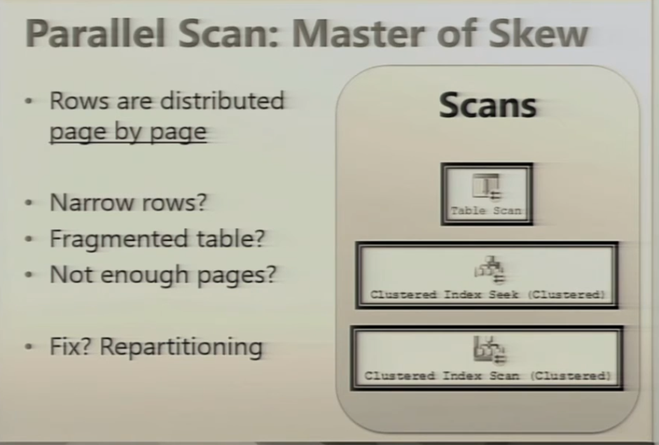
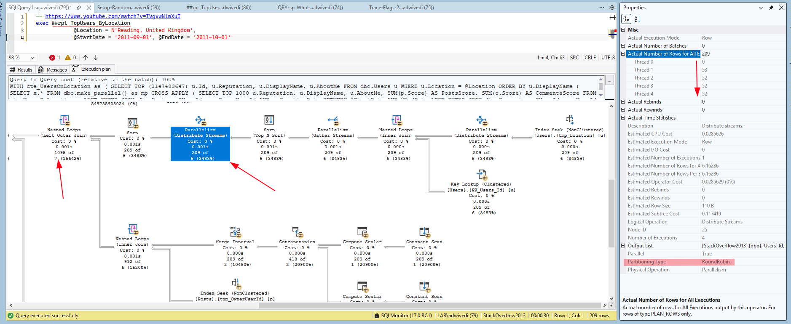
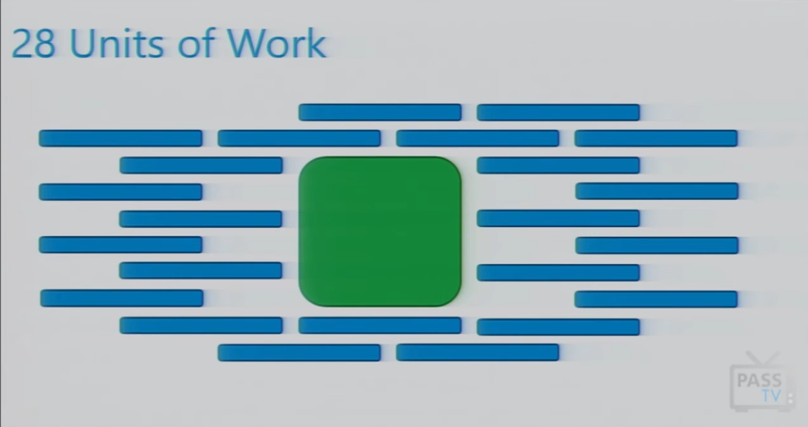
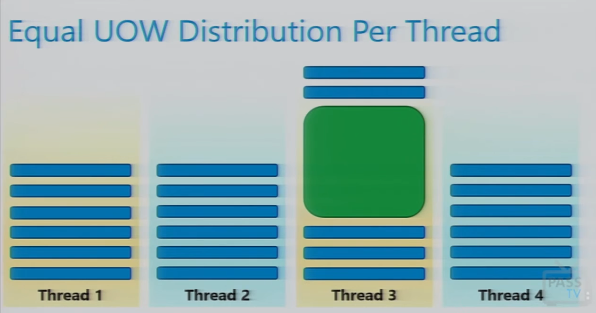
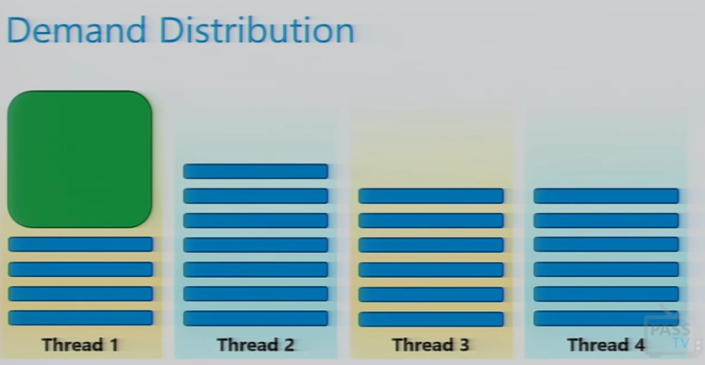
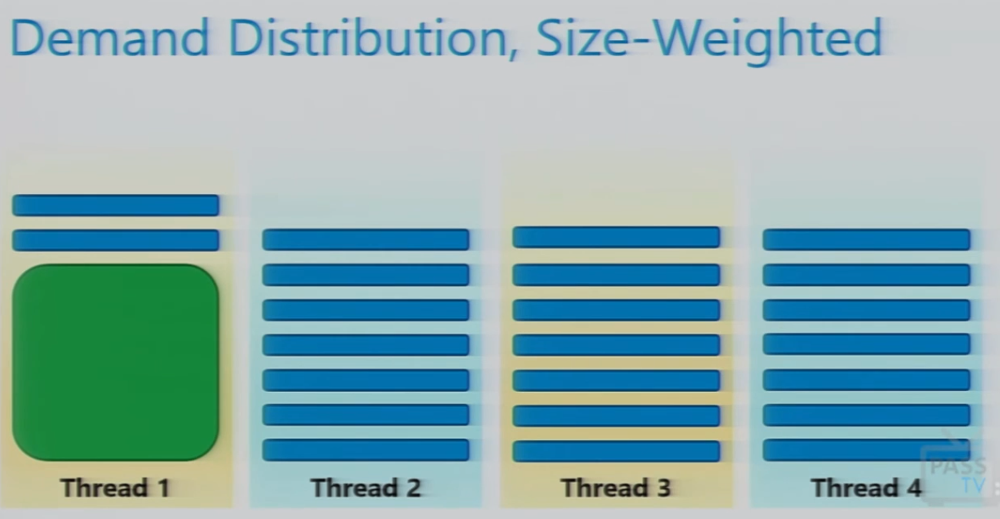

# Handling Skewed Parallelism in SQL Server

**Skewed parallelism** (also known as parallel row skew) occurs when SQL Server divides a query's workload among multiple CPU threads, but **one or a few threads do almost all the heavy lifting** while the remaining threads sit idle. This completely negates the performance benefits of a high Max Degree of Parallelism (MAXDOP).


## Possible Solutions
- [Snake Draft Sorting in SQLServer](https://www.red-gate.com/simple-talk/databases/sql-server/t-sql-programming-sql-server/snake-draft-sorting-in-sql-server-part-1/)
- [Forcing Repartition Using TOP Clause In SQL Server](https://www.youtube.com/watch?v=l8mZheh5-co)
- [Fixing Parallel Plan Row Skew With VALUES Clause](https://www.youtube.com/watch?v=pQ4K0P69SAU&t=4s)
- Forcing Parallel plan using dbo.make_parallel()
- 



- **Parallel Scan** feeds data page by page basis, or sometimes in chunks of 32 pages in *round robin or hash algorithm*. This is called **Demand Based Distribution Scheme**.
- The **Repartitioning Tricks** force a **Fixed Based Distribution Scheme**. This sometimes lead to skew work to one or more thread depending on skewed data.




## Assumptions - 28 units of work - One big unit of work among other 27 uniform unit of works


### Hash/Round Robin Distribution Scheme - Equal UOW (Unit of Work) Distribution Per Thread
- In this work units are distributed equally to each thread. Thus one thread having big unit of work will take long to execute.
- In this, rest of the threads will be idle waiting for the big unit of work to complete.



### Demand Based Distribution Scheme - Skewed UOW (Unit of Work) Distribution Per Thread
- In this work units are distributed based on the demand. Thus one thread that got big unit of work will only be assigned that unit of work. While rest of the threads work on rest of the smaller units of work.
- In this, all the threads eventually finish their work almost at same time.
- SQLServer giving us `Page-Based Demand or Key-Based Balanced` distribution.
- We want `Key-Based Size-Weighted Demand` distribution.



---

## 🔍 How to Detect Skewed Parallelism

You can definitively identify parallel skew by examining the **Actual Execution Plan**. 

### 1. Uneven Rows per Thread
Right-click an operator (such as a `Parallel Clustered Index Seek` or `Hash Match`) and expand the **Actual Number of Rows** property. Check if `Thread 1` has millions of rows while `Thread 2` through `Thread N` have zero or very few rows.

### 2. Disproportionate Wait Statistics
Look out for high `CXPACKET` or `CXCONSUMER` wait times accompanied by a low difference between overall **CPU Time** and **Elapsed Time**. If a query takes 15 seconds of elapsed time and only 16 seconds of CPU time on a `MAXDOP 8` machine, parallelism is failing you.

### 3. TempDB Spills
Because SQL Server calculates memory grants globally and divides them equally across threads, the one heavily-skewed thread only gets a fraction of the required memory. This frequently causes severe **TempDB memory spills** on that specific thread.

---

## 🛠️ Root Causes & Resolution Strategies

### 1. Outdated Statistics or Bad Cardinality Estimates
If the Query Optimizer believes it is dealing with 10 rows when there are actually 10 million, the Parallel Page Supplier will not distribute the threads efficiently.
*   **Resolution**: Update the table statistics with a full scan to give the optimizer accurate distribution histograms.
    ```sql
    UPDATE STATISTICS dbo.YourTable WITH FULLSCAN;
    ```

### 2. Heavily Skewed Underlying Data Distributions
If 90% of your table rows share the exact same foreign key or status value, operators like *Parallel Nested Loops* or *Hash Joins* using a modulo hash function will naturally route all those identical values to the exact same thread.
*   **The `CROSS APPLY / TOP` Trick**: Forcing a serial zone in your plan can re-balance the subsequent parallel stream. By adding a `TOP` clause inside a `CROSS APPLY`, you force SQL Server to process smaller chunks before distributing rows down the pipeline.
*   **The `VALUES` Clause Rewrite**: Instead of doing a standard correlated subquery, pass heavily repeated filter values inside a `VALUES` block, alias them, and join them back. This tricks the optimizer into picking highly efficient Batch Mode processing or standard Hash Joins instead of parallel loops.

### 3. Join Operators & Optimization Hints
Certain join behaviors break parallel balance, particularly when combined with high MAXDOP.
*   **Resolution**: Force a specific distribution mechanism using a query hint. For example, `OPTION (HASH GROUP)` or `OPTION (REPARTITION STREAMS)` can force SQL Server to redistribute the data across threads right before a heavy aggregation or join.

### 4. Non-Parallel Aware Operators
Operators like **Eager Index Spools** are notoriously serial-bound. If one appears in a parallel zone, the immediately preceding index access will bunch up all rows onto a single thread.
*   **Resolution**: Eliminate the need for the spool by creating a supporting index that covers the query's `WHERE` and `JOIN` criteria natively, circumventing the spool entirely.

### 5. Adjust Global Parallelism Guardrails
If the query cannot be rewritten and the parallelism overhead is causing server-wide issues, you must tweak your instance configuration parameters.
*   **Increase Cost Threshold for Parallelism**: The default value of `5` is severely outdated. Raise this to `50` so small queries don't trigger inefficient, skewed parallel plans.
*   **Lower MAXDOP for the Query**: Reducing it to a lower number or forcing it to run serially (`MAXDOP 1`) will eradicate thread sync bottlenecks and prevent memory grant starvation.
    ```sql
    SELECT * FROM dbo.YourTable 
    WHERE SkewedColumn = 'MassiveValue'
    OPTION (MAXDOP 2); -- Or 1 to completely bypass parallel skew
    ```

### 6. Force Parallel Plan using `The Parallel Appy Pattern` and Force RePartition using `TOP Clause in CTE`
- [The `make_parallel()` Trick to Increase Query Plan Cost, and Force Parallelism](http://dataeducation.com/next-level-parallel-plan-forcing-an-alternative-to-8649/)
- [Blog post by Adam Mechanic - Next-Level Parallel Plan Forcing: An Alternative to 8649](http://dataeducation.com/next-level-parallel-plan-forcing-an-alternative-to-8649/)
- [Youtube Session by Adam Mechanic - Query Tuning Mastery: Manhandling Parallelism, 2014 Edition](https://www.youtube.com/watch?v=CTB7LrQVu5c&list=PLFUGPe1byxet0UYXvK0qSwo0EdS8h-r67&index=7)

```sql
CREATE FUNCTION dbo.make_parallel()       
RETURNS TABLE AS        
RETURN        
(        
    WITH        
    a(x) AS        
    (        
        SELECT        
            a0.*        
        FROM        
        (        
            VALUES        
                (1), (1), (1), (1), (1), (1), (1), (1), (1), (1), (1), (1), (1), (1), (1), (1),        
                (1), (1), (1), (1), (1), (1), (1), (1), (1), (1), (1), (1), (1), (1), (1), (1),        
                (1), (1), (1), (1), (1), (1), (1), (1), (1), (1), (1), (1), (1), (1), (1), (1),        
                (1), (1), (1), (1), (1), (1), (1), (1), (1), (1), (1), (1), (1), (1), (1), (1),        
                (1), (1), (1), (1), (1), (1), (1), (1), (1), (1), (1), (1), (1), (1), (1), (1),        
                (1), (1), (1), (1), (1), (1), (1), (1), (1), (1), (1), (1), (1), (1), (1), (1),        
                (1), (1), (1), (1), (1), (1), (1), (1), (1), (1), (1), (1), (1), (1), (1), (1),        
                (1), (1), (1), (1), (1), (1), (1), (1), (1), (1), (1), (1), (1), (1), (1), (1),        
                (1), (1), (1), (1), (1), (1), (1), (1), (1), (1), (1), (1), (1), (1), (1), (1),        
                (1), (1), (1), (1), (1), (1), (1), (1), (1), (1), (1), (1), (1), (1), (1), (1),        
                (1), (1), (1), (1), (1), (1), (1), (1), (1), (1), (1), (1), (1), (1), (1), (1),        
                (1), (1), (1), (1), (1), (1), (1), (1), (1), (1), (1), (1), (1), (1), (1), (1),        
                (1), (1), (1), (1), (1), (1), (1), (1), (1), (1), (1), (1), (1), (1), (1), (1),        
                (1), (1), (1), (1), (1), (1), (1), (1), (1), (1), (1), (1), (1), (1), (1), (1),        
                (1), (1), (1), (1), (1), (1), (1), (1), (1), (1), (1), (1), (1), (1), (1), (1),        
                (1), (1), (1), (1), (1), (1), (1), (1), (1), (1), (1), (1), (1), (1), (1), (1),        
                (1), (1), (1), (1), (1), (1), (1), (1), (1), (1), (1), (1), (1), (1), (1), (1),        
                (1), (1), (1), (1), (1), (1), (1), (1), (1), (1), (1), (1), (1), (1), (1), (1),        
                (1), (1), (1), (1), (1), (1), (1), (1), (1), (1), (1), (1), (1), (1), (1), (1),        
                (1), (1), (1), (1), (1), (1), (1), (1), (1), (1), (1), (1), (1), (1), (1), (1),        
                (1), (1), (1), (1), (1), (1), (1), (1), (1), (1), (1), (1), (1), (1), (1), (1),        
                (1), (1), (1), (1), (1), (1), (1), (1), (1), (1), (1), (1), (1), (1), (1), (1),        
                (1), (1), (1), (1), (1), (1), (1), (1), (1), (1), (1), (1), (1), (1), (1), (1),        
                (1), (1), (1), (1), (1), (1), (1), (1), (1), (1), (1), (1), (1), (1), (1), (1),        
                (1), (1), (1), (1), (1), (1), (1), (1), (1), (1), (1), (1), (1), (1), (1), (1),        
                (1), (1), (1), (1), (1), (1), (1), (1), (1), (1), (1), (1), (1), (1), (1), (1),        
                (1), (1), (1), (1), (1), (1), (1), (1), (1), (1), (1), (1), (1), (1), (1), (1),        
                (1), (1), (1), (1), (1), (1), (1), (1), (1), (1), (1), (1), (1), (1), (1), (1),        
                (1), (1), (1), (1), (1), (1), (1), (1), (1), (1), (1), (1), (1), (1), (1), (1),        
                (1), (1), (1), (1), (1), (1), (1), (1), (1), (1), (1), (1), (1), (1), (1), (1),        
                (1), (1), (1), (1), (1), (1), (1), (1), (1), (1), (1), (1), (1), (1), (1), (1),        
                (1), (1), (1), (1), (1), (1), (1), (1), (1), (1), (1), (1), (1), (1), (1), (1),        
                (1), (1), (1), (1), (1), (1), (1), (1), (1), (1), (1), (1), (1), (1), (1), (1),        
                (1), (1), (1), (1), (1), (1), (1), (1), (1), (1), (1), (1), (1), (1), (1), (1),        
                (1), (1), (1), (1), (1), (1), (1), (1), (1), (1), (1), (1), (1), (1), (1), (1),        
                (1), (1), (1), (1), (1), (1), (1), (1), (1), (1), (1), (1), (1), (1), (1), (1),        
                (1), (1), (1), (1), (1), (1), (1), (1), (1), (1), (1), (1), (1), (1), (1), (1),        
                (1), (1), (1), (1), (1), (1), (1), (1), (1), (1), (1), (1), (1), (1), (1), (1),        
                (1), (1), (1), (1), (1), (1), (1), (1), (1), (1), (1), (1), (1), (1), (1), (1),        
                (1), (1), (1), (1), (1), (1), (1), (1), (1), (1), (1), (1), (1), (1), (1), (1),        
                (1), (1), (1), (1), (1), (1), (1), (1), (1), (1), (1), (1), (1), (1), (1), (1),        
                (1), (1), (1), (1), (1), (1), (1), (1), (1), (1), (1), (1), (1), (1), (1), (1),        
                (1), (1), (1), (1), (1), (1), (1), (1), (1), (1), (1), (1), (1), (1), (1), (1),        
                (1), (1), (1), (1), (1), (1), (1), (1), (1), (1), (1), (1), (1), (1), (1), (1),        
                (1), (1), (1), (1), (1), (1), (1), (1), (1), (1), (1), (1), (1), (1), (1), (1),        
                (1), (1), (1), (1), (1), (1), (1), (1), (1), (1), (1), (1), (1), (1), (1), (1),        
                (1), (1), (1), (1), (1), (1), (1), (1), (1), (1), (1), (1), (1), (1), (1), (1),        
                (1), (1), (1), (1), (1), (1), (1), (1), (1), (1), (1), (1), (1), (1), (1), (1),        
                (1), (1), (1), (1), (1), (1), (1), (1), (1), (1), (1), (1), (1), (1), (1), (1),        
                (1), (1), (1), (1), (1), (1), (1), (1), (1), (1), (1), (1), (1), (1), (1), (1),        
                (1), (1), (1), (1), (1), (1), (1), (1), (1), (1), (1), (1), (1), (1), (1), (1),        
                (1), (1), (1), (1), (1), (1), (1), (1), (1), (1), (1), (1), (1), (1), (1), (1),        
                (1), (1), (1), (1), (1), (1), (1), (1), (1), (1), (1), (1), (1), (1), (1), (1),        
                (1), (1), (1), (1), (1), (1), (1), (1), (1), (1), (1), (1), (1), (1), (1), (1),        
                (1), (1), (1), (1), (1), (1), (1), (1), (1), (1), (1), (1), (1), (1), (1), (1),        
                (1), (1), (1), (1), (1), (1), (1), (1), (1), (1), (1), (1), (1), (1), (1), (1),        
                (1), (1), (1), (1), (1), (1), (1), (1), (1), (1), (1), (1), (1), (1), (1), (1),        
                (1), (1), (1), (1), (1), (1), (1), (1), (1), (1), (1), (1), (1), (1), (1), (1),        
                (1), (1), (1), (1), (1), (1), (1), (1), (1), (1), (1), (1), (1), (1), (1), (1),        
                (1), (1), (1), (1), (1), (1), (1), (1), (1), (1), (1), (1), (1), (1), (1), (1),        
                (1), (1), (1), (1), (1), (1), (1), (1), (1), (1), (1), (1), (1), (1), (1), (1),        
                (1), (1), (1), (1), (1), (1), (1), (1), (1), (1), (1), (1), (1), (1), (1), (1),        
                (1), (1), (1), (1), (1), (1), (1), (1), (1), (1), (1), (1), (1), (1), (1), (1),        
                (1), (1), (1), (1), (1), (1), (1), (1), (1), (1), (1), (1), (1), (1), (1), (1)        
        ) AS a0(x)        
    ),        
    b(x) AS        
    (        
        SELECT TOP(9223372036854775807)        
            1        
        FROM        
            a AS a1,        
            a AS a2,        
            a AS a3,        
            a AS a4        
        WHERE        
            a1.x % 2 = 0
    )        
    SELECT        
        SUM(b1.x) AS x        
    FROM        
        b AS b1        
    HAVING        
        SUM(b1.x) IS NULL        
)        
GO
```

#### Sample query
```sql
CREATE OR ALTER PROC ##rpt_TopUsers_ByLocation
    @Location NVARCHAR(100), @StartDate DATE, @EndDate DATE AS
BEGIN
/*
-- https://www.youtube.com/watch?v=IVqvwNlwXuI
exec ##rpt_TopUsers_ByLocation
            @Location = N'Reading, United Kingdom',
            @StartDate = '2011-09-01', @EndDate = '2011-10-01'
*/
    /*
    SELECT TOP 1000 u.Reputation, u.DisplayName, u.AboutMe,
            SUM(p.Score) AS PostsScore,
            SUM(c.Score) AS CommentsScore
        FROM dbo.Users u
            LEFT OUTER JOIN dbo.Posts p ON u.Id = p.OwnerUserId AND p.CreationDate BETWEEN @StartDate AND @EndDate
            LEFT OUTER JOIN dbo.Comments c ON u.Id = c.UserId AND c.CreationDate BETWEEN @StartDate AND @EndDate
        WHERE u.Location = @Location
        GROUP BY u.Reputation, u.DisplayName, u.AboutMe
        ORDER BY SUM(p.Score) DESC
        OPTION (QUERYTRACEON 8671); -- best plan
        OPTION (QUERYTRACEON 8649); -- parallel plan
    */

    ;WITH cte_UsersOnLocation as (
        SELECT TOP (2147483647) u.Id, u.Reputation, u.DisplayName, u.AboutMe
        FROM dbo.Users u
        WHERE u.Location = @Location
        ORDER BY u.DisplayName
    )
    SELECT x.*
    FROM dbo.make_parallel() as mp
    CROSS APPLY (
    SELECT TOP 1000 u.Reputation, u.DisplayName, u.AboutMe,
            SUM(p.Score) AS PostsScore,
            SUM(c.Score) AS CommentsScore
        FROM cte_UsersOnLocation u
            LEFT OUTER JOIN dbo.Posts p ON u.Id = p.OwnerUserId AND p.CreationDate BETWEEN @StartDate AND @EndDate
            LEFT OUTER JOIN dbo.Comments c ON u.Id = c.UserId AND c.CreationDate BETWEEN @StartDate AND @EndDate
        WHERE 1=1
        GROUP BY u.Reputation, u.DisplayName, u.AboutMe
        ORDER BY SUM(p.Score) DESC
    ) AS x
END
GO

/*
create index tmp_Location on dbo.Users(Location, Id) include (Reputation, DisplayName);
go

create index tmp_OwnerUserId on dbo.Posts(OwnerUserId, CreationDate) include (Score);
go

create index tmp_UserId on dbo.Comments(UserId, CreationDate) include (Score);
go

exec sp_MSforeachdb ' Use [?]; ALTER DATABASE SCOPED CONFIGURATION SET LAST_QUERY_PLAN_STATS = ON;';
go

*/
```

---

## 📚 Community Resources & Deep Dives

### 📰 Technical Blogs & Articles
*   **Brent Ozar**: Learn how the parallel page supplier fails in [Skewing Parallelism For Fun And Profit](https://www.brentozar.com/archive/2018/10/skewing-parallelism-for-fun-and-profit/).
*   **Erik Darling (Darling Data)**: Read a deep-dive analysis on [A Follow Up On Fixing Parallel Plan Row Skew In SQL Server](https://erikdarling.com/a-follow-up-on-fixing-parallel-plan-row-skew-in-sql-server/).
*   **SQLShack**: Understand the relationship between table layout and engine behavior in [Understanding Skewed Data in SQL Server](https://www.sqlshack.com/understanding-skewed-data-in-sql-server/).
*   **Aaron Bertrand**: [Snake Draft Sorting in SQLServer](https://www.red-gate.com/simple-talk/databases/sql-server/t-sql-programming-sql-server/snake-draft-sorting-in-sql-server-part-1/)

### 📺 Video Tutorials
*   **Fixing Row Skew with TOP**: Watch how a `CROSS APPLY` rewrite drops query times from 15 seconds to 0 seconds in [Fixing Parallel Row Skew With TOP In SQL Server](https://www.youtube.com/watch?v=l8mZheh5-co).
*   **The VALUES Clause Hack**: Learn how to write batch-mode friendly queries to split threads evenly in [A Follow Up On Fixing Parallel Plan Row Skew](https://www.youtube.com/watch?v=pQ4K0P69SAU).
*   **Data Skew vs Parallel Skew**: See a live demonstration of how modulo hash distribution concentrates rows onto a single thread in [A Little About Skewed Data and Skewed Parallelism](https://www.youtube.com/watch?v=8UhkvEwenC8).
*   **Repartition Streams**: Understand how to force a data redistribution before a join in [Repartition Streams](https://www.youtube.com/watch?v=qfBEVJga6OM).
