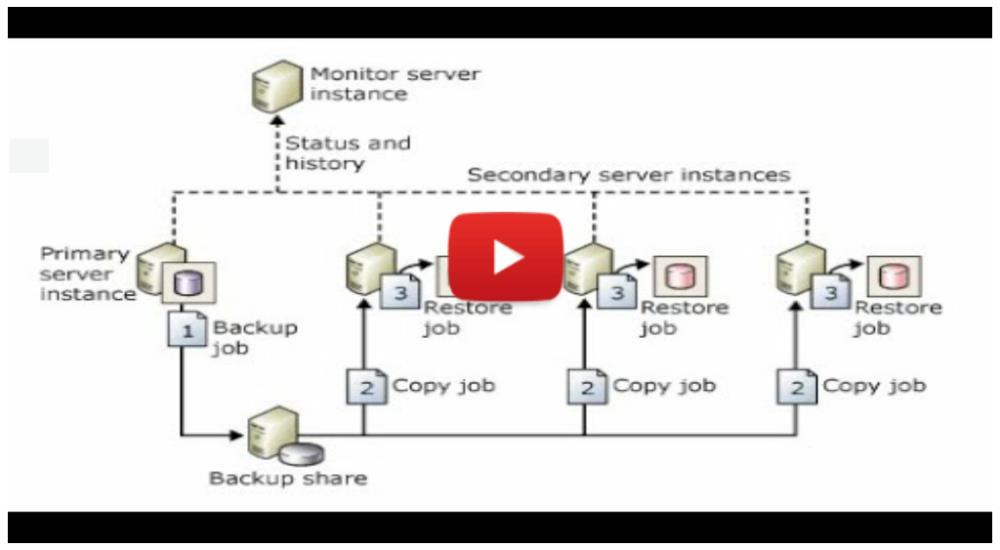

# SQLDBA-SSMS-Solution

This is SQL Server Management Solution containing various projects having SQL scripts to help DBA in carrying out daily activities. 

## Donation
If this project help you reduce time to develop, you can give me a cup of coffee :) 

PayPal |   | UPI
------ | - | -----------
[](https://paypal.me/imajaydwivedi?country.x=IN&locale.x=en_GB) | | [](https://github.com/imajaydwivedi/Images/raw/master/Miscellaneous/UPI-PhonePe-Main.jpeg)

-------------------------------------------------------------------------------------

Below are some highlights:-

### 1. Backup-Restore
This project contains Scripts for SQL Server Instance/Database migration. Following are the files:-
```
1) Generate - Backup Script.sql                                 
2) Script Out DB Permissions in case of DB Refresh.sql          
3) Generate - Restore Script.sql                                
4) Script Out DB_Owner from Source.sql                          
5) Set Compatibility Level as per Model.sql                     
6) Execute CheckDB _ UpdateStats for Migrated DBs.sql           
7) Copy Latest Full backup to Location - Reading BackupFile.sql 
7) Copy Latest Full backup to Location - Using BackupHistory.sql
8) Fix Orphan Logins for All DBs.sql                                     
Query - Backup History.sql                                      
Query - Restore History.sql 
```

### 2. BlitzQueries
This project contains script files that can be used for Health Checkup or Performance Troubleshooting of SQL Server. File `Other queries.sql` within this project contains TSQL code to find variety of informations like:-
```
- Check when SQL Services were started
- Check if compatibility Model of databases are up to date
- Ad hoc queries, and m/r settings
- Find queries using DBCC commands inside them
- Find Most Expensive Queries
- Top Queries by Average IO
- Expensive Queries Having Cursor
- Expensive Queries Having Joins to Table-Valued Functions
- Queries with implicit conversion
- Adhoc queries against Database
- Find queries with multiple plans
- Query to examine IO subsystem latencies
- Active tables without clustered index
- Find tables with forwarded records on Single Database
- Find tables with forwarded records on All Databases
- Find Query with Compilation Timeout
- Find all disabled indexes
- Get Cumulative Waits on Server
- Find Un-trusted Foreign Keys
- Find Usage Stats for Table and Indexes
```
It also contains scripts for finding `WhatIsRunning` and also modified version of `sp_WhoIsActive`. 
Screenshot for **`WhatIsRunning.sql`**:-


Screenshot for modified versin of **`who_is_active_v11_30`**:-


### 3. [sp_WhatIsRunning]
This project contains a procedure named [sp_WhatIsRunning] This procedure gives `currently running queries`, `CPU and Memory usage`, `Usage of Data & Log Volumes`, `Space utilization of data/log files`, `Lead Blockers`, and `session details performing Backup/Restore/Rollback`.


### 4. Custom Log Shipping Script
Log Shipping has many benefits and is often used a Disaster Recovery option. But, If you use Domain Account for SQL Services, then Log Shipping using Custom scripts could be established in much easier way than the default log shipping method. For this purpose, I have created by own Log Shipping procedure [dbo].[usp_DBAApplyTLogs]

<b> [Latest Code of [usp_DBAApplyTLogs]](LogShipping/usp_DBAApplyTLogs.sql)</b>

To learn on how to use this script, please watch below YouTube video:-

[](https://youtu.be/vF-EsyHnFRk)

