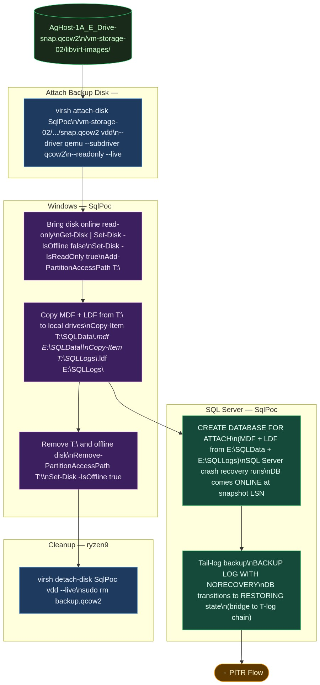
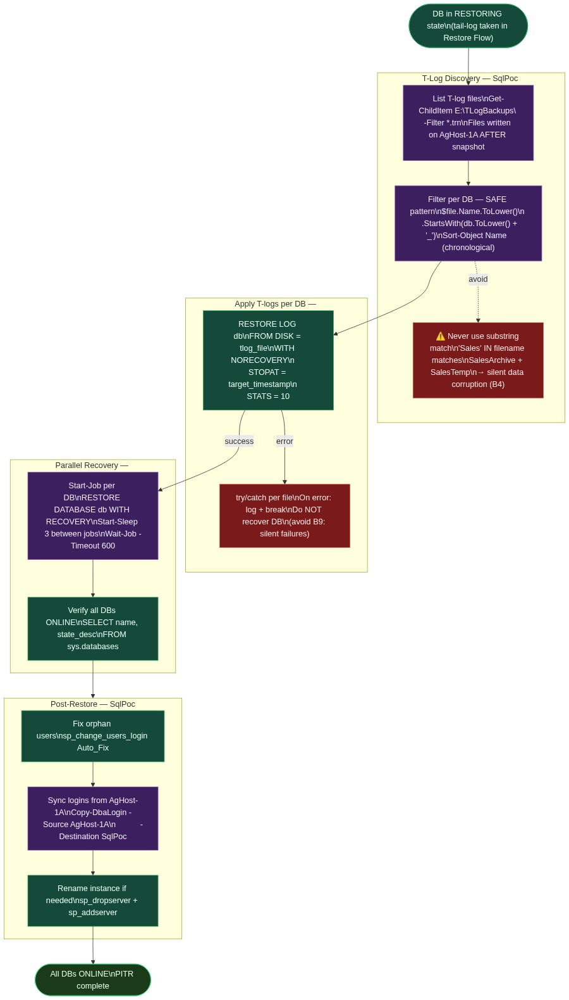
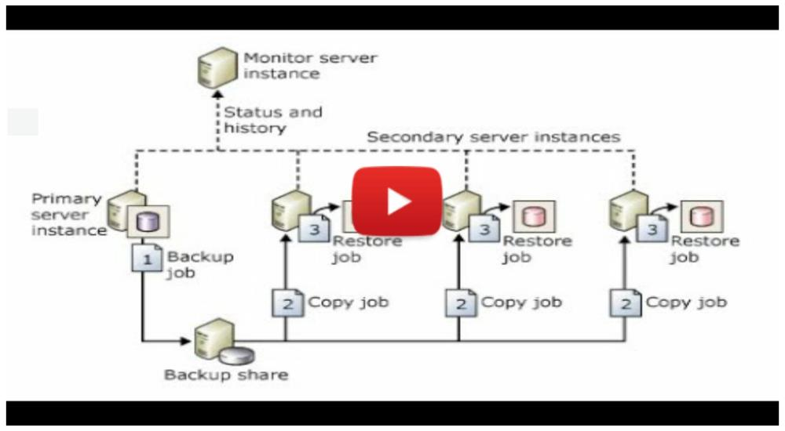

# SQLDBA-SSMS-Solution

A comprehensive SQL Server Management Studio solution — a curated library of T-SQL scripts, PowerShell automations, Python orchestrators, and C# tools built by an experienced DBA to cover the full spectrum of SQL Server administration: from daily health checks to ambitious HA/DR projects.

## Donation
If this project helped you reduce time to develop, you can give me a cup of coffee :)

PayPal |   | UPI
------ | - | -----------
[](https://paypal.me/imajaydwivedi?country.x=IN&locale.x=en_GB) | | [](https://github.com/imajaydwivedi/Images/raw/master/Miscellaneous/UPI-PhonePe-Main.jpeg)

---

## Table of Contents

1. [VSS Backup & Restore on KVM](#1-vss-backup--restore-on-kvm) ⭐ *Flagship Project*
2. [Custom Log Shipping](#2-custom-log-shipping)
3. [Transactional Replication — Full Automation](#3-transactional-replication--full-automation)
4. [Transactional Replication — SQL Auth / Snapshot](#4-transactional-replication--sql-auth--snapshot-based)
5. [Baselining & Performance Collection](#5-baselining--performance-collection)
6. [BlitzQueries — Health Check & Diagnostics](#6-blitzqueries--health-check--diagnostics)
7. [Blocking Alert System](#7-blocking-alert-system)
8. [XEvent Metrics Infrastructure](#8-xevent-metrics-infrastructure)
9. [Performance Tuning SQL Notebooks](#9-performance-tuning-sql-notebooks)
10. [SQLDBATools Inventory & Monitoring](#10-sqldbatools-inventory--monitoring)
11. [StackOverflow Lab & Workload Simulation](#11-stackoverflow-lab--workload-simulation)
12. [Always On / HADR](#12-always-on--hadr)
13. [Service Broker — Single Service Pattern](#13-service-broker--single-service-pattern)
14. [Deadlock Detection via SQL Trace](#14-deadlock-detection-via-sql-trace)
15. [Extended Events](#15-extended-events)
16. [Security — TDE & Certificate Auth](#16-security--tde--certificate-auth)
17. [Self-Service Module — Signed Stored Procedures](#17-self-service-module--signed-stored-procedures)
18. [Columnstore Index Deep Dive](#18-columnstore-index-deep-dive)
19. [Space & Capacity Management](#19-space--capacity-management)
20. [Backup & Restore — Migration Toolkit](#20-backup--restore--migration-toolkit)
21. [Instance Migration](#21-instance-migration)
22. [Maintenance — Index & Statistics](#22-maintenance--index--statistics)
23. [Resource Governor](#23-resource-governor)
24. [SQLWATCH Integration](#24-sqlwatch-integration)
25. [Audit & Logon Trigger](#25-audit--logon-trigger)
26. [SQL Agent Jobs & Notifications](#26-sql-agent-jobs--notifications)
27. [SQL Trace — ClearTrace Integration](#27-sql-trace--cleartrace-integration)
28. [Advanced Query Techniques](#28-advanced-query-techniques)
29. [Architecture Choices That Affect Performance](#29-architecture-choices-that-affect-performance)
30. [TempDB Issues](#30-tempdb-issues)
31. [PowerShell Command Library](#31-powershell-command-library)
32. [SQL Lab — Infrastructure Setup](#32-sql-lab--infrastructure-setup)

---

## 1. VSS Backup & Restore on KVM

> **Flagship project** — A production-grade, Microsoft-standard VSS backup/restore system for SQL Server running on Windows VMs hosted on a Linux KVM hypervisor.

📁 [`Backup-Restore-VSS/`](Backup-Restore-VSS/) · 📖 [Full Tutorial](Backup-Restore-VSS/vss-backup-kvm.md)

### What it does

No native `BACKUP DATABASE`, no `.bak` files, no KVM disk snapshot. Two C# programs talk directly to the **SQL Server VSS Writer** via the `IVssBackupComponents` API:

- **`VssBackup.exe`** (runs on the source VM) — freezes SQL Server for milliseconds, takes a Windows software shadow copy, copies the frozen MDF/LDF files to a Samba share on the hypervisor, releases the shadow.
- **`VssRestore.exe`** (runs on the target VM) — reads the writer metadata from the share, rewrites the recorded machine name, signals the local SQL Writer to accept the files, and leaves the database in `RESTORING` state for continuous log shipping (warm standby).

A Python orchestrator on the hypervisor drives both tools over WinRM and a FastAPI web GUI lets operators run the whole cycle from a browser.

### Architecture

```
┌─────────────────────────────────────────────────────────────┐
│  Bootstrap 5 SPA  (vss_api/static/)                          │
│  Dark sidebar · Backup · Restore · Snapshots · Jobs tabs     │
│  WebSocket live log streaming · PITR datetime picker         │
└──────────────────────────┬──────────────────────────────────┘
                           │ REST + WebSocket + /metrics
┌──────────────────────────▼──────────────────────────────────┐
│  FastAPI REST API  (vss_api/)                                 │
│  server.py  config.py  jobs.py  metrics.py                   │
│  runners/backup.py  runners/restore.py                       │
└─────────┬─────────────────────────────────┬──────────────────┘
          │ WinRM (PS → .exe)               │ mssql-python (TCP 1433)
┌─────────▼─────────────────┐   ┌───────────▼──────────────────┐
│ VssBackup.exe · VssRestore│   │ sys.databases · DROP DATABASE│
│ Agent job (.trn chain)    │   │ RESTORE LOG · ALTER NAME     │
└───────────────────────────┘   └──────────────────────────────┘
```

### Key features

| Feature | Details |
|---------|---------|
| **Pure-VSS path** | No qcow2 juggling, no KVM quiesce; uses the same writer protocol as commercial backup products |
| **LSN-chain verified** | T-logs taken after the VSS backup apply cleanly on the restored DB — `verify_tlog_chain.py` proves it end-to-end |
| **Compression** | `--compress` flag gzips MDF/LDF on the fly; 60 GB → 18 GB (3.4×) on a real 5-database set |
| **Parallelism** | `--parallel N` copies up to N databases concurrently; backup 2.6× faster on the benchmark set |
| **Copy-only mode** | `--copy-only` (`VSS_BT_COPY`) leaves the SQL differential base LSN untouched — safe alongside a live backup schedule |
| **Side-by-side restore** | Rename + move a DB onto the same instance without touching the live original |
| **PITR** | Restore to any point in time via `RESTORE DATABASE … WITH RECOVERY, STOPAT = '<ts>'` |
| **Web GUI** | Full job history, snapshot browser (with per-file detail and delete), real-time WebSocket log stream, running-job badge |
| **mssql-python** | All SQL metadata calls go through Microsoft's pure-Python driver — ~2 ms vs ~15 s for `Invoke-Sqlcmd` cold-load |

### Benchmark results (11 runs, up to 5 DBs / 60 GB)

| Scenario | DBs | Backup | Restore | T-Log | Wire size |
|----------|-----|-------:|--------:|:-----:|----------:|
| Base (serial) | CDCDemo, Db2 | 69 s | 8 s | — | 1.0 GB |
| Compress | CDCDemo, Db2 | 5 s | 12 s | — | 33 MB |
| Compress + Parallel + T-log | CDCDemo, Db2 | 6 s | 5 s | ✅ | 33 MB |
| Full set base | 5 DBs / 60 GB | 3965 s | 860 s | ✅ | 58.4 GB |
| Full set compress + parallel | 5 DBs / 60 GB | 1502 s | 785 s | ✅ | 17.7 GB |

### Source layout

```
Backup-Restore-VSS/
├── vss-backup-kvm.md              ← Full tutorial (this section)
├── VssRequester/                  ← C# solution (core)
│   ├── VssBackup/Program.cs       ← Backup requester
│   ├── VssRestore/Program.cs      ← Restore requester
│   ├── e2e_run.py / e2e_run_multi.py
│   ├── verify_tlog_chain.py
│   └── preflight.py
├── vss_api/                       ← FastAPI web server
│   ├── server.py / config.py / jobs.py
│   ├── runners/backup.py / restore.py
│   └── static/index.html + app.js
├── winrm_helper.py                ← WinRM/SMB helpers
├── create_tlog_job.py             ← Install Agent T-log job
├── Apply-TLogs.ps1                ← Warm-standby log apply loop
└── start-vss-gui.sh               ← One-command GUI launcher
```





---

## 2. Custom Log Shipping

📁 [`LogShipping/`](LogShipping/) · 📖 [README](LogShipping/README.md)

A hand-rolled log shipping solution that outperforms the built-in MSLS wizard when SQL services run under a domain account.

**Core procedure:** [`usp_DBAApplyTLogs`](LogShipping/usp_DBAApplyTLogs.sql) — applies transaction log backups to one or many secondary databases, tracks the last applied file, sends mail alerts on failure, and integrates with Service Broker for event-driven log-walk triggering.

[](https://youtu.be/vF-EsyHnFRk)

**Why use this instead of native log shipping?**
- Multiple secondaries with different latency windows
- Works as DR, limited reporting, migration, or SQL upgrade path
- No extra load on the primary
- Combines with AlwaysOn, Clustering, or Mirroring
- Alert suppression logic (`usp_GetLogWalkJobHistoryAlert_Suppress` — 10 versions tracked) prevents alert storms during planned maintenance

**Key files**

| File | Purpose |
|------|---------|
| `usp_DBAApplyTLogs.sql` | Main log-apply procedure |
| `ServiceBroker-LogWalk.sql` | Event-driven log walk via Service Broker |
| `ScriptOut-Backup-Restore.sql` | Generates BACKUP/RESTORE chains |
| `[usp_GetLogWalkJobHistoryAlert].sql` | Alert on log walk job failures |
| `v1.0 … v10.0 - [usp_GetLogWalkJobHistoryAlert_Suppress].sql` | Versioned alert-suppression logic |
| `__RefreshLogShipping__.ps1` | Automates full log-shipping refresh |

---

## 3. Transactional Replication — Full Automation

📁 [`Replication-Transactional/`](Replication-Transactional/)

End-to-end management of SQL Server transactional replication — from initial setup through production monitoring, latency alerting, and schema-contention mitigation.

### Setup scripts (numbered workflow)

```
1 - Get Replication Jobs.sql
2 - Configuring the Distributor.sql
3 - Setting up Publication (Immediate Sync or Backup/Restore)
4 - Setting up Subscription (Backup/Restore or ReplicationSupportOnly)
5 - Testing a transactional replication topology.sql
6 - Remove Replication.sql
7 - Add Article without Full Snapshot.sql
```

### Monitoring & alerting infrastructure

| Object | Purpose |
|--------|---------|
| `dbo.repl_token_header` / `repl_token_history` | Partitioned tracer-token collection tables |
| `vw_Repl_Latency` / `vw_Repl_Latency_Details` | Views exposing publisher→distributor→subscriber latency |
| `usp_Get_Repl_Latency_Notification` | Sends HTML-formatted email when latency exceeds threshold; cross-checks `MSdistribution_history` errors |
| `usp_repl_pending_commands` | Counts undistributed commands per subscription |
| `DBA - Replication Token Rate.sql` | Tracks token throughput over time |
| `SCH-Repl-Canary-Tables.sql` | Canary table approach for latency without tracer tokens |
| `Job [DBA - Replication - Stoped Jobs].sql` | Alert when any replication agent job stops unexpectedly |
| `usp_replication_agent_checkup` | Comprehensive agent health check |
| `usp_RemoveReplSchemaAccessContention` | Reduces `REPL_SCHEMA_ACCESS` wait by pausing log reader during schema changes |
| `ps-add-distribution-database-2-ag.ps1` | Adds distribution DB to an Availability Group |
| `ps-create-replication-setup-scriptout.ps1` | Scripts out the full replication topology |

---

## 4. Transactional Replication — SQL Auth / Snapshot-Based

📁 [`Replication-Transactional-SQLAuthentication-Snapshot-Based/`](Replication-Transactional-SQLAuthentication-Snapshot-Based/)

A fully scripted, snapshot-initialized transactional replication setup that uses SQL Server Authentication — suitable for environments without Windows domain integration.

**Automation pipeline** (all steps are idempotent):

```
0  → Create sample tables on publisher
1  → Sync logins between publisher and subscriber (PS)
2  → Sync SQL Agent jobs (PS)
3  → Export and apply indexes (PS)
4  → Logon trigger on subscriber
5  → Replication latency check
9  → Full setup via 9__replication_setup.ps1:
       9a  Add distributor
       9b  Create publication
       9c  Add articles
       9d  Start snapshot agent
       9e  Check snapshot history
       9f  Create subscription
       9g  Get publication details
       9h  Check distribution history
       9i  Check identity columns
```

The master PowerShell script `9__replication_setup.ps1` accepts `–DataCenter`, `–Table[]`, `–SqlCredential`, and optional flags to include or skip distributor/publication scripts — making it fully rerunnable.

---

## 5. Baselining & Performance Collection

📁 [`Baselining/`](Baselining/)

A scheduled data collection framework for ongoing performance trending and reactive investigation.

### Collection jobs

| Job / Script | Collects |
|-------------|---------|
| `SCH-Job-[(dba) Collect Metrics - WhoIsActive].sql` | Every-minute `sp_WhoIsActive` snapshots into `dbo.WhoIsActive` with blocking tree, locks, plans, transaction info |
| `(dba) Collect Metrics - Wait Stats.sql` | Incremental wait-stat deltas into a partitioned table |
| `SCH-ResourcePool-CPU-Collection-Partitioned.sql` | Resource Governor pool CPU usage |
| `SCH-Virtual File Stats` (SQLDBATools) | Per-database file I/O latency and throughput |
| `FileStats - AsOf / During / Delta` | Point-in-time and interval-based I/O analysis |
| `BlitzFirst-PerfMon - AsOf / During` | sp_BlitzFirst results stored for trend analysis |

### Analysis queries

| Script | Purpose |
|--------|---------|
| `What Was Running.sql` / `What was Running - AsOf.sql` | Find active sessions at a past moment from WhoIsActive history |
| `What Was Running - BlockingTree*.sql` | Reconstruct blocking chains at a moment or over an interval |
| `WaitStats - Delta/During/Cumulative` | Wait stat trending with Paul Randal's filtering |
| `Top-10-Longest-Running-Variations.sql` | Rank queries by duration from WhoIsActive snapshots |
| `BenchMarking-Storage-Network.sql` | Disk and network throughput baselines |
| `Grafana-Database-Statistics-Dashboard.sql` | Grafana-ready time-series queries |
| `High-Memory-Usage-Alert-Response.sql` | Automated response playbook for memory pressure |
| `Generate-Workload-StackOverflow.sql` | Controlled load generation using the StackOverflow dataset |

---

## 6. BlitzQueries — Health Check & Diagnostics

📁 [`BlitzQueries/`](BlitzQueries/) · 📖 [README](BlitzQueries/README.md)

A curated collection of First Responder Kit wrappers and custom health-check scripts.

### WhatIsRunning

**[`WhatIsRunning.sql`](BlitzQueries/WhatIsRunning.sql)** — A single query that shows currently running sessions at both batch and individual statement level, with CPU/memory usage, volume utilisation, data/log file space, lead blockers, and backup/restore/rollback progress. SQL Agent job sessions are shown with the human-readable job name.


### Modified `sp_WhoIsActive`

**[`who_is_active_v11_30(Modified).sql`](BlitzQueries/SCH-sp_WhoIsActive_v12_00(Modified).sql)** — Adam Mechanic's classic, extended to surface the **SQL Agent job name** for job-owned sessions.


### Diagnostic scripts

| Script | Focus |
|--------|-------|
| `Blitz.sql` / `BlitzCache.sql` / `BlitzIndex.sql` | sp_Blitz family wrappers |
| `BlitzLock.sql` | Deadlock history from Extended Events |
| `BlitzQueryStore.sql` | Query Store health and regression analysis |
| `Buffer-Pool-Analysis.sql` | Buffer pool breakdown by database/object |
| `Plan-Cache-Analysis.sql` | Plan cache bloat, single-use plans, parameter sniffing |
| `Fragmentation-Analysis.sql` | Index fragmentation across all databases |
| `Detect n Reduce High VLFs.sql` | Identify and shrink excessive VLF counts |
| `Find-Indirect-Connections.sql` | Identify cross-server linked server usage |
| `RingBuffer-PerfMon-CPU-Memory.sql` | CPU and memory from the ring buffer (no PerfMon needed) |
| `SRV-Avg-CPU-Over-Time.sql` | CPU trend from `sys.dm_os_ring_buffers` |
| `Very-Large-Databases-Optimization.sql` | Checklist for VLDB health |
| `SCH-usp_PlanCacheAutoPilot.sql` | Automated plan cache analysis and flushing |
| `Configure_PSSDiag.sql` / `MS-SQL_LogScout.sql` | Microsoft diagnostics capture setup |

---

## 7. Blocking Alert System

📁 [`Blocking Alert/`](Blocking&#32;Alert/)

A complete blocked-process alerting solution wired to SQL Server Agent.

**Setup sequence:**

```
1. Add DBAGroup operator
2. Set 'blocked process threshold' (20 s)
3. Create dbo.WhoIsActive_ResultSets capture table
4. Create Job [DBA - Log_With_sp_WhoIsActive]
5. Create Alert [Blocked Process Threshold > 5 minutes]
6. Fetch and format blocking information
```

**Real-time analysis scripts:**

| Script | Use |
|--------|-----|
| `BT-Live.sql` | Live blocking tree in pure T-SQL |
| `BT-Live-WhoIsActive.sql` | Live blocking tree via `sp_WhoIsActive` |
| `BT-Capturing-ThresholdBased.sql` | Capture blocking chains when threshold is hit |
| `Find-Blocking-Tree-LockTime.sql` | Analyse historical blocking with lock duration |
| `Blocking-Alert-Azure.sql` | Azure SQL Database variant |

---

## 8. XEvent Metrics Infrastructure

📁 [`xevent_metrics-infra/`](xevent_metrics-infra/)

An Extended Events-based workload metrics platform that captures per-query CPU, reads, writes, and duration into a normalized `dbo.xevent_metrics` table, then aggregates them for trend analysis.

| Script | Purpose |
|--------|---------|
| `QRY-xevent_metrics-infra.sql` | Parameterised query: group workload by SQL text, login, program, or host over a time window |
| `QRY-xevent_metrics-Infra-Normalized.sql` | Normalized view with `dbo.normalized_sql_text()` for plan-count deduplication |
| `QRY-RC-Workload-Delta-By-CPU.sql` | Delta CPU usage by resource pool / query group |
| `QRY-RC-Workload-Delta-By-Reads.sql` | Delta reads analysis |
| `QRY-top-login-program.sql` | Top consumers by login and application |
| `QRY-Top-Consumers-DELTA.ipynb` | Jupyter notebook for trending top consumers |

---

## 9. Performance Tuning SQL Notebooks

📁 [`Performance-Tuning-SQL-Notebooks/`](Performance-Tuning-SQL-Notebooks/)

A suite of Azure Data Studio / Jupyter SQL notebooks for structured, repeatable performance analysis. Each notebook queries the `[DBA]` metrics database and is parameterised by weekday or month-day for trend comparison.

| Notebook | Analyses |
|----------|---------|
| `sp_Blitz-WeekDay-MonthDay.ipynb` | Server health findings over time |
| `sp_BlitzFirst-WeekDay-MonthDay.ipynb` | Wait stats and perfmon snapshot deltas |
| `sp_BlitzFirst-SinceStartup-WeekDay-MonthDay.ipynb` | Cumulative waits since SQL Server start |
| `sp_BlitzCache-By-CPU/Reads/Writes/Executions/Memory/Spills/UnusedGrants/Writes` | Plan cache top queries, each sorted by a different resource dimension |
| `sp_BlitzIndex-Mode-0/1/2/3/4` | Index analysis across all five BlitzIndex modes |
| `sp_BlitzLock-WeekDay-MonthDay.ipynb` | Deadlock trends |
| `sp_HumanEvents-Compilations-WeekDay-MonthDay.ipynb` | Compilation and recompilation spikes |
| `IO-Latency-WeekDay-MonthDay.ipynb` | File-level I/O latency trends |
| `WaitStats-WeekDay-MonthDay.ipynb` | Wait stat distribution over time |
| `__Observations__.ipynb` | Free-form observation notebook for tuning sessions |

**Supporting scripts:**

| Script | Purpose |
|--------|---------|
| `Import-Blitz-Results-To-SQLServer.ps1` | Bulk-imports Blitz output files into a SQL table |
| `Run-SQLNotebooks-Using-PowerShell.ps1` | Batch-executes notebooks via PowerShell |

---

## 10. SQLDBATools Inventory & Monitoring

📁 [`SQLDBATools-Inventory/`](SQLDBATools-Inventory/)

A centralised `[DBA]` database that aggregates performance metrics from multiple SQL Server instances. Designed to feed Grafana dashboards and alerting pipelines.

### Metrics collected by `usp_collect_performance_metrics`

| DMV / Source | What is stored |
|-------------|----------------|
| `sys.dm_os_memory_clerks` | Memory clerk sizes (MB) per type |
| `sys.dm_os_sys_memory` | Physical / page-file / free memory state |
| `sys.dm_os_process_memory` | SQL process address space |
| `sys.dm_os_performance_counters` | SQL and OS PerfMon counters |
| `sys.dm_io_virtual_file_stats` | Per-file I/O: reads, writes, stall ms |
| `sys.dm_os_wait_stats` | Cumulative wait statistics |
| XEvent ring buffer | Query-level CPU, reads, duration |

### Grafana integration

- `Grafana-Database-Statistics-Dashboard.sql` — Dashboard queries for CPU, memory, I/O, wait stats
- `Grafana-Dashboard-SQLDBATools-1597626189988.json` — Importable Grafana dashboard definition
- `Grafana-WaitStats.sql` — Time-series wait stat queries formatted for Grafana

### Infrastructure scripts

| Script | Purpose |
|--------|---------|
| `SQLDBATools_DDLs.sql` / `SCH-*.sql` | Complete DDL for all metric tables |
| `Job-DataCollection.sql` | Agent job to run `usp_collect_performance_metrics` every minute |
| `Job [SQLDBATools - DataCollection - EventLogs].sql` | Windows Event Log collection |
| `PS-perfmon-collector-logman.sql` | PerfMon data collector set via `logman` |
| `PS-perfmon-collector-push-to-sqlserver.sql` | Push PerfMon BLG files to SQL Server |
| `1-5. Create VHDs / VMs / Post-OS scripts` | Hyper-V lab provisioning from scratch |
| `UnAttended-Sql-Installation.sql` | Silent SQL Server installation script |

---

## 11. StackOverflow Lab & Workload Simulation

📁 [`StackOverflow/`](StackOverflow/)

Scripts and tools for using the public **Stack Overflow database** as a realistic large-scale SQL Server lab dataset.

### Workload simulation

| Script | Purpose |
|--------|---------|
| `Invoke-RandomQ.ps1` | Randomly selects and executes queries against StackOverflow to generate realistic CPU/IO load |
| `Invoke-IndexLab6.ps1` | Index tuning lab — creates/drops indexes while measuring query impact |
| `Invoke-ServerLab2/4/5.ps1` | Graduated server-level performance labs |
| `Generate Workloads.sql` | Grafana-integrated workload queries |

### Analytics queries

| Script | Topic |
|--------|-------|
| `QA - StackOverflow Rank and Percentile.sql` | Reputation percentile ranking |
| `QA - How many upvotes do I have for each tag.sql` | Tag-based vote breakdown |
| `QA - Users with highest accept rate of their answers.sql` | Answer acceptance analysis |
| `QA - How Unsung am I.sql` | Unaccepted answer ratio |
| `QA - Most controversial posts on the site.sql` | Controversy scoring |
| `QA - Top 500 answerers on the site.sql` | Leaderboard query |
| `SCH - RPT-usp_*.sql` (20+ procedures) | Stored reporting procedures for dashboards |

---

## 12. Always On / HADR

📁 [`HADR/`](HADR/)

Certificate-based Always On AG and Database Mirroring setup scripts — no domain Kerberos dependency.

| Script | Purpose |
|--------|---------|
| `AG Setup - Certificate Based.sql` | Creates master key, certificates, mirroring endpoints, logins, AG, and listener across multiple nodes |
| `AG_without_WSFC.sql` | AG configuration outside a Windows Server Failover Cluster |
| `Mirroring Setup - Certificate Based.sql` | Database mirroring with certificate authentication |
| `troubleshooting-issues.sql` | Common HADR error codes and remediation queries |

Complements `SQLAgent-Notifications/SCH-Setup-AG-Alerts.sql` which configures standard AG health alerts and operator notifications.

---

## 13. Service Broker — Single Service Pattern

📁 [`ServiceBroker-SingleService/`](ServiceBroker-SingleService/)

Implements the **single-service** Service Broker pattern to asynchronously queue and process `sp_WhoIsActive` messages — decoupling the capturing step from the processing step.

| Script | Role |
|--------|------|
| `a) Single-Service-Config.sql` | Queue, service, contract, message type setup |
| `b) [usp_SendWhoIsActiveMessage].sql` | Sends a WhoIsActive XML snapshot to the queue |
| `c) [usp_ProcessWhoIsActiveMessage].sql` | Dequeues and processes messages |
| `Test-Multi-Job-Execution-Scenario.sql` | Validates concurrency under multiple simultaneous senders |

---

## 14. Deadlock Detection via SQL Trace

📁 [`Deadlock_Detection_SQLTrace/`](Deadlock_Detection_SQLTrace/)

An automated deadlock capture pipeline using SQL Trace (legacy path, compatible with SQL 2008 R2+).

```
1. Create SQLTrace_Deadlock trace definition
2. Create usp_StopTrace stored procedure
3. Create Agent jobs: SQLTrace_Start (on SQL startup) + SQLTrace_Stop (on schedule)
```

Supporting scripts create a test deadlock scenario (`Job [Update Employee Salary] and [Deadlock Session].sql`) and provide trace metadata queries.

---

## 15. Extended Events

📁 [`Extended Events/`](Extended&#32;Events/)

| Script | Purpose |
|--------|---------|
| `01) XEvent Definition.sql` | Session definitions for capturing query performance, deadlocks, and waits |
| `02) XEvent Extraction.sql` | Parsing and querying XEvent ring buffer and file targets |

---

## 16. Security — TDE & Certificate Auth

📁 [`Security/`](Security/)

| Script | Purpose |
|--------|---------|
| `TDE.sql` | Step-by-step Transparent Data Encryption: master key → certificate → DEK → encryption |
| `Encrypt-SQLDatabases.ps1` | PowerShell wrapper to enable TDE on multiple databases in a single pass |
| `SCH-[tde_implementation_details].sql` | Audit table tracking TDE state, certificate thumbprint, and encryption progress per database |

---

## 17. Self-Service Module — Signed Stored Procedures

📁 [`Self-Service-Module-Signed-Tools/`](Self-Service-Module-Signed-Tools/)

Implements **certificate-based code signing** so DBA tools (e.g., `sp_Blitz`) can be granted elevated permissions without adding the caller to `sysadmin`.

| Script | Purpose |
|--------|---------|
| `Certificate Based Authentication - [CodeSigningLogin].sql` | Creates `CodeSigningCertificate`, backs it up, creates `CodeSigningLogin` from the cert, grants `sysadmin` to the cert-login (not the user) |
| `All-Procedures.sql` | Signs all DBA procedures with the certificate |
| `Dummy-Login-Creation.sql` | Creates a low-privilege login to test the signed-proc pattern |
| `Certificate Cleanup.sql` | Revocation and removal scripts |

---

## 18. Columnstore Index Deep Dive

📁 [`Columnstore/`](Columnstore/)

A 7-module hands-on lab series using the StackOverflow database. Each `.sql` file is a standalone demo:

```
0) Introduction and overview — rowstore vs columnstore on dbo.Votes
1) How data is stored — segments, row groups, dictionaries
2) Deletes, updates, inserts — delta stores and tombstones
3) How data is read — segment elimination, batch mode
4) Rebuilding — ALTER INDEX REBUILD vs REORGANIZE
5) Nonclustered columnstore advantages — partial coverage
6) Clustered columnstore candidate — design criteria
7a/b) Partitioning as a partner — partition switching with columnstore
```

---

## 19. Space & Capacity Management

📁 [`Space Issues/`](Space&#32;Issues/) · [`SpaceCapacity-Automation/`](SpaceCapacity-Automation/)

### Space Issues

| Script | Purpose |
|--------|---------|
| `Get-DbSize.sql` / `QRY-Get-All-Db-Files-Details.sql` | Database and file sizes across all databases |
| `Get-VolumeInfo.sql` | Drive free space via `sys.dm_os_volume_stats` |
| `Get-Table-Sizes.sql` / `PS-Get-Table-Sizes.sql` | Top tables by data and index size |
| `Purge-Records-In-Chunks.sql` | Safe batch delete to reclaim space without log bloat |
| `compress-Tables-Indexes.sql` | ROW/PAGE compression recommendations and application |
| `SCH-Move-Database-Files.sql` | Online database file relocation procedure |
| `Shrink Log Files.sql` / `Invoke-DbaDbShrink.sql` | Controlled log file shrink |
| `QRY-Log-Files-Space-On-Drive.sql` | Log file space consumption per drive |

### SpaceCapacity-Automation

| Script | Purpose |
|--------|---------|
| `Automation - Restrict File growth.sql` | Agent job that caps autogrowth events |
| `Tsql-VLF-Counts.sql` / `Tsql-Remove-VLFs*.sql` | VLF diagnosis and reduction (single DB and all DBs) |

---

## 20. Backup & Restore — Migration Toolkit

📁 [`Backup-Restore/`](Backup-Restore/)

Numbered scripts that walk through a full database migration:

```
1) Generate backup script (all databases)
2) Script out database permissions (for DB refresh)
3) Generate restore script (from backup history or disk files)
4) Script out DB_Owner from source
5) Set compatibility level to match model database
6) Run CHECKDB + UpdateStats on migrated DBs
7) Copy latest full backup to new location (two variants)
8) Fix orphan logins for all databases
```

**Supporting scripts:**

| Script | Purpose |
|--------|---------|
| `RevLogin-Script.sql` | Re-creates logins with original SID and hashed password |
| `Database Mirroring - Certificate Based.sql` | Mirroring setup as part of migration |
| `Get-LatestBackups.sql` | Query latest backup per database |
| `Query - Backup History.sql` / `Restore History.sql` | Backup/restore audit trail |
| `ScriptOut - RESTORE With REPLACE.sql` | Bulk restore override scripts |
| `__RefreshLogShipping__.ps1` | Automates secondary refresh from new full backup |

---

## 21. Instance Migration

📁 [`InstanceMigration/`](InstanceMigration/)

A checklist-driven migration toolkit:

| Script | Purpose |
|--------|---------|
| `Check-Space-Requirement.sql` | Estimates target disk space needed |
| `Estimate-Backup-Size-Full.sql` | Pre-migration backup size estimate |
| `LoginsUsers.sql` | Scripts all logins and user mappings |
| `Get-UserObjects-in-SystemDb.sql` | Finds user objects in master/msdb that must move |
| `Copy-Files-Folders-Permissions.sql` | Robocopy + icacls for file migration |
| `Copy-SSIS-Packages.sql` | SSIS package migration |
| `Migrate-SSRS-Reports.sql` | SSRS report and data source migration |
| `Move-TempDb.sql` | Relocates TempDB files |
| `Migration-Issues.sql` | Common post-migration issues and fixes |
| `PowerShell.ps1` | Bulk migration automation |

---

## 22. Maintenance — Index & Statistics

📁 [`Maintenance/`](Maintenance/)

| Script | Purpose |
|--------|---------|
| `Ola-Maintenance-Solution-Github.sql` | Ola Hallengren's maintenance solution setup |
| `[IndexOptimize_Modified]-SCH.sql` | Modified `IndexOptimize` with additional thresholds |
| `[IndexOptimize_Modified]-Usage.sql` | Usage examples for the modified procedure |
| `Index-Defrag-UpdateStats-Analysis.sql` | Pre/post fragmentation and statistics analysis |
| `QRY-Delta-UpdateStats-IndexOptimize.sql` | Delta comparison of stats update efficiency |
| `QRY-Statistics-State-Update-Status.sql` | Statistics last-updated age across all databases |
| `QRY-Flush-Regressing-QueryPlans.sql` | Flush specific plans from the plan cache |
| `SCH-Purge-msdb.dbo.sysjobhistory.sql` | Agent job history pruning |
| `Maintainence - Delete files older than 72 hours.sql` | File-system cleanup for backup file retention |

---

## 23. Resource Governor

📁 [`Resource Governor/`](Resource&#32;Governor/)

| Script | Purpose |
|--------|---------|
| `Arc-RS-Settings.sql` | Resource Governor pool and workload group configuration |
| `Find-Queries-Consuming-CPU.sql` | Identify top CPU consumers by resource pool |
| `PS-Copy-RG-Classifier-Function.sql` (Baselining) | Copy classifier function between instances |
| `_URLs-Resource-Governor.sql` | Reference links for Resource Governor design |

---

## 24. SQLWATCH Integration

📁 [`SQLWATCH/`](SQLWATCH/)

Scripts and Grafana dashboard definitions for the [SQLWATCH](https://sqlwatch.io) monitoring framework.

| File | Purpose |
|------|---------|
| `SQLWATCH-IMPORT-CENTRAL-REPO.sql` | Import SQLWATCH data into a central repository |
| `SQLWATCH-Make-Changes-in-Configuration.sql` | Configuration tuning (collection intervals, checks) |
| `[dbg].[usp_sqlwatch_internal_process_checks].sql` | Debug wrapper for check processing |
| `Grafana-Queries.sql` | Custom Grafana panel queries |
| `SQL Instance Overview.json` | Importable instance overview dashboard |
| `Repository Dashboard.json` | Central repository Grafana dashboard |
| `Wait Events.json` / `Long Queries.json` | Specialised Grafana panels |

---

## 25. Audit & Logon Trigger

📁 [`Audit-n-LogOn-Trigger/`](Audit-n-LogOn-Trigger/)

| Script | Purpose |
|--------|---------|
| `SCH-Connection-Limit-Infra.sql` | Infrastructure for per-login connection throttling |
| `Connection Limit.sql` | Logon trigger that enforces max-connections-per-login |
| `Audit-Logins-Failed-Successful.sql` | SQL Server Audit spec for login events |
| `SCH-Audit-for-TRUNCATE.sql` | DDL trigger to audit TRUNCATE TABLE |
| `database-access-audit.sql` | Database-level access audit using SQL Audit |
| `create-database-audit.sql` | Server-level audit object creation |
| `POC-Ledger-Audit.sql` | SQL Server 2022 Ledger table proof-of-concept |
| `PS-Generate-Concurrent-Connections.sql` | PowerShell load generator for connection-limit testing |
| `QRY-Check-Limit-Connections-Live.sql` | Live connection count per login |
| `ps-Find-Table-Dependencies.sql` | Find all dependent objects before structural changes |

---

## 26. SQL Agent Jobs & Notifications

📁 [`SQL Jobs/`](SQL&#32;Jobs/) · [`SQLAgent-Notifications/`](SQLAgent-Notifications/)

| Script | Purpose |
|--------|---------|
| `v0.0/0.1 - Mail-Notification-Long-Running-Jobs.sql` | Alert when an Agent job exceeds a runtime threshold |
| `v0.1 - dbo.usp_StopLongRunningJob.sql` | Automatically stops a runaway job and notifies |
| `v0.0 - dbo.usp_GetDisabledJobNotification.sql` | Alert when expected jobs are disabled |
| `usp_GetStepFailureData.sql` | Detailed step failure history with error messages |
| `JobHistory_Duration.sql` | Job duration trend across days/weeks |
| `Jobs_Schedule.sql` | Visualise job schedules and last run results |
| `SCH-Setup-AG-Alerts.sql` | Always On health alerts (role change, data movement suspended) |
| `DBA - Ping Mirroring Partners.sql` | Scheduled ping of mirroring endpoints |
| `PingServers.ps1` | Multi-server availability check |

---

## 27. SQL Trace — ClearTrace Integration

📁 [`SQLTrace/`](SQLTrace/)

| Script | Purpose |
|--------|---------|
| `01) Trace Definition (SQL 2008 R2).sql` | Server-side trace capturing RPC/Batch completed events |
| `02) Trace Related Queries.sql` | Query active traces and their file targets |
| `03) DBA - SQLTrace_Stop.sql` | Gracefully stops the trace and closes the file |
| `04) ClearTrace-Top-15-Batches-By-*.sql` | ClearTrace-imported data: top 15 batches by CPU / Duration / IO |
| `04) ClearTrace-Top-15-Statements-By-*.sql` | Statement-level top consumers |

---

## 28. Advanced Query Techniques

📁 [`Advanced Query Techniques/`](Advanced&#32;Query&#32;Techniques/)

Demo scripts from conference presentations on advanced T-SQL:

| Script | Topic |
|--------|-------|
| `Carry-Over-Sort-vs-Batch-Mode-Window-Functions.sql` | Sort spill avoidance with batch-mode window aggregates |
| `Itzik-Ben-Gan.sql` | Techniques from Itzik Ben-Gan's T-SQL training |
| `Wild-LIKE-CHARINDEX.sql` | Wildcard search performance — LIKE vs CHARINDEX vs Full-Text |

---

## 29. Architecture Choices That Affect Performance

📁 [`Architecture-Choices-That-Affect-Performance/`](Architecture-Choices-That-Affect-Performance/)

Presentation materials and demo queries for the meetup talk *"Database Architecture Designs That Impact Performance"*:

| File | Topic |
|------|-------|
| `Finding Data Type Mismatches.sql` | Detect implicit conversion hotspots |
| `Implicit Conversion Examples.sql` | Reproduce and measure conversion overhead |
| `Foreign key and constraints.sql` | FK trust status and optimizer impact |
| `Red Flags for Database Design.sql` | Design anti-patterns: HEAPs, wide rows, NULLs, GUIDs |
| `Meetup - Database Architecture Designs That Impact Performance.pptx` | Slide deck |

---

## 30. TempDB Issues

📁 [`TempDb-Issues/`](TempDb-Issues/)

| Script | Purpose |
|--------|---------|
| `Find-Longest-Running-Query-TempLog.sql` | Find the query consuming the most TempDB log space |
| `Find-Db-Files-Space-Usage.sql` | Real-time TempDB file utilization |
| `Version-Store-Usage.sql` | Version store size and cleanup rate |
| `Raw-Queries-TempDb-Space-Issues.sql` | Ad-hoc TempDB diagnostic queries |
| `v0.0 - [usp_getDatabaseFileSpaceUsageNotification].sql` | Alert when TempDB hits a space threshold |

---

## 31. PowerShell Command Library

📁 [`PowerShell Commands/`](PowerShell&#32;Commands/)

A reference library of production-tested PowerShell patterns for SQL Server administration:

| Script | Technique |
|--------|-----------|
| `MultiThreading-Powershell-Jobs.sql` | Background jobs (`Start-Job`) |
| `MultiThreading-Powershell-PoshRSJob.sql` | PoshRSJob module for faster parallelism |
| `MultiThreading-Powershell-RunSpaces.sql` | Raw runspace pools for maximum throughput |
| `RSJob-with-Progress-Bar.sql` | Progress reporting for long-running RS jobs |
| `PowerShell-Efficient-Fetch-From-Multiple-Servers.sql` | Concurrent multi-server data collection |
| `ScriptOut-Database-Objects-EachInOwnFile.sql` | Script all objects, one file per object |
| `ScriptOut-Database-Objects-AllCombinedFile.sql` | Single-file full database script-out |
| `Copy-DbaDbTableData.sql` | dbatools `Copy-DbaDbTableData` with filtering |
| `Save-Credentials.sql` | Secure credential storage with `Export-Clixml` |
| `Retry-Command.sql` | Generic retry wrapper with exponential back-off |
| `QueryResults-2-Excel.sql` / `Get-SqlResult2Excel.sql` | Export query results to Excel |
| `compare-replication-state-change.ps1` | Diff replication agent state before/after a change |
| `ps-upgrade-sql2019-powershell.ps1` | Automates SQL Server 2019 upgrade via PowerShell |

---

## 32. SQL Lab — Infrastructure Setup

📁 [`SQL-Lab/`](SQL-Lab/)

Scripts for building a multi-node SQL Server lab from scratch on KVM/Hyper-V:

| Script | Purpose |
|--------|---------|
| `Join-CentOS-2-Windows-Domain.sql` | Join a Linux VM to an Active Directory domain |
| `hosts-file-*.sql` | `/etc/hosts` entries for DC, VMs, and hypervisor |
| `Setup-Email-Server.sql` | Configure Database Mail with Gmail SMTP |
| `Setup-VPN-Windows-Server.sql` | RRAS VPN configuration for lab isolation |
| `FireWall-Rules.sql` | Windows Firewall rules for SQL, AG endpoints, and WinRM |
| `Simulating a Multi Subnet cluster.pdf` | Lab guide for multi-subnet FCI/AG |

---

## Donation

If this project helped you reduce development time, you can give me a cup of coffee :)

PayPal |   | UPI
------ | - | -----------
[](https://paypal.me/imajaydwivedi?country.x=IN&locale.x=en_GB) | | [](https://github.com/imajaydwivedi/Images/raw/master/Miscellaneous/UPI-PhonePe-Main.jpeg)

